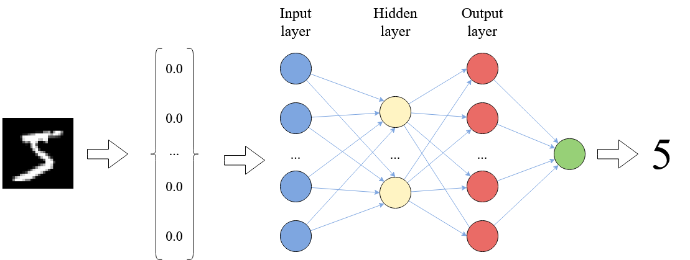

# A Vehicle Tutorial 

## Outline

0. Introduction and Motivation for Vehicle

1. A simple semantically meaningful example.
    - Maybe hierarchical classification? e.g. In this dogs dataset it shouldn't confuse an Afghan hound and a Border terrier.
    - Introduce basic syntax and properties.
2. A more complicated semantically meaningful example 
    - e.g. AcasXu
    - Introduces building and reusing functions.
3. Less semantically meaningful
    - e.g. MNIST robustness
    - Introduces concepts of datasets, parameters etc.
4. Semantically meaningful + integration with Agda.
    - Braking example?
    - Vehicle controller?

## 0. Introduction and Motivation
 
### What is Neural Network Verification about?

Neural networks are widely used in the field of machine learning; and are often embedded as *pattern-recognition* or *signal processing* components into complex software. Below we see a schematic depiction of a neural network trained to classify hand-written digits:

The image is represented as a vector of real numbers, each vector element standing for a pixel value. Each arrow in the picture bears a *weight* that is used to multiply the input signal; each neuron computes the sum of its inputs.

In some scenarious, it becomes important to establish formal guarantees about neural network behaviour. Following the pioneering work of [@Katz2017,Singh2019,Wang2021] neural network verification has become an active research area. 

Formally, a neural network is a function $N : R^m \rightarrow R^n$. Verification of such functions most commonly boils down to specifying admissible intervals for the function's output given an interval for its inputs. For example, one can specify a set of inputs to belong to an $\epsilon$- neighborhood of some given input $\mathbf{x}$, and verify that for such inputs, the outputs of $N$ will be in $\delta$ distance to $N(\mathbf{x})$. This property is often called $\epsilon$*-ball robustness* (or just *robustness*), as it proves the network's output is robust (does not change drastically) in the neighborhood of certain inputs.

Seen as functions, neural networks have particular features that play an important role in their verification: 
- these functions are not written manually, but generated (or *fitted*) to model the unknown data distribution;
- the "data" may be big, and require large neural networks; 
- we often attribute very little semantic meaning to the resulting function. 

### Challenges in Neural Network Verification

There are several  research challenges in the area of neural network verification: 
1. On the solver side, undecidability of non-linear real arithmetic [@Akbarpour2009] and scalability of neural network verifiers [@Wang2021] stand as two main challenges.  
2. In all realistic scenarious, even accurate neural networks require extra "property-driven training" in order to comply with verification properties in question. This calls for new methods of integrating training with verification.
3. The scope of neural network properties available in the literature is limited. Robustness is the most popular general property to date [@Casadio2022], and others include mostly domain-specific properties, such as ACAS Xu Benchmark [@Katz2017], which we will consider shortly in this tutorial. 
4. The available language inrastructure (e.g. the existing neural network solvers) encourage property specifications in terms of the input space, whereas one often needs to reason about neural network behavior in terms of the problem space.
5. Finally, neural networks usually work as components of complex systems, and the question of smooth integation of existing neural network solvers with other theorem provers requires resolution.

This tutorial will focus on problems 2 -- 5, and will present the tool Vehicle that provides support in alleviating them. In particular,  Vehicle provides a specification language that allows one to express neural network properties in a high-level, human-readable format (thus opening the way to reasoning about a wider space of properties, and reasoning in terms of the problem space). Then it compiles the specification down into low-level queries and passes them automatically to existing neural network solvers. If the specification cannot be verified, Vehicle gives one an option to automatically generate a new loss function that can be used to train the model to satisfy the stated property. Once a specification has been verified (possibly after property-driven re-training), Vehicle allows one to export the proof to an interactive theorem prover, and reason about the behavior of the complex system that embeds the machine learning model.

Vehicle programs can be compiled to an unusually broad set of backends,
including: 

 a) loss functions for Tensorflow which can be used to guide 
 both specification-directed training and gradient-based counter-example
 search.
 
 b) queries for the Marabou neural network verifier, which
 can be used to formally prove that the network obeys the specification.
 
 c) Agda specifications, which are tightly coupled to the original network
 and verification result, in order to scalably and maintainably construct
 larger proofs about machine learning-enhanced systems.
 
Currently, Vehicle supports the verifier Marabou, the ITP Agda, and the ONNX format for neural networks.

### Objectives of this Tutorial

This tutorial will give an introduction to the Vehicle tool 
(https://github.com/vehicle-lang/vehicle) and its conceptual approach
to modelling specifications for machine learning systems via functional
programming. It will teach the participants to understand the 
range of problems that arise in neural network property specification, 
verification and training, and will give a hands-on experience on 
solving these problems at a level of a higher-order specification 
language with dependent types.

### Prerequisites

To follow the tutorial, you will need Vehicle, Marabou and Agda installed in your machine.
For instructions, refer to [vehicle documentation](https://vehicle-lang.readthedocs.io/en/latest/installation.html).
You can also download already trained networks for our examples from [link to tutorial repo].

(Recommendation to use vsc with vcl syntax highlighting)

### Related work

- Behzad Akbarpour and Lawrence C. Paulson. MetiTarski: An automatic theorem prover for real valued special functions. Journal of Automated Reasoning 44(3), 175–205, 2009.
- Marco Casadio, Ekaterina Komendantskaya, Matthew L. Daggitt, Wen Kokke, Guy Katz,
Guy Amir, and Idan Refaeli. Neural network robustness as a verification property: A
principled case study. In Computer Aided Verification (CAV 2022), Lecture Notes in
Computer Science. Springer, 2022.
- Guy Katz, Clarke Barrett, D. Dill, K. Julian, and M. Kochenderfer. Reluplex: An Efficient SMT
Solver for Verifying Deep Neural Networks. In CAV, 2017.
- Gagandeep Singh, Timon Gehr, Markus Püschel, and Martin T. Vechev. An abstract
domain for certifying neural networks. Proc. ACM Program. Lang., 3(POPL):41:1–41:30, 2019.
- Shiqi Wang, Huan Zhang, Kaidi Xu, Xue Lin, Suman Jana, Cho-Jui Hsieh, and J. Zico
Kolter. Beta-crown: Efficient bound propagation with per-neuron split constraints for neu-
ral network robustness verification. In Marc’Aurelio Ranzato, Alina Beygelzimer, Yann N.
Dauphin, Percy Liang, and Jennifer Wortman Vaughan, editors, Advances in Neural In-
formation Processing Systems 34: Annual Conference on Neural Information Processing
Systems 2021, NeurIPS 2021, December 6-14, 2021, virtual, pages 29909–29921, 2021.

## Vehicle Preliminaries

- introduction of dataset and models
- introduction of basic syntax
- describe a property in words
- example with NN?
- example of property not holding 
- fix in vehicle!
