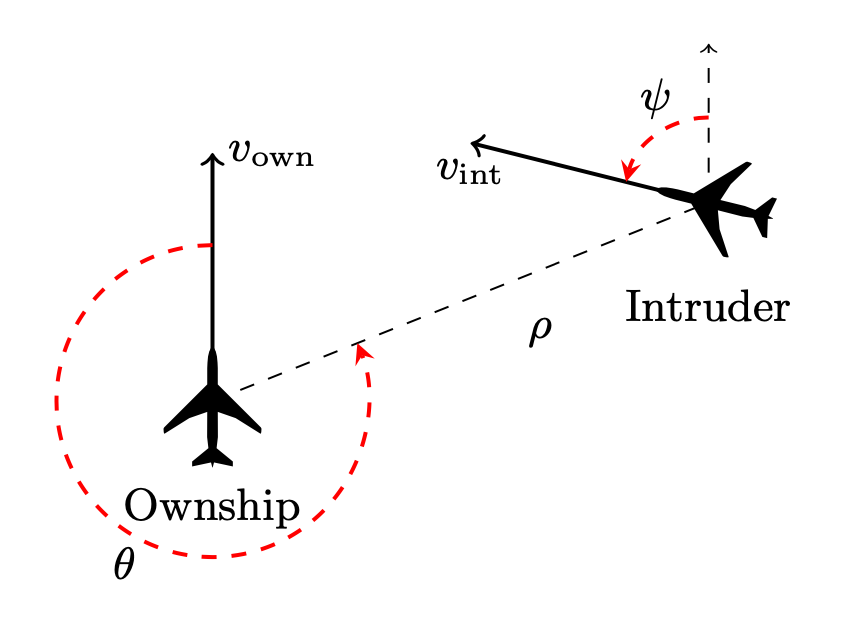

## Chapter 1. Getting Started: the Vehicle's Language

In this chapter we will introduce some basic features of Vehicle as a programming language. We will use the famous ACAS Xu verification challenge,
first introduced by Guy Katz et al in "Reluplex: An Efficient SMT Solver for Verifying -- Deep Neural Networks" (<https://arxiv.org/pdf/1702.01135.pdf>)

### Standard Components of a Verification Problem

In the simplest verification scenario, we will need  a neural network $N : R^m \rightarrow R^n$, and a property of the network we wish to verify. Often, though not always, such property can be formulated based on our understyanding of the domain where the neural network is used.
ACAS Xu stands for *Airborne Collision Avoidance System for unmanned  aircraft*. The objective is to analyse the airctaft's position and distance realtive to other airctafts, and based on this data to issue one of the following instructions: 
- Clear-of-Conflict (CoC), 
- weak left, 
- weak right, 
- strong left, 
- strong right. 

The following picture illustrates 

