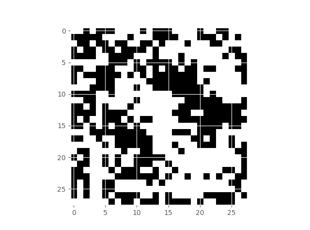

# Chapter 2. Proving Neural Network Robustness

In this chapter we will learn about the problem that has received significanrt attention within the machine learning community: 
_the problem of robustness of neural networks to out-of-distribution shifts, also known as "robustness to adversarial attacks"._ 
The problem was famously raised by Christian Szegedy and his co-authors in 2013 in the paper _"Intriguing properties of neural networks"(<https://arxiv.org/pdf/1312.6199.pdf>)_

So, here is the problem. Suppose we are given a data set $\mathcal{X}$ for classification of images, it consists of 
pairs $(\mathbf{x}, \mathbf{y})$, where $\mathbf{x} \in \mathbb{R}^n$ is an input, and  $\mathbf{y} \in \mathbb{R}^m$ is the desired output.
It is assumed that the outputs $\mathbf{y}$ are generated from $\mathbf{x}$ by some function $\mathcal{H} : \mathbb{R}^n → \mathbb{R}^m$ 
and that $\mathbf{x}$ is drawn from some probability distribution over $\mathbb{R}^n$. 

Let us take as an example the famous MNIST data set be LeCun et al. The images look like this:

As we have already discussed in the previous chapter, a neural network is a function $f : \mathbb{R}^n → \mathbb{R}^m$  parametrised by 
a set of weights $\mathbf{w}$. 
The goal of training is to use the dataset $\mathcal{X}$ to find weights $\mathbf{w}$ such that $f$ approximates $\mathcal{H}$ well 
over input regions with high probability density.

When we train a neural network to be highly accurate on both the training and the test sets, we emprically test: 
 *  how well the neural network can in principle approximate  $\mathcal{H}$  (we do this by measuring its accuracy on the training set);
 *  how well that learnt hypothesis generalises to yet unseen data (we do this by measuring the accuracy on the test set).

 Coming to our example, if my neural network has a $99$ % accuracy on the MNIST data set, I should be satisfied that it learnt
 what a hand-written digit is. Szegedy et al were the first to show systematically that this is not the case:
take the image on the left (below), which is classified with high confidence as "0", apply perturbation on the middle,
and your neural network will give a $94$ % confidence that it sees a "5" on the right, even despite the fact that the image did 
not change the class (for the human eye):

 Original MNIST Image |    Perturbation        |  Resulting Perturbed Image
:-------------------------:|:-------------------------:|:-----------------------------
 |  |  

The root of the problem is: the image on the right no longer belongs to the probability distribution that the network has learnt (whether or not the image looks the same to a human observer).
We could phrase it differently: an ideal probability distribiution $\mathcal{H}$ that is "learnt" by a "human" accounts not only for the images we obtained as part of the dataset $\mathcal{X}$, but also involves an implicit assumption that "semantically" similar images belong to the same class.    

 The simplest way to capture this implicit assumption is to formulate a _verification property_ that insists that all similar images (images within an $\epsilon$ distance of each other in $\mathbb{R}^n$) are classified similarly.  
This property is often called _$\epsilon$-ball robusness_. We refer the interested reader for a more detailed discussion of the property in: 

_Marco Casadio, Ekaterina Komendantskaya, Matthew L. Daggitt, Wen Kokke, Guy Katz, Guy Amir, Idan Refaeli:
Neural Network Robustness as a Verification Property: A Principled Case Study. CAV (1) 2022: 219-231._ 

Here, we will proceed by means of a concrete example.

Remember that we have some number of sample images in our data set, and each image is a point in an $n$ dimenional real space. Assume you can "draw" a small ball around each point, and guarantee that within that ball classification of the network does not change:

 $\epsilon$-ball around a number "7" in MNIST |
 :-------------------------:|
||

Formally, we define an $\epsilon$-ball  around an image $\hat{\mathbf{x}}$ as: $\mathbb{B}(\hat{\mathbf{x}}, \epsilon) = ( {\mathbf{x} \in \mathbb{R}^n: |\hat{\mathbf{x}}-\mathbf{x}| \leq \epsilon} )$.

It now remains to define the property "classification of $f$ does not change much". The paper by Casadio et al. summarises a few options for this definition, but let us use the _"standard robustness"_ and take $|f(\hat{\mathbf{x}}) -  f(\mathbf{x})| \leq \delta$, for some small $\delta$.
We now assemble the desired robustness property definition: Given an $\hat{\mathbf{x}}$,

$\forall \mathbf{x}. |\hat{\mathbf{x}}-\mathbf{x}| \leq \epsilon  \Longrightarrow |f(\hat{\mathbf{x}}) -  f(\mathbf{x})| \leq \delta $

for some chosen metric $| ... |$, such as Euclidean distance or $L_{\infty}$-norm. 