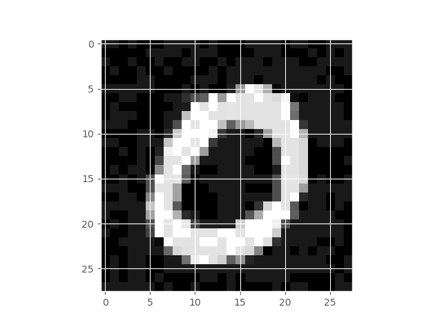

# Chapter 2. Proving Neural Network Robustness


## Neural Network Robustness as a Verification Property

In this chapter we will learn about the problem that has received significanrt attention within the machine learning community: 
_the problem of robustness of neural networks to out-of-distribution shifts, also known as "robustness to adversarial attacks"._ 
The problem was famously raised by Christian Szegedy and his co-authors in 2013 in the paper ["Intriguing properties of neural networks"](<https://arxiv.org/pdf/1312.6199.pdf>)

So, here is the problem. Suppose we are given a data set $\mathcal{X}$ for classification of images, it consists of 
pairs $(\mathbf{x}, \mathbf{y})$, where $\mathbf{x} \in \mathbb{R}^n$ is an input, and  $\mathbf{y} \in \mathbb{R}^m$ is the desired output.
It is assumed that the outputs $\mathbf{y}$ are generated from $\mathbf{x}$ by some function $\mathcal{H} : \mathbb{R}^n → \mathbb{R}^m$ 
and that $\mathbf{x}$ is drawn from some probability distribution over $\mathbb{R}^n$. 

Let us take as an example the famous MNIST data set be LeCun et al.(<https://www.tensorflow.org/datasets/catalog/mnist>) The images look like this:


As we have already discussed in the previous chapter, a neural network is a function $f : \mathbb{R}^n → \mathbb{R}^m$  parametrised by 
a set of weights $\mathbf{w}$. 
The goal of training is to use the dataset $\mathcal{X}$ to find weights $\mathbf{w}$ such that $f$ approximates $\mathcal{H}$ well 
over input regions with high probability density.


When we train a neural network to be highly accurate on both the training and the test sets, we emprically test: 
 *  how well the neural network can in principle approximate  $\mathcal{H}$  (we do this by measuring its accuracy on the training set);
 *  how well that learnt hypothesis generalises to yet unseen data (we do this by measuring the accuracy on the test set).

 Coming to our example, if my neural network has a $99$ % accuracy on the MNIST data set, I should be satisfied that it learnt
 what a hand-written digit is. Szegedy et al were the first to show systematically that this is not the case:
take the image on the left (below), which is classified with high confidence as "0", apply perturbation on the middle,
and your neural network will give a $94$ % confidence that it sees a "5" on the right, even despite the fact that the image did 
not change the class (for the human eye):


 Original MNIST Image |    Perturbation        |  Resulting Perturbed Image
:-------------------------:|:-------------------------:|:-----------------------------
 |  |  

This experiment can be replicated for any data set and any neural network, no matter how accurate it is.

The root of the problem is: the image on the right no longer belongs to the probability distribution that the network has learnt (whether or not the image looks the same to a human observer).
We could phrase it differently: an ideal probability distribiution $\mathcal{H}$ that is "learnt" by a "human" accounts not only for the images we obtained as part of the dataset $\mathcal{X}$, but also involves an implicit assumption that "semantically" similar images belong to the same class.    

 The simplest way to capture this implicit assumption is to formulate a _verification property_ that insists that all similar images (images within an $\epsilon$ distance of each other in $\mathbb{R}^n$) are classified similarly. This property is often called $\epsilon$-ball robusness: For every image in the dataset, we assume we can "draw" a small $\epsilon$-ball around it, and guarantee that within that ball classification of the network does not change much (the ball's radius below is given by the chosen $\epsilon$):

 $\epsilon$-ball around a number "7" in MNIST |
 :-------------------------:|
||

Formally, we define an $\epsilon$-ball  around an image $\hat{\mathbf{x}}$ as: 

$$\mathbb{B}(\hat{\mathbf{x}}, \epsilon) = [  \mathbf{x} \in \mathbb{R}^n: |\hat{\mathbf{x}}-\mathbf{x}| \leq \epsilon ]$$

where $| ... |$ is a distance function (or $L$-norm) in $\mathbb{R}^n$, such as Euclidean distance or $L_{\infty}$-norm. 


It now remains to define the property "classification of $f$ does not change much". The paper by [Casadio et al.](https://arxiv.org/abs/2104.01396)
summarises a few options for this definition. The simplest is the _Classification Robustness_ that requires that all images within any given $\epsilon$-ball are classified as the same class.  We will consider this property in detail, and will take a few other properties from Casadio et al. as an exercise. 

## Formalising $\epsilon$-ball robustness for MNIST networks in Vehicle

We note that $\epsilon$-ball robustness as a verification property bears some similarity to the ACAS Xu example that we have already covered in Chapter 1. In particular, both verification properties impose constraints on the output regions of the neural networks, assuming some constraint on their input regions. (Both problems are therefore amenable to a range of interval propagation and abstract interpretation methods, see [this survey](https://arxiv.org/abs/1812.08342) for further details.) From the point of view of the property specification, which is our main concern here, there are three main differences between these two examples:

 * ACAS Xu did not have to refer to a dataset $\mathcal{X}$; $\epsilon$-ball robustness, however, is formulated relative to the images given in the data set. We will see how Vehicle can be used to handle properties that refer directly to the data sets.  
 
 * MNIST, as many other data set used in Computer Vision, has images represented as 2D arrays. Such data sets often require Convolutional Neural Networks (NN) that are best desgned to deal with 2D and 3D data.  In terms of property specification, we will see Vehicle's support for 2D arrays, which comes for free with its general type infrastructure.   

 * Finally, the MNIST specification involves two parameters that we may want to pass or infer at the compilation time rather than hard-code within the spec. These are the $\epsilon$ and the number of examples we wish to be checked (at most the size of the entire data set). We will see how such parameters are defined and used in Vehicle.

### 2D Arrays in vehicle

Starting a specification for MNIST data set follows the same pattern as we have seen in Chapter 1, only this time we declare inputs as 2D arrays:

``` vehicle
type Image = Tensor Rat [28, 28]
type Label = Index 10
```

As before, we define valid inputs, this time making a mild adaptation to 2D arrays and assuming all pixel values are normalised between 0 and 1:

``` vehicle
validImage : Image -> Bool
validImage x = forall i j . 0 <= x ! i ! j <= 1
```

The output of the network is a
-- score for each of the digits 0 to 9.

``` vehicle
@network
classifier : Image -> Vector Rat 10
```

We note again the use of the syntax for `@network`, marking the place where Vehicle interacts with an external tool (this time most likely with Python Tensorflow).

The classifier advises that input image `x` has label `i` if the score
for label `i` is greater than the score of any other label `j`.

``` vehicle
advises : Image -> Label -> Bool
advises x i = forall j . j != i => classifier x ! i > classifier x ! j
``` 

### Definition of Robustness Around a Point

First we define the parameter `epsilon` that will represent the radius of the
ball that we want the network to be robust in. Note that we declare this as
 a parameter which allows the value of `epsilon` to be specified at compile
time rather than be fixed in the specification. Note we again use the syntax `@` 
to communicate this information externally.

``` vehicle
@parameter
epsilon : Rat
``` 

Next we define what it means for an image `x` to be in a ball of
size epsilon around 0. The definition above actually corresponds to 
the $L_{\infty}$ norm. Using the Eucledian distance would require a slightly more complicated 
definition, which we will do as an exercise. 

``` vehicle
boundedByEpsilon : Image -> Bool
boundedByEpsilon x = forall i j . -epsilon <= x ! i ! j <= epsilon
``` 


We now define what it means for the network to be robust around an image `x`
that should be classified as `y`. Namely, that for any perturbation no greater
than epsilon then if the perturbed image is still a valid image then the
 network should still advise label `y` for the perturbed version of `x`.

``` vehicle
robustAround : Image -> Label -> Bool
robustAround image label = forall pertubation .
  let perturbedImage = image - pertubation in
  boundedByEpsilon pertubation and validImage perturbedImage =>
    advises perturbedImage label
``` 

Again, note the use of a quantifier `forall` that ranges over an infinite domain of images of type `Image`. 

## Definition of Robustness with Respect to a Dataset

We first specify parameter `n` the size of the training dataset. Unlike
the earlier parameter `epsilon`, we set the `infer` option of the
 parameter `n` to 'True'. This means that it does not need to be provided  manually but instead will be automatically inferred by the compiler.
 In this case it will be inferred from the training datasets.

``` vehicle
@parameter(infer=True)
n : Nat
``` 

We next declare two datasets, the training images and the corresponding
training labels. Note that we use the previously declared parameter `n`
to enforce that they are the same size.

``` vehicle
@dataset
trainingImages : Vector Image n

@dataset
trainingLabels : Vector Label n
``` 

Again we note the use of syntax that involves `@` flagging Vehicle's connection with an external tool or object -- this case the data set is defined externally. 


We then say that the network is robust if it is robust around every pair
of input images and output labels. Note once again the use of the `foreach`
 keyword when quantifying over the index `i` in the dataset. Whereas `forall`
 would return a single `Bool`, `foreach` constructs a `Vector` of booleans,
 ensuring that Vehicle will report on the verification status of each image in
 the dataset separately. If `forall` was omitted, Vehicle would only
 report if the network was robust around *every* image in the dataset, a
 state of affairs which is unlikely to be true.

``` vehicle
@property
robust : Vector Bool n
robust = foreach i . robustAround (trainingImages ! i) (trainingLabels ! i)
``` 

## Running the Verification Query

The tutorial files contain two Python scripts that show how to convert Tensorflow Neural Networks into _ONNX_ format; and images -- into `.idx` files. These are the formats expected by Vehicle. You can use the ones we provide, or generate your own. Having obtained these, the following command line will take care of verification of the network `mnist-classifier.onnx`,
for data sets `images.idx` and `labels.idx` and $\epsilon = 0.005$:

``` vehicle
vehicle verify \
  --specification examples/mnist-robustness/mnist-robustness.vcl \
  --network classifier:examples/mnist-robustness/mnist-classifier.onnx \
  --parameter epsilon:0.005 \
  --dataset trainingImages:examples/mnist-robustness/images.idx \
  --dataset trainingLabels:examples/mnist-robustness/labels.idx \
  --verifier Marabou
  ``` 

For the first two images in your data set, the output will look as follows:

``` vehicle
Verifying properties:
  robust [================================================] 9/9 queries complete
  robust [================================================] 9/9 queries complete
Result: true
  robust: 2/2 verified
    🗸 robust!0

    🗸 robust!1
``` 

The reader may have guessed at this pont that, as we make $\epsilon$ larger, fewer and fewer examples will staisfy the property. Chapter 3 will look into methods that can be used to train networks to satisfy robustness for larger $\epsilon$. 


## Exercises

### Exercise 1: Standard Robustness in Vehicle

Define and Verify in Vehicle the propety of _Standard Robustness_. 
 that requires that $|f(\hat{\mathbf{x}}) -  f(\mathbf{x})| \leq \delta$, for some small $\delta$.
We now assemble the desired _standard robustness_ property definition: 

Given an $\hat{\mathbf{x}} \in \mathcal{X}$,

$\forall \mathbf{x}. |\hat{\mathbf{x}}-\mathbf{x}| \leq \epsilon  \Longrightarrow |f(\hat{\mathbf{x}}) -  f(\mathbf{x})| \leq \delta $.


We refer the interested reader for a more detailed discussion of different robustness properties in: 
 * Marco Casadio, Ekaterina Komendantskaya, Matthew L. Daggitt, Wen Kokke, Guy Katz, Guy Amir, Idan Refaeli:
Neural Network Robustness as a Verification Property: A Principled Case Study. CAV (1) 2022: 219-231.

* Xiaowei Huang, Daniel Kroening, Wenjie Ruan, James Sharp, Youcheng Sun, Emese Thamo, Min Wu, Xinping Yi. A Survey of Safety and Trustworthiness of Deep Neural Networks: Verification, Testing, Adversarial Attack and Defence, and Interpretability. J. of Computer Science Review, 2018. 

### Exercise 2: Explore Other Definitions of Robustness

Try defining other forms of Robustness property from Casadio et al.

### Exercise 3: Other Distances in Vehicle

Re-define the Classification and Standrad robustness by using some different notion of distance, e.g. Euclidean distance, instead of the $L_{\infty}$ norm. 

### Exercise 4: Conduct the training - verification experiment from start to finish. 

Download the Fashion MNIST data set, train the model, and verify its robustness.