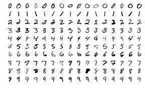
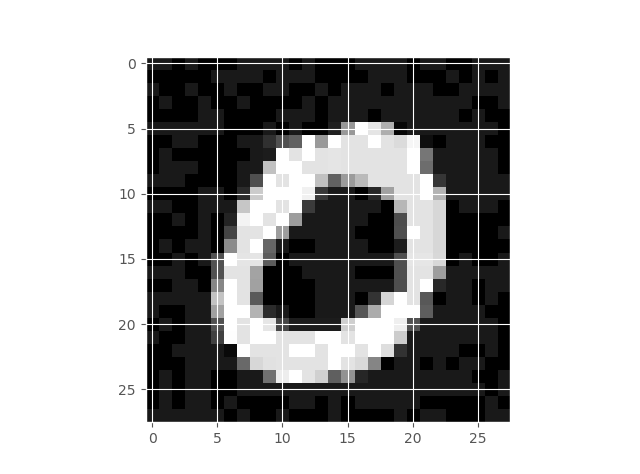
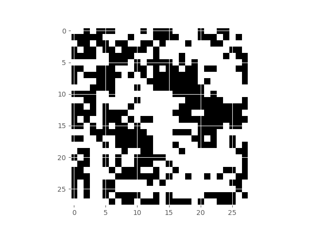
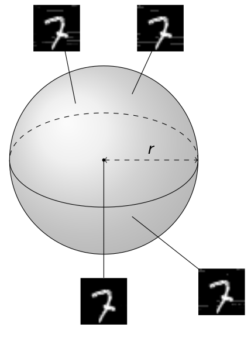

<!-- THIS FILE IS AUTOMATICALLY GENERATED, DO NOT EDIT IT -->

# Introduction

With contributions by

- Matthew Daggitt
- Wen Kokke
- Ekaterina Komendantskaya
- Bob Atkey
- Luca Arnaboldi
- Natalia Slusarz
- Marco Casadio
- Ben Coke
- Jeonghyeon Lee

## What is Neural Network Verification?

Neural networks are widely used in the field of machine learning; and
are often embedded as *pattern-recognition* or *signal processing*
components into complex software. Below we see a schematic depiction of
a neural network trained to classify hand-written digits: 

The image is represented as a vector of real numbers, each vector
element standing for a pixel value. Each arrow in the picture bears a
*weight* that is used to multiply the input signal; each neuron computes
the sum of its inputs.

In some scenarios, it becomes important to establish formal guarantees
about neural network behaviour. One of the first known attempts to
verify neural networks, by (Pulina and Tacchella 2010), was based on
abstract interpretation. The famous paper by Szegedy (Szegedy et al.
2013) that highlighted the problem of neural network vulnerability to
small-norm input perturbations (“adversarial attacks”) gave additional
impulse to this line of research. In CAV’2017, two papers, by Huang et
al (Huang et al. 2017) and Katz et al. (Katz et al. 2017), on neural
network verification appeared and both used specialised forms of
SMT-solving. The later gave rise to Marabou (Katz et al. 2019), – a
rapidly developing sound and complete neural network verifer, which we
use in Vehicle.

In 2019, the ERAN verifier by Dingh et al. (Singh et al. 2019) appeared
in POPL, and showed that performance of abstract interpretation methods
compares favourably against those based on SMT solving. However, the
range of properties they handled was limited to proving adversarial
robustness of neural networks; moreover ERAN was incomplete. This line
of research led to many subsequent extensions, e.g. by Muller et al.
(Müller et al. 2022), (Müller et al. 2023) to mention a few.

Mixed Integer Linear Programming (MILP) methods were brought into this
community by Bastani et al. (Bastani et al. 2016), and were further
developed into working tools, e.g. Venus (Botoeva et al. 2020).

Neural network verifier extensions followed two main directions:

- scaling to larger networks (we can mention $\alpha\beta$-Crown (Wang
  et al. 2021) and GCP-Crown (Zhang et al. 2022) as VNN-COMP winners in
  2021 and 2022);

and

- extending from piece-wise linear to non-linear activation functions.
  (An example are sigmoid neurons handled by Verisig using interval
  arithmetic (Ivanov et al. 2019).)

At the time of writing, there exist over a hundred verifiers for neural
networks. Several papers and monographs are dedicated to the survey of
the landscape Huang et al. (2020). The community established the
specification standards [VNNLib](https://www.vnnlib.org/), common
benchmarks and annual competitions. Vehicle compiles down to the VNNLib
standard, with a view to be compatible with the growing family of
verifiers.

Formally, a neural network is a function $N : R^m \rightarrow R^n$.
Verification of such functions most commonly boils down to specifying
admissible intervals for the function’s output given an interval for its
inputs. For example, one can specify a set of inputs to belong to an
$\epsilon$- neighborhood of some given input $\mathbf{x}$, and verify
that for such inputs, the outputs of $N$ will be in $\delta$ distance to
$N(\mathbf{x})$. This property is often called $\epsilon$*-ball
robustness* (or just *robustness*), as it proves the network’s output is
robust (does not change drastically) in the neighborhood of certain
inputs.

Seen as functions, neural networks have particular features that play an
important role in their verification:

- these functions are not written manually, but generated (or *fitted*)
  to model the unknown data distribution;
- the “data” may be big, and require large neural networks;
- we often attribute very little semantic meaning to the resulting
  function.

## Challenges in Neural Network Verification

There are several research challenges in the area of neural network
verification:

1.  *Theory: finding appropriate verification properties.* The scope of
    neural network properties available in the literature is limited.
    Robustness is the most popular general property to date (Casadio et
    al. 2021), and others include mostly domain-specific properties,
    such as ACAS Xu Benchmark (Katz et al. 2017), which we will consider
    shortly in this tutorial. What neural network properties we want and
    can realistically verify still stands as a big research question.

2.  *Solvers: undecidability of non-linear real arithmetic and
    scalability of neural network verifiers.* On the solver side,
    undecidability of non-linear real arithmetic (Akbarpour and
    Paulson 2009) and scalability of neural network verifiers
    \[wang2021beta\] stand as two main challenges.

3.  *Machine Learning: understanding and integrating property-driven
    training.* In all realistic scenarios, even accurate neural networks
    require extra “property-driven training” in order to comply with
    verification properties in question. This requires new methods of
    integrating training with verification. Several approaches exist,
    including the recently introduced method of *“differentiable
    logics”* that translate logical properties into loss functions. But
    they all have pitfalls, see (Slusarz et al. 2023) for a discussion.

4.  *Programming: finding the right languages to support these
    developments* Many existing solvers have low-level syntax that is
    hard to understand, making maintenance of the specification
    difficult. There is very little programming infrastructure to
    interface verification and property-driven training. Furthermore,
    the available language infrastructure only allows specifications to
    be written in terms of the input space, whereas one often needs to
    reason about neural network behavior in terms of the problem space.
    This creates an additional *embedding gap* on verification side, – a
    problem that eventually needs to be resolved.

5.  *Complex systems: integration of neural net verification into
    complex systems.* Finally, neural networks usually work as
    components of complex systems, and the question of smooth integation
    of existing neural network solvers with other theorem provers
    requires resolution.

This tutorial will focus on problems 3 – 5, and will present Vehicle, a
tool that provides support in alleviating them. In particular, Vehicle
is equipped with a specification language that allows one to express
neural network properties in a high-level, human-readable format (thus
opening the way to reasoning about a wider space of properties, and
reasoning in terms of the problem space). Then it compiles the
specification down into low-level queries and passes them automatically
to existing neural network solvers. If the specification cannot be
verified, Vehicle gives one an option to automatically generate a new
loss function that can be used to train the model to satisfy the stated
property. Once a specification has been verified (possibly after
property-driven re-training), Vehicle allows one to export the proof to
an interactive theorem prover, and reason about the behavior of the
complex system that embeds the machine learning model.

Vehicle programs can be compiled to an unusually broad set of backends,
including:

1)  loss functions for Tensorflow which can be used to guide both
    specification-directed training and gradient-based counter-example
    search.

2)  queries for the Marabou neural network verifier, which can be used
    to formally prove that the network obeys the specification.

3)  Agda specifications, which are tightly coupled to the original
    network and verification result, in order to scalably and
    maintainably construct larger proofs about machine learning-enhanced
    systems.

Currently, Vehicle supports the verifier Marabou, the ITP Agda, and the
ONNX format for neural networks.

## Objectives of this Tutorial

This tutorial will give an introduction to the Vehicle tool
(<https://github.com/vehicle-lang/vehicle>) and its conceptual approach
to modelling specifications for machine learning systems via functional
programming. It will teach the participants to understand the range of
problems that arise in neural network property specification,
verification and training, and will give hands-on experience at solving
these problems at a level of a higher-order specification language with
dependent types.

## Prerequisites

To follow the tutorial, you will need Vehicle, Marabou and Agda
installed in your machine. For instructions, refer to [vehicle
documentation](https://vehicle-lang.readthedocs.io/en/latest/installation.html).
You can also download already trained networks for our examples from the
[tutorial repository](https://github.com/vehicle-lang/vehicle-tutorial).

We recommend using [Visual Studio Code](https://code.visualstudio.com)
with the [Vehicle Syntax
Highlighting](https://marketplace.visualstudio.com/items?itemName=wenkokke.vehicle-syntax-highlighting)
plugin.

# Getting Started with the Vehicle Specification Language

In this chapter we will introduce some basic features of the **Vehicle**
specification language. As an example, we will use the famous *ACAS Xu
verification challenge*, first introduced in 2017 by Guy Katz et al. in
*“Reluplex: An Efficient SMT Solver for Verifying – Deep Neural
Networks” (<https://arxiv.org/pdf/1702.01135.pdf>)* ACAS Xu stands for
*Airborne Collision Avoidance System for unmanned aircraft*. The
objective of the system is to analyse the aircraft’s position and
distance relative to other aircraft and give collision avoidance
instructions.

## Standard Components of a Verification Problem

In the simplest verification scenario, we will need a neural network
$N : R^m \rightarrow R^n$, and a property of the network we wish to
verify. In this case the property can be formulated based on our
understanding of the ACASXu domain.

In particular, the following measurements are of importance:

- $\rho$: feet **measuring the distance to intruder**,
- $\theta, \psi$: radians **measuring angle of intrusion**,
- $v_{own}, v_{vint}$: feet per second - **the speed of both
  aircrafts**,
- $\tau$: seconds - **time until loss of vertical separation**,
- $a_{prev}$: **previous advisory**

as the following picture illustrates: 

$\theta$ and $\psi$ are measured counter clockwise, and are always in
the range $[-\pi, \pi]$.

Based on these inputs, the system should produce one of the following
instructions:

- clear-of-conflict (CoC),
- weak left,
- weak right,
- strong left,
- strong right.

In practice, the domains of $\tau$ and $a_{prev}$ are used to partition
the input space into 45 discrete subspaces. Next a different neural
network is trained to analyse the relation of input and output variables
within each subspace, using previous historic data. Therefore each
individual neural network uses only the first five input variables, and
outputs a score for each of the output instructions. The instruction
with the lowest score is then chosen.

Therefore each pf the 45 ACASXu neural networks have the mathematical
type $N_{AX} : R^5 \rightarrow R^5$. The exact architecture of the
neural networks and their training modes are not important for this
example, and so we will omit the details for now.

The original paper by Guy Katz lists ten properties, but for the sake of
the illustration we will just consider the third property: *If the
intruder is directly ahead and is moving towards the ownship, the score
for COC will not be minimal.*

## Basic Building Blocks in Vehicle

### Types

Unlike many Neural Network verifier input formats, Vehicle is a typed
language, and it is common for each specification file starts with
declaring the types. In the ACAS Xu case, these are the types of vectors
of rational numbers that the network will be taking as inputs and giving
as outputs

``` vehicle
type InputVector = Vector Rat 5
type OutputVector = Vector Rat 5
```

The `Vector` type represents a mathematical vector, or in programming
terms can be thought of as a fixed-length array. One potentially unusual
aspect in Vehicle is that the size of the vector (i.e the number of
items it contains) must be known statically at compile time. This allows
Vehicle to check for the presence of out-of-bounds errors at compile
time rather than run time.

The most general `Vector` type is therefore written as `Vector A n`,
which represents the type of vectors containing `n` elements of type
`A`. For example, in this case `Vector Rat 5` is a vector of length $5$
that contains rational numbers.

**Vehicle** in fact has a comprehensive support for programming with
vectors, which we will see throughout this tutorial. But the interested
reader may go ahead and check the documentation pages for vectors:
<https://vehicle-lang.readthedocs.io/en/stable/language/vectors.html>.

### Networks

Given this, we can declare the network itself:

``` vehicle
@network
acasXu : InputVector -> OutputVector
```

Networks are declared by adding a `@network` annotation to a function
declaration, as shown above. Note that no implementation for the network
is provided directly in the specification, and instead will be provided
later at compile time. However, the name `acasXu` can still be used in
the specification as any other declared function would be. This follows
the **Vehicle** philosophy that specifications should be independent of
any particular network, and should be able to be used to
train/test/verify a range of candidate networks implementations.

### Values

New values can be declared in Vehicle using the following syntax, where
the first line provides the declaration’s type and the bottom line
provides its definition.

``` vehicle
<name> : <type>
<name> = <expr>
```

For example, as we’ll be working with radians, it useful to define a
rational value called `pi`.

``` vehicle
pi : Rat
pi = 3.141592
```

While in many cases, the types provide useful information to the reader,
in general types can be omitted. For example, in this case it is cleaner
to simply write the declaration as:

``` vehicle
pi = 3.141592
```

The Vehicle compiler will then automatically infer the correct `Rat`
type.

### Problem Space versus Input Space

Neural networks nearly always assume some amount of pre-processing of
the input and post-processing of the output. In our ACASXu example, the
neural networks are trained to accept inputs in the range $[0, 1]$ and
outputs are likewise in the range $[0,1]$, i.e. the network does not
work directly with units like $m/s$ or radians, nor the 5 output
instructions used in the description of the problem above. However, the
specifications we write will be much more understandable if we can refer
to values in the original units.

When we encounter such problems, we will say we encountered an instance
of *problem space / input space mismatch*. If we were to reason on input
vectors directly, we would be writing specifications in terms of the
*input space* (i.e. referring to the neural network inputs directly).
However, when reasoning about properties of neural networks, it is much
more convenient to to refer to the original problem. In this case
specifications will be written in terms of the *problem space*. Being
able to write specifications in the problem space (alongside the input
space) is a feature that distinguishes **Vehicle** from majority of the
mainstream neural network verifiers, such as e.g. Marabou, ERAN, or
$\alpha\beta$-Crown. Let us see how this happens in practice.

We start with introducing the full block of code that will normalise
input vectors into the range $[0,1]$, and will explain significant
features of Vehicle syntax featured in the code block afterwards.

For clarity, we define a new type synonym for unnormalised input vectors
in the problem space.

``` vehicle
type UnnormalisedInputVector = Vector Rat 5
```

Next we define the minimum and maximum values that each input can take.
These correspond to the range of the inputs that the network is designed
to work over. Note that these values are in the *problem space*.

``` vehicle
minimumInputValues : UnnormalisedInputVector
minimumInputValues = [0,pi,pi,100,0]

maximumInputValues : UnnormalisedInputVector
maximumInputValues = [60261, pi, pi, 1200, 1200]
```

The above is the first instance of vector definition we encounter. The
type-checker will ensure that all vectors written in this way are of the
correct size (in this case, `5`).

Then we define the mean values that will be used to scale the inputs:

``` vehicle
meanScalingValues : UnnormalisedInputVector
meanScalingValues = [19791.091, 0.0, 0.0, 650.0, 600.0]
```

An alternative method for defining new vectors is to use the `foreach`
constructor, which is used to provide a value for each index `i`. This
method is useful if the vector has some regular structure. For example,
we can now define the normalisation function that takes an unnormalised
input vector and returns the normalised version.

``` vehicle
normalise : UnnormalisedInputVector -> InputVector
normalise x = foreach i .
  (x ! i - meanScalingValues ! i) / (maximumInputValues ! i  - minimumInputValues ! i))
```

Using this we can define a new function that first normalises the input
vector and then applies the neural network:

``` vehicle
normAcasXu : UnnormalisedInputVector -> OutputVector
normAcasXu x = acasXu (normalise x)
```

### Functions

In the above block, we saw function definitions for the first time, so
let us highlight the important features of the **Vehicle** language
concerning functions.

#### Function declarations

Declarations may be used to define new functions. A declaration is of
the form

``` vehicle
<name> : <type>
<name> [<args>] = <expr>
```

Observe how all functions above fit within this declaration scheme.

#### Function types

Functions make up the backbone of the **Vehicle** language. The function
type is written `A -> B` where `A` is the input type and `B` is the
output type. For example, the function `validInput` above takes values
of the (defined) type of `UnnormalisedInputVector` and returns values of
type `Bool`. The function `normalise` has the same input type, but its
output type is `InputVector`, which was defined as a vector of rational
numbers of size $5$.

As is standard in functional languages, the function arrow associates to
the right so `A -> B -> C` is therefore equivalent to `A -> (B -> C)`.

#### Function application and composition

As in most functional languages, function application is written by
juxtaposition of the function with its arguments. For example, given a
function `f` of type `Rat -> Bool -> Rat` and arguments `x` of type
`Rat` and `y` of type `Bool`, the application of `f` to `x` and `y` is
written `f x y` and this expression has type `Bool`. This is unlike
imperative languages such as Python, C or Java where you would write
`f(x,y)`.

Functions of suitable types can be composed. For example, given a
function `acasXu` of type `InputVector -> OutputVector`, a function
`normalise` of type `UnnormalisedInputVector -> InputVector` and an
argument `x` of type `UnnormalisedInputVector` the application of
`acasXu` to the `InputVector` resulting from applying `normalise x` is
written as `acasXu (normalise x)`, and this expression has type
`OutputVector`.

#### Pre-defined functions and predicates

Some functions are pre-defined in **Vehicle**. For example, the above
block uses multiplication `*`, division `/` and vector lookup `!`. We
have also seen the use of a pre-defined “less than or equal to”
predicate `<=` in the definition of the function `validInput` (note its
`Bool` type).

### Quantifying over indices

In the `normalise` declaration we saw the `foreach` construct which
constructs a vector given the definition of the element at each index
`i`. We can use the similar `forall` to quantify over all indices and
return a `Bool` which is `true` if the predicate holds for all indices
and `false` otherwise. For example, having defined the range of minimum
and maximum values, we can define a simple predicate saying whether a
given input vector is in the right range:

``` vehicle
validInput : UnnormalisedInputVector -> Bool
validInput x = forall i . minimumInputValues ! i <= x ! i <= maximumInputValues ! i
```

Equally usefully, we can write a function that takes an output index `i`
and an input `x` and returns true if output `i` has the minimal score,
i.e., neural network outputs instruction `i`.

``` vehicle
minimalScore : Index 5 -> UnnormalisedInputVector -> Bool
minimalScore i x = forall j . i != j => normAcasXu x ! i < normAcasXu x ! j
```

Here implication `=>` is used to denote logical implication, i.e. for
every other output index `j` apart from `i` we want the score of action
`i` to be smaller than the score of action `j`.

### Naming indices

As ACASXu properties refer to certain elements of input and output
vectors, let us give those vector indices some suggestive names. This
will help us to write a more readable code:

``` vehicle
distanceToIntruder = 0   -- measured in metres
angleToIntruder    = 1   -- measured in radians
intruderHeading    = 2   -- measured in radians
speed              = 3   -- measured in metres/second
intruderSpeed      = 4   -- measured in meters/second
```

The fact that all vector types come annotated with their size means that
it is impossible to mess up indexing into vectors, e.g. if you changed
`distanceToIntruder = 0` to `distanceToIntruder = 5` the specification
would fail to type-check as `5` is not a valid index into a `Vector` of
length 5.

Similarly, we define meaningful names for the indices into output
vectors.

``` vehicle
clearOfConflict = 0
weakLeft        = 1
weakRight       = 2
strongLeft      = 3
strongRight     = 4
```

## Property Definition in Vehicle

We now make up for the time invested into learning the **Vehicle**
syntax, as stating a verification property becomes very easy. Let us now
look at the property again:

*If the intruder is directly ahead and is moving towards the ownship,
the score for COC will not be minimal.*

We first need to define what it means to be *directly ahead* and *moving
towards*. The exact ACASXu definition can be written in **Vehicle** as:

``` vehicle
directlyAhead : UnnormalisedInputVector -> Bool
directlyAhead x =
  1500  <= x ! distanceToIntruder <= 1800 and
  -0.06 <= x ! angleToIntruder    <= 0.06

movingTowards : UnnormalisedInputVector -> Bool
movingTowards x =
  x ! intruderHeading >= 3.10  and
  x ! speed           >= 980   and
  x ! intruderSpeed   >= 960
```

Note the reasoning in terms of the “problem space”, i.e. the use of
unnormalised input vectors. We have already encountered the vector
lookup `!` before; but now we have a new predefined comparison function,
`>=`, “greater than or equal to”. The connective `and` is a usual
Boolean connective (note the type of the function is `Bool`).

There is little left to do, and we finish our mini-formalisation with
the property statement:

``` vehicle
@property
property3 : Bool
property3 = forall x .
  validInput x and directlyAhead x and movingTowards x =>
  not (minimalScore clearOfConflict x)
```

To flag that this is the property we want to verify, we use the label
`@property`, we have seen this notation before when we used `@network`
to annotate the neural network declaration. The final new bit of syntax
we have not yet discussed is the quantifier `forall`.

### Infinite quantifiers

One of the main advantages of **Vehicle** is that it can be used to
state and prove specifications that describe the network’s behaviour
over an infinite set of values. We have already seen the `forall`
operator used in the declaration `validInput` – however, there it was
quantifying over a finite number of indices.

The `forall` in the property above is a very different beast as it is
quantifying over an “infinite” number of `Vector Rat 5`s. The definition
of `property1` brings a new variable `x` of type `Vector Rat 5` into
scope. The variable `x` has no assigned value and therefore represents
an arbitrary input of that type.

Vehicle also has a matching quantifer `exists`.

## How to run **Vehicle**

To verify this property, we only need to have:

- a verifier installed (at the moment of writing Vehicle has integration
  with Marabou);
- the actual network or networks that we wish to verify. These need to
  be supplied in an ONNX format, one of the standard formats for
  representing trained neural networks.

Having these suitably installed or located, it only takes one command
line to obtain the result (note the `vcl` file, where we have written
the above specification):

``` vehicle
 vehicle \
  compileAndVerify \
  --specification acasXu.vcl \
  --verifier Marabou \
  --network acasXu:acasXu_1_7.onnx \
  --property property3
```

**Vehicle** passes the network, as well as a translation of our
specification, to Marabou, and we obtain the result – `property3` does
not hold for the given neural network, `acasXu_1_7.onnx`:

``` vehicle
Verifying properties:
  property3 [======================================================] 1/1 queries
    result: ✗ - counterexample found
      x: [1799.9886669999978, 5.6950779776e-2, 3.09999732192, 980.0, 960.0]
```

Furthermore, Vehicle gives us a counter-example in the problem space! In
particular an assignment for the quantified variable `x` that falsifies
the assignment.

## Exercises

### Exercise 1. Your first Vehicle specification

1.  On the tutorial pages, find the ONNX model, `iris_model.onnx`
    trained on the famous Iris data set:
    <https://en.wikipedia.org/wiki/Iris_flower_data_set> Find also the
    data set in the `idx` format (cf. tutorial repository).
2.  Using the Wikipedia page or other sources, examine the data set, and
    try to define a few “obvious properties” that should hold for a
    model that does its classification.
3.  Write those properties as a Vehicle specification, ensure it type
    checks. See the [Vehicle
    Manual](https://vehicle-lang.readthedocs.io/en/stable/) for how to
    run type checking.
4.  Using the Vehicle command line, verify your specification,
    i.e. check whether the properties hold.

# Proving Neural Network Robustness

## Neural Network Robustness as a Verification Property

In this chapter we will learn about the problem that has received
significanrt attention within the machine learning community: *the
problem of robustness of neural networks to out-of-distribution shifts,
also known as “robustness to adversarial attacks”.* The problem was
famously raised by Christian Szegedy and his co-authors in 2013 in the
paper [“Intriguing properties of neural
networks”](https://arxiv.org/pdf/1312.6199.pdf)

So, here is the problem. Suppose we are given a data set $\mathcal{X}$
for classification of images, it consists of pairs
$(\mathbf{x}, \mathbf{y})$, where $\mathbf{x} \in \mathbb{R}^n$ is an
input, and $\mathbf{y} \in \mathbb{R}^m$ is the desired output. It is
assumed that the outputs $\mathbf{y}$ are generated from $\mathbf{x}$ by
some function $\mathcal{H} : \mathbb{R}^n → \mathbb{R}^m$ and that
$\mathbf{x}$ is drawn from some probability distribution over
$\mathbb{R}^n$.

Let us take as an example the famous [MNIST data set by LeCun et
al.](https://www.tensorflow.org/datasets/catalog/mnist) The images look
like this:

<figure>

<figcaption aria-hidden="true">Images from the MNIST data
set</figcaption>
</figure>

As we have already discussed in the previous chapter, a neural network
is a function $f : \mathbb{R}^n → \mathbb{R}^m$ parametrised by a set of
weights $\mathbf{w}$. The goal of training is to use the dataset
$\mathcal{X}$ to find weights $\mathbf{w}$ such that $f$ approximates
$\mathcal{H}$ well over input regions with high probability density.

When we train a neural network to be highly accurate on both the
training and the test sets, we emprically test:

- how well the neural network can in principle approximate $\mathcal{H}$
  (we do this by measuring its accuracy on the training set);
- how well that learnt hypothesis generalises to yet unseen data (we do
  this by measuring the accuracy on the test set).

Coming to our example, if my neural network has a $99$ % accuracy on the
MNIST data set, I should be satisfied that it learnt what a hand-written
digit is. Szegedy et al were the first to show systematically that this
is not the case: take the image on the left (below), which is classified
with high confidence as “0”, apply perturbation on the middle to get the
image on the right, and your neural network will give a $94$ %
confidence that it sees a “5” on the right, even despite the fact that
the image did not change the class (for the human eye):

|           Original MNIST Image           |          Perturbation           | Resulting Perturbed Image          |
|:----------------------------------------:|:-------------------------------:|:-----------------------------------|
|  |  |  |

This experiment can be replicated for any data set and any neural
network, no matter how accurate it is.

The root of the problem is: the image on the right no longer belongs to
the probability distribution that the network has learnt (whether or not
the image looks the same to a human observer). We could phrase it
differently: an ideal probability distribiution $\mathcal{H}$ that is
“learnt” by a “human” accounts not only for the images we obtained as
part of the dataset $\mathcal{X}$, but also involves an implicit
assumption that “semantically” similar images belong to the same class.

The simplest way to capture this implicit assumption is to formulate a
*verification property* that insists that all similar images (images
within an $\epsilon$ distance of each other in $\mathbb{R}^n$) are
classified similarly. This property is often called $\epsilon$-ball
robusness. For every image in the dataset, we assume we can “draw” a
small $\epsilon$-ball around it, and guarantee that within that
$\epsilon$-ball classification of the network does not change much (the
ball’s radius below is given by the chosen $\epsilon$):

|     $\epsilon$-ball around a number “7” in MNIST     |
|:----------------------------------------------------:|
|  |

Formally, we define an $\epsilon$-ball around an image
$\hat{\mathbf{x}}$ as:

$$\mathbb{B}(\hat{\mathbf{x}}, \epsilon) = [  \mathbf{x} \in \mathbb{R}^n: |\hat{\mathbf{x}}-\mathbf{x}| \leq \epsilon ]$$

where $| ... |$ is a distance function (or $L$-norm) in $\mathbb{R}^n$,
such as Euclidean distance or $L_{\infty}$-norm.

It now remains to define the property “classification of $f$ does not
change much”. The paper by [Casadio et
al.](https://arxiv.org/abs/2104.01396) summarises a few options for this
definition. The simplest is the *Classification Robustness* that
requires that all images within any given $\epsilon$-ball are classified
as the same class. We will consider this property in detail, and will
take a few other properties from Casadio et al. as an exercise.

## Formalising $\epsilon$-ball robustness for MNIST networks in Vehicle

We note that $\epsilon$-ball robustness as a verification property bears
some similarity to the ACAS Xu example that we have already covered in
Chapter 1. In particular, both verification properties impose
constraints on the output regions of the neural networks, assuming some
constraint on their input regions. (Both problems are therefore amenable
to a range of interval propagation and abstract interpretation methods,
see [this survey](https://arxiv.org/abs/1812.08342) for further
details.) From the point of view of the property specification, which is
our main concern here, there are three main differences between these
two examples:

- ACAS Xu did not have to refer to a dataset $\mathcal{X}$;
  $\epsilon$-ball robustness, however, is formulated relative to the
  images given in the data set. We will see how Vehicle can be used to
  handle properties that refer directly to the data sets.

- MNIST, as many other data sets used in Computer Vision, has images
  represented as 2D arrays. Such data sets often require Convolutional
  Neural Networks (NN) that are best desgned to deal with 2D and 3D
  data. In terms of property specification, we will see Vehicle’s
  support for 2D arrays, which comes for free with its general type
  infrastructure.

- Finally, the MNIST specification involves two parameters that we may
  want to pass or infer at the compilation time rather than hard-code
  within the spec. These are the $\epsilon$ and the number of data
  points ($\epsilon$-balls) we wish to check (the number is at most the
  size of the entire data set). We will see how such parameters are
  defined and used in Vehicle.

### 2D Arrays in Vehicle

Starting a specification for MNIST data set follows the same pattern as
we have seen in Chapter 1, only this time we declare inputs as 2D
arrays:

``` vehicle
type Image = Tensor Rat [28, 28]
type Label = Index 10
```

As before, we define valid inputs, this time making a mild adaptation to
2D arrays and assuming all pixel values are normalised between 0 and 1:

``` vehicle
validImage : Image -> Bool
validImage x = forall i j . 0 <= x ! i ! j <= 1
```

The output of the network is a score for each of the digits 0 to 9.

``` vehicle
@network
classifier : Image -> Vector Rat 10
```

We note again the use of the syntax for `@network`, marking the place
where Vehicle interacts with an external tool (this time most likely
with Python Tensorflow).

The classifier advises that input image `x` has label `i` if the score
for label `i` is greater than the score of any other label `j`:

``` vehicle
advises : Image -> Label -> Bool
advises x i = forall j . j != i => classifier x ! i > classifier x ! j
```

This completes the basic description if the data set and the model
architecture in Vehicle. We are ready to define verification properties.

### Definition of Robustness Around a Point

First we define the parameter `epsilon` that will represent the radius
of the balls that we verify. Note that we declare this as a parameter
which allows the value of `epsilon` to be specified at compile time
rather than be fixed in the specification. We again use the syntax `@`
to communicate this information externally:

``` vehicle
@parameter
epsilon : Rat
```

Next we define what it means for an image `x` to be in a ball of size
epsilon. The definition below uses the $L_{\infty}$ norm, defined as:

$$|\mathbf{x}|_{\infty} = max (\mathbf{x})$$

where $max (\mathbf{x})$ computes the maximum element of $\mathbf{x}$.
Below, we shortcut a bit the calculation of $|\mathbf{x}|_{\infty}$
being bounded by $\epsilon$ and simply require that all vector elements
are bounded by $\epsilon$:

``` vehicle
boundedByEpsilon : Image -> Bool
boundedByEpsilon x = forall i j . -epsilon <= x ! i ! j <= epsilon
```

Using the Eucledian distance would require a slightly more complicated
definition, which we will do as an exercise.

We now define what it means for the network to be robust around an image
`x` that should be classified as `y`. Namely, we define that for any
perturbation no greater than $\epsilon$, if the perturbed image is still
a valid image then the network should still advise label `y` for the
perturbed version of `x`.

``` vehicle
robustAround : Image -> Label -> Bool
robustAround image label = forall pertubation .
  let perturbedImage = image - pertubation in
  boundedByEpsilon pertubation and validImage perturbedImage =>
    advises perturbedImage label
```

Again, note the use of a quantifier `forall` that ranges over an
infinite domain of images of type `Image`.

## Definition of Robustness with Respect to a Dataset

We first specify parameter `n` , which stands for the size of the
training dataset. Unlike the earlier parameter `epsilon`, we set the
`infer` option of the parameter `n` to ‘True’. This means that it does
not need to be provided manually but instead will be automatically
inferred by the compiler. In this case it will be inferred from the
training datasets.

``` vehicle
@parameter(infer=True)
n : Nat
```

We next declare two datasets, the training images and the corresponding
training labels. Note that we use the previously declared parameter `n`
to enforce that they are of the same size:

``` vehicle
@dataset
trainingImages : Vector Image n

@dataset
trainingLabels : Vector Label n
```

Again we note the use of syntax that involves `@` flagging Vehicle’s
connection with an external tool or object – in this case, the data set
is defined externally.

We then say that the network is robust *for this data set* if it is
robust around every pair of input images and output labels. Note once
again the use of the `foreach` keyword when quantifying over the index
`i` in the dataset. Whereas `forall` would return a single `Bool`,
`foreach` constructs a `Vector` of booleans, ensuring that Vehicle will
report on the verification status of each image in the dataset
separately. If `forall` was omitted, Vehicle would only report if the
network was robust around *every* image in the dataset, a state of
affairs which is unlikely to be true.

``` vehicle
@property
robust : Vector Bool n
robust = foreach i . robustAround (trainingImages ! i) (trainingLabels ! i)
```

## Running the Verification Query

In order to run Vehicle, we need to provide:

- the specification file,
- the network in ONNX format,
- the data in idx format,
- and the desired $\epsilon$ value.

The tutorial files contain two Python scripts that show how to convert
Tensorflow Neural Networks into *ONNX* format; and images – into `.idx`
files. These are the formats expected by Vehicle. You can use the ones
we provide, or generate your own. Having obtained these, the following
command line will take care of verification of the network
`mnist-classifier.onnx`, for data sets `images.idx` and `labels.idx` and
$\epsilon = 0.005$:

``` vehicle
vehicle verify \
  --specification examples/mnist-robustness/mnist-robustness.vcl \
  --network classifier:examples/mnist-robustness/mnist-classifier.onnx \
  --parameter epsilon:0.005 \
  --dataset trainingImages:examples/mnist-robustness/images.idx \
  --dataset trainingLabels:examples/mnist-robustness/labels.idx \
  --verifier Marabou
```

For the first two images in your data set, the output will look as
follows:

``` vehicle
Verifying properties:
  robust [================================================] 9/9 queries complete
  robust [================================================] 9/9 queries complete
Result: true
  robust: 2/2 verified
    ✓ robust!0

    ✓ robust!1
```

The reader may have guessed at this pont that, as we make $\epsilon$
larger, fewer and fewer examples will staisfy the property. Chapter 3
will look into methods that can be used to train networks to satisfy
robustness for larger $\epsilon$.

## Exercises

### Exercise 1: Standard Robustness in Vehicle

Define and verify in Vehicle the propety of *Standard Robustness*, that
requires, for all $\mathbf{x}$ in the $\epsilon$-ball of
$\hat{\mathbf{x}}$, that
$|f(\hat{\mathbf{x}}) - f(\mathbf{x})| \leq \delta$, for some small
$\delta$. We now assemble the desired *standard robustness* property
definition:

Given an $\hat{\mathbf{x}} \in \mathcal{X}$,

$$
\forall \mathbf{x}. |\hat{\mathbf{x}}-\mathbf{x}| \leq \epsilon  \Longrightarrow |f(\hat{\mathbf{x}}) -  f(\mathbf{x})| \leq \delta
$$

We refer the interested reader for a more detailed discussion of
different robustness properties in:

- Marco Casadio, Ekaterina Komendantskaya, Matthew L. Daggitt, Wen
  Kokke, Guy Katz, Guy Amir, Idan Refaeli: Neural Network Robustness as
  a Verification Property: A Principled Case Study. CAV (1) 2022:
  219-231.

- Xiaowei Huang, Daniel Kroening, Wenjie Ruan, James Sharp, Youcheng
  Sun, Emese Thamo, Min Wu, Xinping Yi. A Survey of Safety and
  Trustworthiness of Deep Neural Networks: Verification, Testing,
  Adversarial Attack and Defence, and Interpretability. J. of Computer
  Science Review, 2018.

### Exercise 2: Explore Other Definitions of Robustness

Use Vehicle to define other forms of Robustness property from Casadio et
al.

### Exercise 3: Other Distances in Vehicle

Re-define the *classification* and *standard robustness* properties by
using some different notion of distance, e.g. the Euclidean distance,
instead of the $L_{\infty}$ norm.

### Exercise 4: Conduct a complete “training - verification” experiment from start to finish

Download the [Fashion MNIST data
set](https://www.tensorflow.org/datasets/catalog/fashion_mnist), train
the model, generate `onnx` and `idx` files, define the spec and verify
its robustness.

# Property-Driven Training

## Motivation and Problem Statement

We finished the last chapter with a conjecture concerning diminishing
robustness verification success with increasing values of $\epsilon$.
Let us now see, using a concrete example, how soon the success rate
declines.

The last exercise of the previous chapter gave us a property
specification for robustness of \`\`Fashion MNIST” models. We propose
now to look into the statistics of verifying one of such models on 500
examples from the data set. To obtain quicker verification times, let us
use a Fashion MNIST model with one input layer of $32$ neurons, and one
output layer of $10$ neurons (the tutorial files contain the model if
you wish to check it). Running Vehicle, we obtain the following success
rates:

| $\epsilon = 0.01$ | $\epsilon = 0.05$ | $\epsilon = 0.1$ | $\epsilon = 0.5$ |
|:-----------------:|:-----------------:|:----------------:|:-----------------|
| 82.6 % (413/500)  | 29.8 % (149/500)  |  3.8 % (19/500)  | 0 % (0/500)      |

As we see in the table, verifiability of the property deteriorates
quickly with growing $\epsilon$. Yet, for majority of practical
applications, it is desirable to have a larger $\epsilon$, as this
increases the chance that new yet unseen data points will fall within
the verified subspaces of the input vector space.

Can we re-train the neural network to be more robust within a desirable
$\epsilon$? The long tradition of robustifying neural networks in
machine learning has a few methods ready, for example, to re-train the
networks with new data set that was augmented with images within the
desired $\epsilon$-balls, or to generate adversarial examples (sample
images closest to the decision boundary) within the given
$\epsilon$-balls. We once again refer the reader to

- Marco Casadio, Ekaterina Komendantskaya, Matthew L. Daggitt, Wen
  Kokke, Guy Katz, Guy Amir, Idan Refaeli: Neural Network Robustness as
  a Verification Property: A Principled Case Study. CAV (1) 2022:
  219-231.

for further discussion of these various methods.

In this tutorial, however, our interest is in *specification-driven*
neural network verification. Our interest is thus in generating suitable
loss functions directly from specifications. Crucially, this will allow
us to work with arbitrary properties of neural networks, not only
robustness.

Traditionally, translations from a given logical syntax to a loss
function are known as “differentiable logics”, or DLs. One of the first
attempts to translate propositional logic specifications to loss
functions was given in (**Xu?** et al. 2018):

- Jingyi Xu, Zilu Zhang, Tal Friedman, Yitao Liang, and Guy Van den
  Broeck. 2018. A Semantic Loss Function for Deep Learning with Symbolic
  Knowledge. In Proceedings of the 35th International Conference on
  Machine Learning, ICML 2018, Stockholmsmässan, Stockholm, Sweden, July
  10-15, 2018 (Proceedings of Machine Learning Research, Vol. 80),
  Jennifer G. Dy and Andreas Krause (Eds.). PMLR, 5498–5507.
  <http://proceedings.mlr.press/v80/xu18h.html>

and was generalised to a fragment of first-order logic in (**Fischer?**
et al. 2019):

- Marc Fischer, Mislav Balunovic, Dana Drachsler-Cohen, Timon Gehr, Ce
  Zhang, and Martin T. Vechev. 2019. DL2: Training and Querying Neural
  Networks with Logic. In Proceedings of the 36th International
  Conference on Machine Learning, ICML 2019, 9-15 June 2019, Long Beach,
  California, USA (Proceedings of Machine Learning Research, Vol. 97),
  Kamalika Chaudhuri and Ruslan Salakhutdinov (Eds.). PMLR, 1931–1941.
  <http://proceedings.mlr.press/v97/fischer19a.html>

Later, this work was complemented by giving a fuzzy interpretation to DL
by (**van?** Krieken et al. 2022):

- Emile van Krieken, Erman Acar, and Frank van Harmelen. 2022. Analyzing
  Differentiable Fuzzy Logic Operators. Artif. Intell. 302
  (2022), 103602. <https://doi.org/10.1016/j.artint.2021.103602>

Slusarz et al. \[2023\] proposed generalisation for the syntax and
semantics of DL, with a view of encoding all previously presented DLs in
one formal system, and comparing their theoretical properties:

- Natalia Slusarz, Ekaterina Komendantskaya, Matthew L. Daggitt,
  Robert J. Stewart, and Kathrin Stark. 2023. Logic of Differentiable
  Logics: Towards a Uniform Semantics of DL. In LPAR-24: The
  International Conference on Logic for Programming, Artificial
  Intelligence and Reasoning.

Following this work, Vehicle contains translation to several loss
functions available in the literature.

# References

<div id="refs" class="references csl-bib-body hanging-indent">

<div id="ref-Akbarpour2009" class="csl-entry">

Akbarpour, Behzad, and Lawrence Charles Paulson. 2009. “MetiTarski: An
Automatic Theorem Prover for Real-Valued Special Functions.” *Journal of
Automated Reasoning* 44 (3): 175–205.

</div>

<div id="ref-PGL-051" class="csl-entry">

Albarghouthi, Aws. 2021. “Introduction to Neural Network Verification.”
*Foundations and Trends® in Programming Languages* 7 (1–2): 1–157.
<https://doi.org/10.1561/2500000051>.

</div>

<div id="ref-BastaniILVNC16" class="csl-entry">

Bastani, Osbert, Yani Ioannou, Leonidas Lampropoulos, Dimitrios
Vytiniotis, Aditya V. Nori, and Antonio Criminisi. 2016. “Measuring
Neural Net Robustness with Constraints.” In *Advances in Neural
Information Processing Systems 29: Annual Conference on Neural
Information Processing Systems 2016, December 5-10, 2016, Barcelona,
Spain*, edited by Daniel D. Lee, Masashi Sugiyama, Ulrike von Luxburg,
Isabelle Guyon, and Roman Garnett, 2613–21.
<https://proceedings.neurips.cc/paper/2016/hash/980ecd059122ce2e50136bda65c25e07-Abstract.html>.

</div>

<div id="ref-BotoevaKKLM20" class="csl-entry">

Botoeva, Elena, Panagiotis Kouvaros, Jan Kronqvist, Alessio Lomuscio,
and Ruth Misener. 2020. “Efficient Verification of ReLU-Based Neural
Networks via Dependency Analysis.” In *The Thirty-Fourth AAAI Conference
on Artificial Intelligence, AAAI 2020, the Thirty-Second Innovative
Applications of Artificial Intelligence Conference, IAAI 2020, the Tenth
AAAI Symposium on Educational Advances in Artificial Intelligence, EAAI
2020, New York, NY, USA, February 7-12, 2020*, 3291–99. AAAI Press.
<https://ojs.aaai.org/index.php/AAAI/article/view/5729>.

</div>

<div id="ref-casadio2021property" class="csl-entry">

Casadio, Marco, Matthew L. Daggitt, Ekaterina Komendantskaya, Wen Kokke,
Daniel Kienitz, and Rob Stewart. 2021. “Property-Driven Training: All
You (n) Ever Wanted to Know About.” *arXiv Preprint arXiv:2104.01396*.

</div>

<div id="ref-HuangKRSSTWY20" class="csl-entry">

Huang, Xiaowei, Daniel Kroening, Wenjie Ruan, James Sharp, Youcheng Sun,
Emese Thamo, Min Wu, and Xinping Yi. 2020. “A Survey of Safety and
Trustworthiness of Deep Neural Networks: Verification, Testing,
Adversarial Attack and Defence, and Interpretability.” *Comput. Sci.
Rev.* 37: 100270. <https://doi.org/10.1016/j.cosrev.2020.100270>.

</div>

<div id="ref-HuangKWW17" class="csl-entry">

Huang, Xiaowei, Marta Kwiatkowska, Sen Wang, and Min Wu. 2017. “Safety
Verification of Deep Neural Networks.” In *Computer Aided Verification -
29th International Conference, CAV 2017, Heidelberg, Germany, July
24-28, 2017, Proceedings, Part I*, edited by Rupak Majumdar and Viktor
Kuncak, 10426:3–29. Lecture Notes in Computer Science. Springer.
[https://doi.org/10.1007/978-3-319-63387-9\\1](https://doi.org/10.1007/978-3-319-63387-9\_1).

</div>

<div id="ref-IvanovWAPL19" class="csl-entry">

Ivanov, Radoslav, James Weimer, Rajeev Alur, George J. Pappas, and Insup
Lee. 2019. “Verisig: Verifying Safety Properties of Hybrid Systems with
Neural Network Controllers.” In *Proceedings of the 22nd ACM
International Conference on Hybrid Systems: Computation and Control,
HSCC 2019, Montreal, QC, Canada, April 16-18, 2019*, edited by Necmiye
Ozay and Pavithra Prabhakar, 169–78. ACM.
<https://doi.org/10.1145/3302504.3311806>.

</div>

<div id="ref-katz2017reluplex" class="csl-entry">

Katz, Guy, Clark Barrett, David L Dill, Kyle Julian, and Mykel J
Kochenderfer. 2017. “Reluplex: An Efficient SMT Solver for Verifying
Deep Neural Networks.” In *International Conference on Computer Aided
Verification*, 97–117. Springer.

</div>

<div id="ref-katz2019marabou" class="csl-entry">

Katz, Guy, Derek A Huang, Duligur Ibeling, Kyle Julian, Christopher
Lazarus, Rachel Lim, Parth Shah, et al. 2019. “The Marabou Framework for
Verification and Analysis of Deep Neural Networks.” In *International
Conference on Computer Aided Verification*, 443–52. Springer.

</div>

<div id="ref-LiuALSBK21" class="csl-entry">

Liu, Changliu, Tomer Arnon, Christopher Lazarus, Christopher A. Strong,
Clark W. Barrett, and Mykel J. Kochenderfer. 2021. “Algorithms for
Verifying Deep Neural Networks.” *Found. Trends Optim.* 4 (3-4):
244–404. <https://doi.org/10.1561/2400000035>.

</div>

<div id="ref-mueller2023abstract" class="csl-entry">

Müller, Mark Niklas, Marc Fischer, Robin Staab, and Martin T. Vechev.
2023. “Abstract Interpretation of Fixpoint Iterators with Applications
to Neural Networks.” In *PLDI ’23: 44nd ACM SIGPLAN International
Conference on Programming Language Design and Implementation, Orlando,
Florida, United States June 17-21, 2023*. ACM.
<https://doi.org/10.1145/3591252>.

</div>

<div id="ref-muller2022prima" class="csl-entry">

Müller, Mark Niklas, Gleb Makarchuk, Gagandeep Singh, Markus Püschel,
and Martin Vechev. 2022. “PRIMA: General and Precise Neural Network
Certification via Scalable Convex Hull Approximations.” *Proceedings of
the ACM on Programming Languages* 6 (POPL): 1–33.

</div>

<div id="ref-PT10" class="csl-entry">

Pulina, Luca, and Armando Tacchella. 2010. “An Abstraction-Refinement
Approach to Verification of Artificial Neural Networks.” In *Computer
Aided Verification (CAV’23)*, edited by Tayssir Touili, Byron Cook, and
Paul Jackson, 243–57. Berlin, Heidelberg: Springer Berlin Heidelberg.

</div>

<div id="ref-singh2019abstract" class="csl-entry">

Singh, Gagandeep, Timon Gehr, Markus Püschel, and Martin Vechev. 2019.
“An Abstract Domain for Certifying Neural Networks.” *Proceedings of the
ACM on Programming Languages* 3 (POPL): 1–30.

</div>

<div id="ref-SKDSS23" class="csl-entry">

Slusarz, Natalia, Ekaterina Komendantskaya, Matthew L. Daggitt, Robert
J. Stewart, and Kathrin Stark. 2023. “Logic of Differentiable Logics:
Towards a Uniform Semantics of DL.” In *LPAR-24: The International
Conference on Logic for Programming, Artificial Intelligence and
Reasoning*.

</div>

<div id="ref-szegedy2013intriguing" class="csl-entry">

Szegedy, Christian, Wojciech Zaremba, Ilya Sutskever, Joan Bruna,
Dumitru Erhan, Ian Goodfellow, and Rob Fergus. 2013. “Intriguing
Properties of Neural Networks.” In *International Conference on Learning
Representations*. <http://arxiv.org/abs/1312.6199>.

</div>

<div id="ref-wang2021beta" class="csl-entry">

Wang, Shiqi, Huan Zhang, Kaidi Xu, Xue Lin, Suman Jana, Cho-Jui Hsieh,
and J Zico Kolter. 2021. “Beta-CROWN: Efficient Bound Propagation with
Per-Neuron Split Constraints for Complete and Incomplete Neural Network
Verification.” *Advances in Neural Information Processing Systems* 34.

</div>

<div id="ref-zhang2022general" class="csl-entry">

Zhang, Huan, Shiqi Wang, Kaidi Xu, Linyi Li, Bo Li, Suman Jana, Cho-Jui
Hsieh, and J Zico Kolter. 2022. “General Cutting Planes for
Bound-Propagation-Based Neural Network Verification.” *Advances in
Neural Information Processing Systems*.

</div>

</div>
