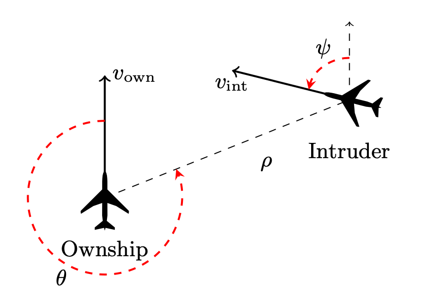

<!-- THIS FILE IS AUTOMATICALLY GENERATED, DO NOT EDIT IT -->

# A Vehicle Tutorial

## Outline

0.  Introduction and Motivation for Vehicle

1.  A simple semantically meaningful example.

    - Maybe hierarchical classification? e.g. In this dogs dataset it
      shouldn’t confuse an Afghan hound and a Border terrier.
    - Introduce basic syntax and properties.

2.  A more complicated semantically meaningful example

    - e.g. AcasXu
    - Introduces building and reusing functions.

3.  Less semantically meaningful

    - e.g. MNIST robustness
    - Introduces concepts of datasets, parameters etc.

4.  Semantically meaningful + integration with Agda.

    - Braking example?
    - Vehicle controller?

## 0. Introduction and Motivation

### What is Neural Network Verification about?

Neural networks are widely used in the field of machine learning; and
are often embedded as *pattern-recognition* or *signal processing*
components into complex software. Below we see a schematic depiction of
a neural network trained to classify hand-written digits: 

The image is represented as a vector of real numbers, each vector
element standing for a pixel value. Each arrow in the picture bears a
*weight* that is used to multiply the input signal; each neuron computes
the sum of its inputs.

In some scenarious, it becomes important to establish formal guarantees
about neural network behaviour. Following the pioneering work of (Katz
et al. 2017, Singh2019, Wang2021) neural network verification has become
an active research area.

Formally, a neural network is a function $N : R^m \rightarrow R^n$.
Verification of such functions most commonly boils down to specifying
admissible intervals for the function’s output given an interval for its
inputs. For example, one can specify a set of inputs to belong to an
$\epsilon$- neighborhood of some given input $\mathbf{x}$, and verify
that for such inputs, the outputs of $N$ will be in $\delta$ distance to
$N(\mathbf{x})$. This property is often called $\epsilon$*-ball
robustness* (or just *robustness*), as it proves the network’s output is
robust (does not change drastically) in the neighborhood of certain
inputs.

Seen as functions, neural networks have particular features that play an
important role in their verification: - these functions are not written
manually, but generated (or *fitted*) to model the unknown data
distribution; - the “data” may be big, and require large neural
networks; - we often attribute very little semantic meaning to the
resulting function.

### Challenges in Neural Network Verification

There are several research challenges in the area of neural network
verification: 1. On the solver side, undecidability of non-linear real
arithmetic (**Akbarpour2009?**) and scalability of neural network
verifiers (**Wang2021?**) stand as two main challenges. 2. In all
realistic scenarious, even accurate neural networks require extra
“property-driven training” in order to comply with verification
properties in question. This calls for new methods of integrating
training with verification. 3. The scope of neural network properties
available in the literature is limited. Robustness is the most popular
general property to date (Casadio et al. 2021), and others include
mostly domain-specific properties, such as ACAS Xu Benchmark (Katz et
al. 2017), which we will consider shortly in this tutorial. 4. The
available language inrastructure (e.g. the existing neural network
solvers) encourage property specifications in terms of the input space,
whereas one often needs to reason about neural network behavior in terms
of the problem space. 5. Finally, neural networks usually work as
components of complex systems, and the question of smooth integation of
existing neural network solvers with other theorem provers requires
resolution.

This tutorial will focus on problems 2 – 5, and will present the tool
Vehicle that provides support in alleviating them. In particular,
Vehicle provides a specification language that allows one to express
neural network properties in a high-level, human-readable format (thus
opening the way to reasoning about a wider space of properties, and
reasoning in terms of the problem space). Then it compiles the
specification down into low-level queries and passes them automatically
to existing neural network solvers. If the specification cannot be
verified, Vehicle gives one an option to automatically generate a new
loss function that can be used to train the model to satisfy the stated
property. Once a specification has been verified (possibly after
property-driven re-training), Vehicle allows one to export the proof to
an interactive theorem prover, and reason about the behavior of the
complex system that embeds the machine learning model.

Vehicle programs can be compiled to an unusually broad set of backends,
including:

1)  loss functions for Tensorflow which can be used to guide both
    specification-directed training and gradient-based counter-example
    search.

2)  queries for the Marabou neural network verifier, which can be used
    to formally prove that the network obeys the specification.

3)  Agda specifications, which are tightly coupled to the original
    network and verification result, in order to scalably and
    maintainably construct larger proofs about machine learning-enhanced
    systems.

Currently, Vehicle supports the verifier Marabou, the ITP Agda, and the
ONNX format for neural networks.

### Objectives of this Tutorial

This tutorial will give an introduction to the Vehicle tool
(https://github.com/vehicle-lang/vehicle) and its conceptual approach to
modelling specifications for machine learning systems via functional
programming. It will teach the participants to understand the range of
problems that arise in neural network property specification,
verification and training, and will give a hands-on experience on
solving these problems at a level of a higher-order specification
language with dependent types.

### Prerequisites

To follow the tutorial, you will need Vehicle, Marabou and Agda
installed in your machine. For instructions, refer to [vehicle
documentation](https://vehicle-lang.readthedocs.io/en/latest/installation.html).
You can also download already trained networks for our examples from
\[link to tutorial repo\].

(Recommendation to use vsc with vcl syntax highlighting)

### Related work

- Behzad Akbarpour and Lawrence C. Paulson. MetiTarski: An automatic
  theorem prover for real valued special functions. Journal of Automated
  Reasoning 44(3), 175–205, 2009.
- Marco Casadio, Ekaterina Komendantskaya, Matthew L. Daggitt, Wen
  Kokke, Guy Katz, Guy Amir, and Idan Refaeli. Neural network robustness
  as a verification property: A principled case study. In Computer Aided
  Verification (CAV 2022), Lecture Notes in Computer Science. Springer,
  2022.
- Guy Katz, Clarke Barrett, D. Dill, K. Julian, and M. Kochenderfer.
  Reluplex: An Efficient SMT Solver for Verifying Deep Neural Networks.
  In CAV, 2017.
- Gagandeep Singh, Timon Gehr, Markus Püschel, and Martin T. Vechev. An
  abstract domain for certifying neural networks. Proc. ACM Program.
  Lang., 3(POPL):41:1–41:30, 2019.
- Shiqi Wang, Huan Zhang, Kaidi Xu, Xue Lin, Suman Jana, Cho-Jui Hsieh,
  and J. Zico Kolter. Beta-crown: Efficient bound propagation with
  per-neuron split constraints for neu- ral network robustness
  verification. In Marc’Aurelio Ranzato, Alina Beygelzimer, Yann N.
  Dauphin, Percy Liang, and Jennifer Wortman Vaughan, editors, Advances
  in Neural In- formation Processing Systems 34: Annual Conference on
  Neural Information Processing Systems 2021, NeurIPS 2021, December
  6-14, 2021, virtual, pages 29909–29921, 2021.

## Vehicle Preliminaries

- introduction of dataset and models
- introduction of basic syntax
- describe a property in words
- example with NN?
- example of property not holding
- fix in vehicle!

## Chapter 1. Getting Started: the Vehicle’s Language

In this chapter we will introduce some basic features of **Vehicle** as
a programming language. We will use the famous *ACAS Xu verification
challenge*, first introduced in 2017 by Guy Katz et al. in *“Reluplex:
An Efficient SMT Solver for Verifying – Deep Neural Networks”
(<https://arxiv.org/pdf/1702.01135.pdf>)*

### Standard Components of a Verification Problem

In the simplest verification scenario, we will need a neural network
$N : R^m \rightarrow R^n$, and a property of the network we wish to
verify. Often, though not always, such property can be formulated based
on our understanding of the domain where the neural network is used.
ACAS Xu stands for *Airborne Collision Avoidance System for unmanned
aircraft*. The objective is to analyse the airctaft’s position and
distance relative to other airctafts and give collision avoidance
instructions.

In particular, the following measurements are of importance:

- $\rho$: feet **measuring the distance to intruder**,
- $\theta, \psi$: radians **measuring angle of intrusion**,
- $v_{own}, v_{vint}$: feet per second - **the speed of both
  aircrafts**,
- $\tau$: seconds - **time until loss of vertical separation**

as the following picture illustrates: 

$\theta$ and $\psi$ are measured counter clockwise, and are always in
the range $[−\pi, \pi]$.

Based on this data the neural network is to issue one of the following
instructions:

- Clear-of-Conflict (CoC),
- weak left,
- weak right,
- strong left,
- strong right.

Given six input parameters, and five instructions, a neural network
$N_{AX} : R^6 \rightarrow R^5$ is trained, given the previous historic
data. The exact architecture of the neural network , or its training
mode are not important at the moment for our argument, and so we will
omit this discussion for now.

The original paper by Guy Katz lists ten properties, but for the sake of
the illustration we will just consider the first of them: *If the
intruder is distant and is significantly slower than the ownship, the
score of a COC advisory will always be below a certain fixed threshold.*

### Basic Building Blocks in Vehicle

#### Types

Unlike many Neural Network verifiers, Vehicle is a typeful language, and
each specification file starts with declaring the types. In the ACAS Xu
case, these are

    type InputVector = Vector Rat 6
    type OutputVector = Vector Rat 5

– the types of vectors of rational numbers that the network will be
taking as inputs and giving as outputs; and ofcourse the type of the
network itself:

    @network
    acasXu : InputVector -> OutputVector

The `Vector` type represents a mathematical vector, or in programming
terms can be thought of as a fixed-length array. One potentially unusual
aspect in Vehicle is that the size of the vector (i.e the number of
items it contains) must be known statically at compile time. This allows
Vehicle to check for the presence of out-of-bounds errors at compile
time rather than run time.

The full type is therefore written as `Vector A n`, which represents the
type of vectors with `n` elements of type `A`. For example,
`Vector Rat 5` is a vector of length $10$ that contains rational
numbers, and `Vector (List Nat) 2` is a vector of length $2$ that
contains lists of natural numbers.

**Vehicle** in fact has a comprehensive support for programming with
vectors, which we will see throughout this tutorial. But the interested
reader may go ahead and check the documentation pages for vectors:
<https://vehicle-lang.readthedocs.io/en/stable/language/vectors.html>

Networks are declared by adding a `@network` annotation to a function
declaration, as shown above. Note that although no implementation for
the network is provided directly in the specification, `acasXu` can
still be used in the specification as any other declared function would
be. This follows the **Vehicle** philosophy that specifications should
be independent of any particular network, and should be able to be used
to train/test/verify a range of candidate networks implementations.

#### Values

Types for values are automatically inferred by **Vehicle**. For example,
we can declare the number $\pi$ and its type will be inferred as
rational (note the minimalistic syntax required to do that in
**Vehicle**):

    pi = 3.141592

#### Working with Vectors

Often, some amount of input or output pre-processing is expected when
defining a neural network. In the case of our example, it is assumed
that neural network inputs and outputs are normalised, i.e. the network
does not work directly with units like m/s. However, the specifications
(and verification properties) we want to write should ideally concern
the original units.

##### Problem space versus Input space

When we encounter similar problems later, we will say we encountered an
instance of *problem space / input space mismatch*. These occur because
neural network models impose certain constraints on how a problem can be
expressed. In the example above, values may need to be normalised. If we
were to reason on input vectors directly, we would be writing
specifications in terms of the *input space* (i.e. refering to the
neural network inputs directly). However, when reasoning about
properties of neural networks, one often needs to refer to the original
problem. In this case specifications will be written in terms of the
*problem space*. Let us see how this happens in practice.

##### Vector Normalisation

For clarity, we define a new type synonym for unnormalised input vectors
which are in the problem space.

    type UnnormalisedInputVector = Vector Rat 5

Next we define the minimum and maximum values that each input can take.
These correspond to the range of the inputs that the network is designed
to work over.

    minimumInputValues : UnnormalisedInputVector
    minimumInputValues = [0,0,0,0,0]

    maximumInputValues : UnnormalisedInputVector
    maximumInputValues = [60261.0, 2*pi, 2*pi, 1100.0, 1200.0]

We can therefore define a simple predicate saying whether a given input
vector is in the right range.

    validInput : UnnormalisedInputVector -> Bool
    validInput x = forall i . minimumInputValues ! i <= x ! i <= maximumInputValues ! i

Then the mean values that will be used to scale the inputs.

    meanScalingValues : UnnormalisedInputVector
    meanScalingValues = [19791.091, 0.0, 0.0, 650.0, 600.0]

We can now define the normalisation function that takes an input vector
and returns the unnormalised version.

    normalise : UnnormalisedInputVector -> InputVector
    normalise x = foreach i .
      (x ! i - meanScalingValues ! i) / (maximumInputValues ! i)

Using this we can define a new function that first normalises the input
vector and then applies the neural network.

    normAcasXu : UnnormalisedInputVector -> OutputVector
    normAcasXu x = acasXu (normalise x)

#### Functions

In the above block, we saw function definitions for the first time, so
let us highlight the important features of the **vehicle** language
concerning functions. Functions make up the backbone of the Vehicle
language.

##### Function types

The function type is written `A -> B` where `A` is the input type and
`B` is the output type. For example the function `validInput` above
takes values of the (defined) type of `UnnormalisedInputVector` and
returns values of type `Bool`. The function `normalise` has the same
input type, but its output type is `InputVector`, which was define as a
vector of rational numbers of size $5$.

As is standard in functional languages, the function arrow associates to
the right so `A -> B -> C` is therefore equivalent to `A -> (B -> C)`.
The type `A -> (B -> C)` is a function that takes something of type `A`
and returns a function from `B` to `C`. In contrast `(A -> B) -> C` is a
function that takes another function from `A -> B` as its first argument
and returns something of type `C`.

##### Function application

As in most functional languages, function application is written by
juxtaposition of the function with its arguments. For example, given a
function `f` of type `Rat -> Bool -> Rat` and arguments `x` of type
`Rat` and `y` of type `Bool`, the application of `f` to `x` and `y` is
written `f x y` and this expression has type `Bool`.

This is unlike imperative languages such as Python, C or Java where you
would write `f(x,y)`.

##### Function declarations

Declarations may be used to define new functions. A declaration is of
the form

    <name> : <type>
    <name> [<args>] = <expr>

Observe how all functions above fit within this declaration scheme.

# References

Casadio, Marco, Matthew L. Daggitt, Ekaterina Komendantskaya, Wen Kokke,
Daniel Kienitz, and Rob Stewart. 2021. “Property-Driven Training: All
You (n)ever Wanted to Know About.” *CoRR* abs/2104.01396.
<https://arxiv.org/abs/2104.01396>.

Katz, Guy, Clark W. Barrett, David L. Dill, Kyle Julian, and Mykel J.
Kochenderfer. 2017. “Reluplex: An Efficient SMT Solver for Verifying
Deep Neural Networks.” *CoRR* abs/1702.01135.
<http://arxiv.org/abs/1702.01135>.

