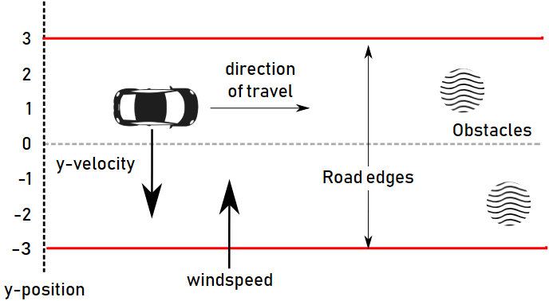

# Wind Controller

The Wind Controller benchmark models an autonomous car travelling along a
straight, six-metre-wide road. The road follows the x-axis, while a changing
crosswind pushes the car sideways along the y-axis. The red lines in the diagram
are the road edges at y = -3 and y = 3.

The car has an imperfect sensor for its y-position. The Vehicle specification
passes the current and previous readings to `controller.onnx`; the network
returns a change to the car's y-velocity. Using two readings lets the controller
react not only to where the car is now but also to how its measured position has
changed since the last sample.

The supplied network expects readings normalised from the physical range
[-4, 4] metres to [0, 1]. For that reason, the tensor specification and all
model solutions keep the same `normalise` function. Exercise 3 changes only how
the inputs and output are represented in Vehicle; it continues to use the same
local `controller.onnx` file.

The chapter first asks Vehicle and Marabou to prove a property of this neural
controller. It then exports the result to an interactive theorem prover, where
that network property can be combined with assumptions about the road, wind and
sensor error to prove that the complete system keeps the car on the road.

This chapter uses Vehicle 0.26.1. Its commands deliberately retain that
version's `--verifier` and `vehicle export` syntax.

## Where things are

- `chapter-code` contains the tensor-based Vehicle specification, the ONNX
  network, and the commands used in the chapter.
- `exercises` contains an editable copy of the specification and notes about
  the files required by each exercise.
- `solutions` contains expected results for Exercises 1 and 2, Vehicle model
  solutions for Exercises 3 and 4, the optional parameterised challenge, and a
  focused Rocq proof for Exercise 4.

The chapter also discusses complete system-level proofs of this example. Those
larger developments are not copied into the tutorial repository; the external
proofs referenced by the chapter are linked from `chapter-code/README.md`.
