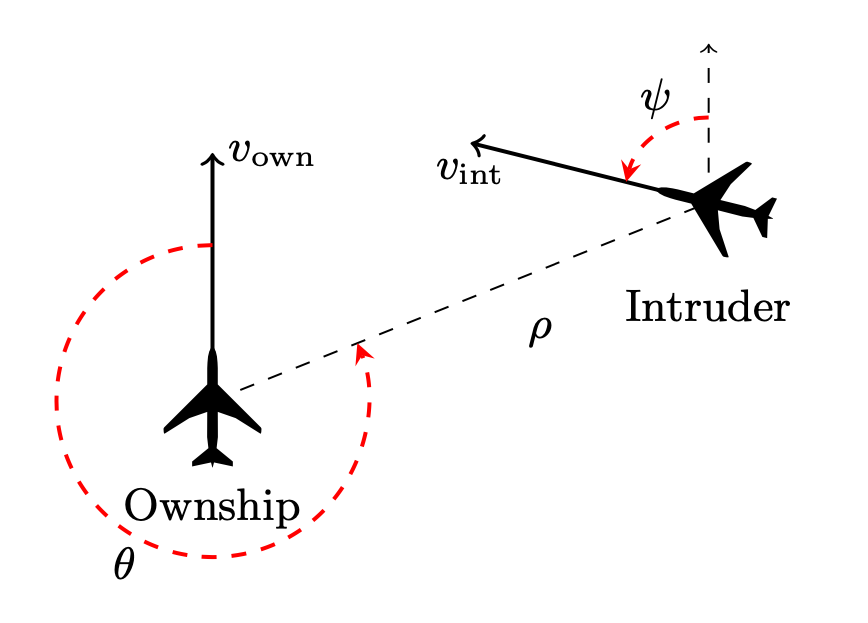

In this chapter we will introduce the basic features of the Vehicle specification language via the famous *ACAS Xu verification challenge*,
first introduced by Guy Katz et al. [-@katz2017reluplex] ([arXiv](https://arxiv.org/pdf/1702.01135.pdf)).

# ACAS Xu

ACAS Xu stands for *Airborne Collision Avoidance System for unmanned aircraft*.
The objective of the system is to analyse the aircraft's position and distance relative to other aircraft and give collision avoidance instructions.

In particular, the following measurements are of importance:

- $\rho$: feet **measuring the distance to intruder**,
- $\theta, \psi$: radians **measuring angle of intrusion**,
- $v_{own}, v_{vint}$: feet per second - **the speed of both aircrafts**,
- $\tau$: seconds - **time until loss of vertical separation**,
- $a_{prev}$: **previous advisory**

as the following picture illustrates:



$\theta$ and $\psi$ are measured counter clockwise, and are always in the range $[-\pi, \pi]$.

Based on these inputs, the system should produce one of the following instructions:

- clear-of-conflict (CoC),
- weak left,
- weak right,
- strong left,
- strong right.

In practice, the domains of $\tau$ and $a_{prev}$ are used to partition the input space into 45 discrete subspaces. Next a different neural network is trained to analyse the relation of input and output variables within each subspace, using previous historic data.
Therefore each individual neural network uses only the first five input variables, and outputs a score
for each of the output instructions.
The instruction with the lowest score is then chosen.

Therefore each of the 45 ACASXu neural networks have the mathematical type $N_{AX} : R^5 \rightarrow R^5$.
The exact architecture of the neural networks and their training modes are not important for this example, and so we will omit the details for now.

The original paper by Guy Katz lists ten properties, but for the sake of the illustration we will just consider the third property:
*If the intruder is directly ahead and is moving towards the ownship, the score for COC will not be minimal.*

# Basic Building Blocks in Vehicle

## Types

Unlike many Neural Network verifier input formats, Vehicle is a typed language, and it is common for each specification file starts with declaring the types. For ACAS Xu, these are the types of the real number tensors that the network will be taking as inputs and giving as outputs:

```vehicle
type Input = Tensor Real [5]
type Output = Tensor Real [5]
```

The `Tensor` type represents a mathematical tensor, or in programming terms can be thought of as a multi-dimensional array. One potentially unusual aspect in Vehicle is that the shape of the tensor (i.e its dimensions) must be known statically at compile time. This allows Vehicle to check for the presence of out-of-bounds errors at compile time rather than run time.

The most general `Tensor` type is therefore written as `Tensor A d`, which represents the type of tensors with shape `d` with elements of type `A`. The argument `d` is a list of numbers, where each number represents a dimension, e.g., if `d` is `[2, 3]` then the tensor is a 2-by-3 matrix.. In this case, `Tensor Real [5]` is a one-dimensional tensor, where the size of the first dimension is 5, which contains real numbers.

Vehicle has a comprehensive support for programming with tensors, which we will see throughout this tutorial.
The interested reader may go ahead and check the documentation pages for tensors:
<https://vehicle-lang.readthedocs.io/en/stable/language/tensors.html>.

## Networks

Given this, we can declare the network itself:

```vehicle
@network
acasXu : Input -> Output
```

Networks are declared by adding a `@network` annotation to a function declaration, as shown above.
Note that no implementation for the network is provided directly in the specification, and instead will
be provided later at compile time.
However, the name `acasXu` can still be used in the specification as any other declared function would be.
This follows the Vehicle philosophy that specifications should be independent of any particular network, and should be able to be used to train/test/verify a range of candidate networks implementations.

## Values

New values can be declared in Vehicle using the following syntax, where the first line provides the declaration's type and the bottom line provides its definition.

```vehicle
<name> : <type>
<name> = <expr>
```

For example, as we’ll be working with radians, it is useful to define a real number called `pi`.

```vehicle
pi : Real
pi = 3.141592
```

While in many cases, the types provide useful information to the reader, in general types can be omitted. For example, in this case it is cleaner to simply write the declaration as:

```vehicle
pi = 3.141592
```

The Vehicle compiler will then automatically infer the correct `Real` type.

## Problem Space versus Input Space

Neural networks nearly always assume some amount of pre-processing of the input and post-processing of the output.
In our ACASXu example, the neural networks are trained to accept inputs in the range $[0, 1]$ and outputs are likewise in the range $[0,1]$, i.e. the network does not work directly with units like $m/s$ or radians, nor the 5 output instructions used in the description of the problem above.
However, the specifications we write will be much more understandable if we can refer to values in the original units.

When we encounter such problems, we will say we encountered an instance of *problem space / input space mismatch*, also known as *the embedding gap*.
If we were to reason on input vectors
directly, we would be writing specifications in terms of the *input space* (i.e. referring to the neural network inputs directly).
However, when reasoning about properties of neural networks, it is much more convenient to refer to the original problem.
In this case specifications will be written in terms of the *problem space*.
Being able to write specifications in the problem space (alongside the input space) is a feature that distinguishes Vehicle from
majority of the mainstream neural network verifiers, such as e.g. Marabou, ERAN, or $\alpha\beta$-Crown.
Let us see how this happens in practice.

We start with introducing the full block of code that will normalise input vectors into the range $[0,1]$, and will explain significant features of Vehicle syntax featured in the code block afterwards.

For clarity, we define a new type synonym for unnormalised inputs in the problem space.

```vehicle
type UnnormalisedInput = Input
```

Next we define the minimum and maximum values that each input can take.
These correspond to the range of the inputs that the network is designed to work over.
Note that these values are in the *problem space*.

```vehicle
minimumInputValues : UnnormalisedInput
minimumInputValues = [0, -pi, -pi, 0, 0]

maximumInputValues : UnnormalisedInput
maximumInputValues = [60261, pi, pi, 1200, 1200]
```

The above is the first instance of vector definition we encounter.
The type-checker will ensure that all vectors written in this way are of the correct size (in this case, `5`).

Then we define the mean values that will be used to scale the inputs:

```vehicle
meanScalingValues : UnnormalisedInput
meanScalingValues = [19791.091, 0.0, 0.0, 650.0, 600.0]
```

An alternative method for defining new vectors is to use the `foreach` constructor, which is used to provide a value for each index `i`.
This method is useful if the vector has some regular structure.
For example, we can now define the normalisation function that takes an unnormalised input vector and
returns the normalised version.

```vehicle
normalise : UnnormalisedInput -> Input
normalise x = foreach i .
  (x ! i - meanScalingValues ! i)
    / (maximumInputValues ! i - minimumInputValues ! i)
```

Using this we can define a new function that first normalises the input
vector and then applies the neural network:

```vehicle
normAcasXu : UnnormalisedInput -> Output
normAcasXu x = acasXu (normalise x)
```

## Functions

In the above block, we saw function definitions for the first time, so let us highlight the important features of the Vehicle language concerning functions.

Function declarations may be used to define new functions. A declaration is of the form

```vehicle
<name> : <type>
<name> [<args>] = <expr>
```

Observe how all functions above fit within this declaration scheme.

Functions make up the backbone of the Vehicle language. The function type is written `A -> B` where `A` is the input type and `B` is the output type. For example, the function `validInput` above takes values of the (defined) type of `UnnormalisedInput` and returns values of type `Bool`. The function `normalise` has the same input type, but its output type is `Input`, which was defined as a tensor of real numbers with 5 elements.

As is standard in functional languages, the function arrow associates to the right so `A -> B -> C` is therefore equivalent to `A -> (B -> C)`.

As in most functional languages, function application is written by juxtaposition of the function with its arguments. For example, given a function `f` of type `Real -> Bool -> Real` and arguments `x` of type `Real` and `y` of type `Bool`, the application of `f` to `x` and `y` is written `f x y` and this expression has type `Real`. This is unlike imperative languages such as Python, C or Java where you would write `f(x,y)`.

Functions of suitable types can be composed. For example, given a function `acasXu` of type `Input -> Output`, a function `normalise` of type `UnnormalisedInput -> Input` and an argument `x` of type `UnnormalisedInput` the application of `acasXu` to the `Input` resulting from applying `normalise x` is written as `acasXu (normalise x)`, and this expression has type `Output`.

Some functions are pre-defined in Vehicle. For example, the above block uses multiplication `*`, division `/` and vector lookup `!`. We have also seen the use of a pre-defined "less than or equal to" predicate `<=` in the definition of the function `validInput` (note its `Bool` type).

## Quantifying over indices

In the `normalise` declaration we saw the `foreach` construct which constructs a vector given the definition of the element at each index `i`.
We can use the similar `forall` to quantify over all indices and return a `Bool` which is `true`
if the predicate holds for all indices and `false` otherwise.
For example, having defined the range of minimum and maximum values, we can define a simple predicate saying whether a given input vector is in the right range:

```vehicle
validInput : UnnormalisedInput -> Bool
validInput x = forall i .
  minimumInputValues ! i <= x ! i <= maximumInputValues ! i
```

Equally usefully, we can write a function that takes an output index `i` and an input `x` and returns true if output `i` has the minimal score, i.e., neural network outputs instruction `i`.

```vehicle
minimalScore : Index 5 -> UnnormalisedInput -> Bool
minimalScore i x = forall j .
  i != j => normAcasXu x ! i < normAcasXu x ! j
```

<!-- TODO: How does Index work with Tensor? -->

Here the `Index 5` refers to the type of indices into `Vector`s of length 5, and implication `=>` is used to denote logical implication.
Therefore this property says that for every other output index `j` apart from output index `i` we want the score of action `i` to be strictly smaller than the score of action `j`.

## Naming indices

As ACASXu properties refer to certain elements of input and output tensors, let us give those tensors indices some suggestive names. This will help us to write a more readable code:

```vehicle
distanceToIntruder = 0   -- measured in metres
angleToIntruder    = 1   -- measured in radians
intruderHeading    = 2   -- measured in radians
speed              = 3   -- measured in metres/second
intruderSpeed      = 4   -- measured in meters/second
```

The fact that all tensors types come annotated with their dimensions means that it is impossible to mess up indexing into vectors, e.g. if you changed `distanceToIntruder = 0` to `distanceToIntruder = 5` the specification would fail to type-check as `5` is not a valid index into a Tensor with dimensions `[5]`.

Similarly, we define meaningful names for the indices into output tensors.

```vehicle
clearOfConflict = 0
weakLeft        = 1
weakRight       = 2
strongLeft      = 3
strongRight     = 4
```

# Property Definition in Vehicle

We now make up for the time invested into learning the Vehicle syntax, as stating a verification property becomes very easy. Let us now look at the property again:

*If the intruder is directly ahead and is moving towards the ownship, the score for COC will not be minimal.*

We first need to define what it means to be *directly ahead* and *moving towards*.
The exact ACASXu definition can be written in Vehicle as:

```vehicle
directlyAhead : UnnormalisedInput -> Bool
directlyAhead x =
  1500  <= x ! distanceToIntruder <= 1800 and
  -0.06 <= x ! angleToIntruder    <= 0.06

movingTowards : UnnormalisedInput -> Bool
movingTowards x =
  x ! intruderHeading >= 3.10  and
  x ! speed           >= 980   and
  x ! intruderSpeed   >= 960
```

Note the reasoning in terms of the "problem space", i.e. the use of unnormalised input vectors.

We have already encountered the vector lookup `!` before; but now we have a new predefined comparison function, `>=`, "greater than or equal to". The connective `and` is a usual Boolean connective (note the type of the function is `Bool`).

There is little left to do, and we finish our mini-formalisation with the property statement:

```vehicle
@property
property3 : Bool
property3 = forall x .
  validInput x and directlyAhead x and movingTowards x =>
  not (minimalScore clearOfConflict x)
```

To flag that this is the property we want to verify, we use the label `@property`, we have seen this notation before when we used `@network` to annotate the neural network declaration. The final new bit of syntax we have not yet discussed is the quantifier `forall`.

## Infinite quantifiers

One of the main advantages of Vehicle is that it can be used to state and prove specifications that describe the network’s behaviour over an infinite set of values.
We have already seen the `forall` operator used in the declaration `validInput` -- however, there it was quantifying over a finite number of indices.

The `forall` in the property above is a very different beast as it is quantifying over an “infinite” number of values of type `Tensor Real [5]`. The definition of `property3` brings a new variable `x` of type `Tensor Real [5]` into scope. The variable `x` has no assigned value, but represents an arbitrary input of that type.

Vehicle also has a matching quantifer `exists`.

# How to run Vehicle

To verify this property, we only need to have:

- a verifier installed (at the moment of writing Vehicle has integration with Marabou);
- the actual network or networks that we wish to verify. These need to be supplied in an ONNX format, one of the standard formats for representing trained neural networks.

Having these suitably installed or located, it only takes one command line to obtain the result (note the `vcl` file, where we have written the above specification):

```sh
 vehicle verify \
  --specification acasXu.vcl \
  --verifier Marabou \
  --network acasXu:acasXu_1_7.onnx \
  --property property3
```

Vehicle passes the network, as well as a translation of our specification, to Marabou, and we
obtain the result -- `property3` does not hold for the given neural network, `acasXu_1_7.onnx`:

```plain
Verifying properties:
  property3 [======================================================] 1/1 queries
    result: ✗ - counterexample found
      x: [1799.9886669999978, 5.6950779776e-2, 3.09999732192, 980.0, 960.0]
```

Furthermore, Vehicle gives us a counter-example in the problem space! In particular an assignment
for the quantified variable `x` that falsifies the assignment.

# Exercises

We will use symbols (⭑), (⭑⭑) and (⭑⭑⭑) to rate exercise difficulty: *easy, moderate and  hard*.

The exercises assume that you already installed Vehicle as described in [vehicle documentation](https://vehicle-lang.readthedocs.io/en/latest/installation.html).

## Exercise #1 (⭑)

Start by simply running the code that was discussed in the above chapter.
It is available from the `examples` section of the [tutorial repository](https://github.com/vehicle-lang/vehicle-tutorial)

 Repeat the steps described in this chapter: download the Vehicle specification and the network, and verify the ACAS Xu Property 3.

Did it work? If yes, you are ready to experiment with your own specifications.

## Exercise #2 (⭑⭑). Problem Space versus Input/Output Space

We discussed an instance of the embedding gap when verifying Property 3.
In particular, we reasoned in terms of the problem space, but verified the network trained on the input space.

Property 1 in the Acas Xu library is an example where the
problem space and the output space deviate, as well. This makes Property 1 specification somewhat harder.

For your first exercise, define Property 1 in Vehicle, paying attention to careful handling of the *embedding gap*.

*ACAS Xu Propery 1*: *If the intruder is distant and is significantly slower than the ownship, the score of a COC advisory will always be below a certain fixed threshold.*

Taking the original thresholds, this boils down to:

$$
  (\rho \geq 55947.691) \wedge
  (v_{own} \geq 1145) \wedge (v_{int} \leq 60)
  \Rightarrow \text{the score for COC is at most} 1500
$$

*Note:*
The ACAS Xu neural network outputs are scaled as follows: given an element $x$ of the output vector, we scale it as:

$$
\frac{x - 7.518884}{373.94992}
$$

To run the verification queries, please use the networks available from the [tutorial repository](https://github.com/vehicle-lang/vehicle-tutorial).

## Exercise #3 (⭑⭑). The full ACAS Xu challenge in one file

Why not trying to state all 10 ACAS Xu properties in one `.vcl` file?
Try running the verification query in Vehicle using all $10$ properties.
You can find them in the Reluplex paper [@katz2017reluplex] ([arXiv](https://arxiv.org/pdf/1702.01135.pdf)).

## Exercise #4 (⭑⭑⭑). Your first independent Vehicle specification

1.  Clone the [tutorial repository](https://github.com/vehicle-lang/vehicle-tutorial).
2.  Find the `iris_model.onnx` model under `exercises/chapter2/iris-dataset`.
    This model was trained on the famous [Iris flower data set](https://en.wikipedia.org/wiki/Iris_flower_data_set).
3.  Find the Iris data set files `iris_test_data.idx` and `iris_test_labels.idx` under `exercises/chapter2/iris-dataset`.
4.  Examine the data set and try to define a few "obvious properties" that should hold for the model.
    You a free to look at the Wikipedia page for the [Iris flower data set](https://en.wikipedia.org/wiki/Iris_flower_data_set) or consult other sources.
5.  Write those properties as a Vehicle specification.
    Ensure that your specification is well-typed.
    See the [Vehicle Manual](https://vehicle-lang.readthedocs.io/en/stable/) for how to type-check a Vehicle specification file.
4.  Verify that the properties in your Vehicle specification hold using the `vehicle` command.
