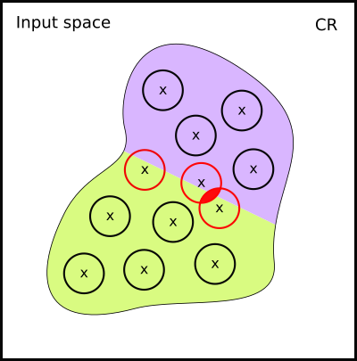

---
**Note**

This section contains a lot of theory. For implementation details, please skip to [Logical Loss Functions In Vehicle](#logical-loss-functions-in-vehicle).

---
## Motivation
The goal of this section is to answer one question: _can we train a neural network to be more robust within a desirable $\epsilon$?_
The long tradition of robustifying neural networks in machine learning has a few methods
ready. For example, we can re-train the networks with new data that was augmented using images within the
desired $\epsilon$-balls, or generate adversarial examples (sample images closest to the decision boundary) within the given $\epsilon$-balls during training. Let us breifly explore these approaches.


[need citations for data augmentation/adversarial trianing]: #

## Current Approaches
**Data Augmentation** works by generating additional data within the $\epsilon$-balls of the original training data points, done using methods such as random sampling. The augmented data points are assigned the same label as the original ones they were augmented from. We can then use our usual training methods with this augmented dataset with the hope that it will improve the network's average-case robustness [@SK19].

Unfortunately, this approach has its problems. Firstly, if our original sampled data point is already very close to the decision boundary, there is a chance that an augmented data point will actually lie on the wrong side, even though it is still within the $\epsilon$-ball. This means it will have been assigned the wrong label:


In the case where two data points' $\epsilon$-balls overlap, there is a chance we generate two new data points with the same position in the input space. Furthermore, if the two original data points lie both close to (and on opposite sides of) the decision boundary, the augmented data points may have _different labels_, despite occupying the same location in the input space:



These inconsistencies mean this approach is generally unviable for network robustification.

**Adversarial Training** also involves generating new data to train the network, but unlike data augmentation where perturbations are sampled randomly, adversarial training aims to find the _worst-case_ perturbation within $\epsilon$-distance to a data point from the training dataset. These examples are used to optimise the network with the hope of improving its worst-case robustness.

[the below paragraph was pasted from the previous version -- double check understanding and fix citation]: #

Adversarial training is almost the right solution!
Its main limitation turns out to be the logical property it optimises for.
Recall that we may encode an arbitrary property in Vehicle. However, as we discovered in [@CasadioKDKKAR22], the projected gradient descent can only optimise for one concrete property.
Recall the property of $\epsilon$-ball robustness was defined as:
$\forall \mathbf{x} \in \mathbb{B}(\hat{\mathbf{x}}, \epsilon). robust(f(\mathbf{x}))$. It turns out that adversarial training determines the definition of *robust* to be
$|f(\mathbf{x}) - f(\hat{\mathbf{x}})| \leq \delta$.

## Loss Functions
Humans learn by making mistakes. The same is true of neural networks. Loss functions are a way of measuring the "magnitude" of a mistake made by a neural network. For a given training input, loss functions compute a penalty proportional to the difference between the output of the network and the _true_ output (i.e., the training label). Formally, this is written as follows:

$$\mathcal{L}: \mathbb{R}^n \times \mathbb{R}^m \rightarrow \mathbb{R}$$

The function $f_\theta: \mathbb{R}^n \rightarrow \mathbb{R}^m$ represents the network, whose optimisation parameters are $\theta$, and $n$ and $m$ represent the sizes of the input and output tensors respectively.

One of the simplest loss functions is called **mean squared error**, defined as:

$$\mathcal{L}_\text{MSE}(\hat x, y)=\frac{1}{n}\sum_{i=1}^n(y_i-f_\theta(\hat x_i))^2$$

where $n$ is the total number of data points, $y_i$ is the label for data point ${\hat x}_i$, and $f_\theta(\hat x_i)$ is the model's predicted value for $\hat x_i$. I.e., we find the difference between the prediction and the actual value, square it, and take the average across the training dataset.

Models learn by iteratively tweaking their optimsation parameters with the goal of minimising the ouptut of the loss function. The most common way to do this is using **gradient descent**. Formally, we wish to find what $\theta$ yeilds the least loss:

$$\min_\theta\mathcal{L}(\hat x,y)$$

We can use a variant of gradient descent, called **projected gradient descent**, to maximise loss for adversarial training purposes. We ensure that the perturbation still lies within the $\epsilon$-ball of the original data point by projecting those perturbations that escape the $\epsilon$-ball back inside. Our new training objective becomes:

$$\min_\theta\bigg[\max_{x:|x-\hat x|\le\epsilon} \mathcal{L}(\hat x, y) \bigg]$$

In other words, we want to find the perturbation $x$ that is within $\epsilon$-distance of the data point $\hat x$ that produces the _largest_ loss (the worst-case perturbation). Then, we aim to find the optimsation parameters $\theta$ which _minimises_ this loss value.

## Logical Loss Functions
Traditional loss functions aim to minimise _task loss_. However, a neural network's performance on a given task is not necessarily correlated with the likelihood that it satisfies logical properties such as robustness. Let us recall our initial question: _can we train a neural network to be more robust within a desirable $\epsilon$?_ Given what we know about adversarial training and loss functions, we can reframe this question: _instead of optimising a network purely to fit a dataset, can we also optimise it to fit a specific logical property, e.g., robustness?_

Gradient descent algorithms train networks to fit data. The concept of logical loss functions is to use that same algorithm to train the network to also obey the specification. Standard logic is insufficient for this task since we need a differentiable signal to find the gradient. Hence, we need a type of logic that we can differentiate.

## Differentiable Logics
[abridged wording from previous version]: #

Differentiable logics to convert booleans and operations over booleans into equivalent numerical operations that are differentiable. Consider the following example language:

$$p:=p\;|\;a\le b\;|\;p\wedge p\;|\;p\implies p$$

Let the function $\mathcal{I}$ be the translation from this logical syntax to a differentiable logic. Additionally, let us assume the domain of the differentiable logic we wish to define is $[0,1]$. Let us define the semantics of $p$ case-by-case.

Firstly, if we have the equation $a\le b$, we want this to be true (i.e., take the value of $1$) when $a$ is less than or equal to $b$. We also want this to degrade linearly as $a$ overtakes $b$ - i.e., if $a$ is only slightly bigger than $b$, the value of $a\le b$ should only be slightly below $1$ (it's only a "little bit" false). These intuitions are satisfied by the following definition:

$$\mathcal{I}(a \le b ):=1-\max(0,a-b)$$

Next, if we have the equation $p_1\wedge p_2$, we want the truth value to approach $1$ as the respective truth values of equations $p_1$ and $p_2$ approach $1$. This is satisfied by the simple definition:

$$\mathcal{I}(p_1\wedge p_2):=\mathcal{I}(p_1)\times \mathcal{I}(p_2)\\$$

Finally, if we have the equation $p_1\implies p_2$, we shall require that it is true if: **1.** the premise is false, or **2.** the conclusion is _at least as true_ as the premise (i.e., $\mathcal{I}(p_2)\ge\mathcal{I}(p_1)$). In the case that the premise is more true than the conclusion (i.e., $\mathcal{I}(p_1)>\mathcal{I}(p_2)$), the truth value of the implication should proportionally reflect this discrepancy. This can be achieved with the following definition:

$$\mathcal{I}(p_1\implies p_2):=\min\bigg(1, \frac{\mathcal{I}(p_2)}{\mathcal{I}(p_1)}\bigg)$$

It is recommended that you take a moment to convince yourself that these definitions are satisfactory (albeit simple). Thus, we have defined a translation function, $\mathcal{I}$, to convert a simple boolean logic to a differentiable logic. This enables us to train a network to obey a logical specification!

[comment on differentiability/subgradients of max/min functions?]: #

## Logical Loss Functions in Vehicle
Vehicle supports several different differentiable logics from the literature, though we will not explore them here. Instead, we will use a simple example to explain how logical loss functions can be generated using Vehicle with Pytorch. Here, we use the MNIST Fashion dataset to train a neural network. All files used in this example can be found in the supporting materials. 

First, we will load our Vehicle specification and define our constraint loss function:

<div class="tabs-container">
  <div class="tabs-header">
    <button class="tab-button active" data-index="0">PyTorch</button>
    <button class="tab-button" data-index="1">TensorFlow</button>
  </div>
  <div class="tabs-content">
<div>

```python
import vehicle_lang as vcl
from vehicle_lang.loss import pytorch as loss_pt

spec = loss_pt.load_specification(
    "mnist-robustness.vcl",
    logic=vcl.VehicleDifferentiableLogic(),
)

constraint_loss_fn = spec["robust"]
```
</div>

<div>

```python
TensorFlow placeholder
```
</div>

</div>
</div>

The first parameter to the `load_specification` function is the path to the Vehicle specification. The second parameter defines which logic to use -- this is optional, and defaults to DL2. We define which property from the specification to use as our constraint loss function by accessing it by name on the specification object.

Next, we will define a simple model and training procedure:

<div class="tabs-container">
  <div class="tabs-header">
    <button class="tab-button active" data-index="0">PyTorch</button>
    <button class="tab-button" data-index="1">TensorFlow</button>
  </div>
  <div class="tabs-content">
<div>

```python
import torch
import torch.nn as nn
import torchvision
import torchvision.transforms as transforms
from torch.utils.data import DataLoader

model = nn.Sequential(
    nn.Flatten(),
    nn.Linear(784, 64),
    nn.ReLU(),
    nn.Linear(64, 32),
    nn.ReLU(),
    nn.Linear(32, 10)
)

def network(x: torch.Tensor) -> torch.Tensor:
    return model(x.reshape(1, 1, 28, 28)).reshape(10)

optimizer = torch.optim.Adam(model.parameters(), lr=1e-3)
num_epochs = 5
alpha = 0.5

for epoch in range(num_epochs):
    for images, labels in train_loader:
        optimizer.zero_grad()
        logits = model(images)
        loss = nn.functional.cross_entropy(logits, labels)

        constraint_loss = constraint_loss_fn(network)
        total_loss = alpha * loss + (1 - alpha) * constraint_loss

        total_loss.backward()
        optimizer.step()
```
</div>

</div>
</div>

Note that the `network` callable must match the type of the network declared in the Vehicle specification. The `alpha` parameter can be used to tweak the weighting of task loss vs. constraint loss, which are blended together in `total_loss`. We can now export this trained model to verify it using vehicle, with the hope that it is more robust as a result of training with constraint loss. Model exportation can be done like so:

<div class="tabs-container">
  <div class="tabs-header">
    <button class="tab-button active" data-index="0">PyTorch</button>
    <button class="tab-button" data-index="1">TensorFlow</button>
  </div>
  <div class="tabs-content">
<div>

```python
import torch.onnx

model.eval()
input_tensor = torch.randn(1,1,28,28)

torch.onnx.export(
    model,
    input_tensor,
    "classifier.onnx",
    external_data=False, # required for Marabou verification
)
```
</div>

</div>
</div>

 Exporting an ONNX file in Pytorch works by tracing, which runs the model with an arbitrary input and records each operation. Hence, we provide the model with a randomly generated input tensor. At the time of writing, Marabou does not support external data locations, so we require that `external_data=False`.

 # Exercises

 ## Exercise #1 (⭑): Run the Chapter code
Download the required materials (or produce them yourself) and repeat the steps described in this chapter. All code is available from the tutorial repository.

 ## Exercise #2 (⭑): Verifying and comparing networks
 Use a vehicle specification (either the one provided, or your own) to verify a property (e.g., robustness) of a network trained _with_ a logical loss function, and compare this to one trained _without_ a logical loss function. Which is more robust? Which is has a better task accuracy?

 ## Exercise #3 (⭑⭑): Further experimentation
Try various combinations of task loss functions, constraint loss functions, and alpha values. How do these affect each other? Is there a combination that makes the network more robust? Is there a combination that makes the network more accurate? What happens when you use multiple constraint loss functions simultaneously?