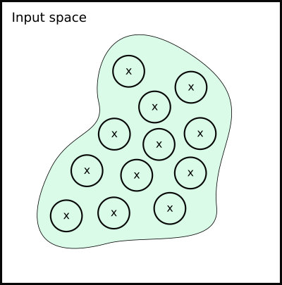
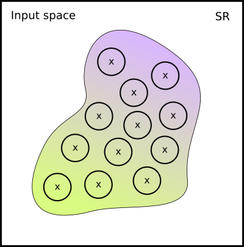
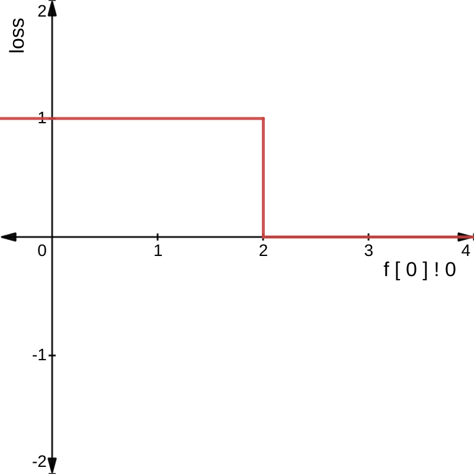
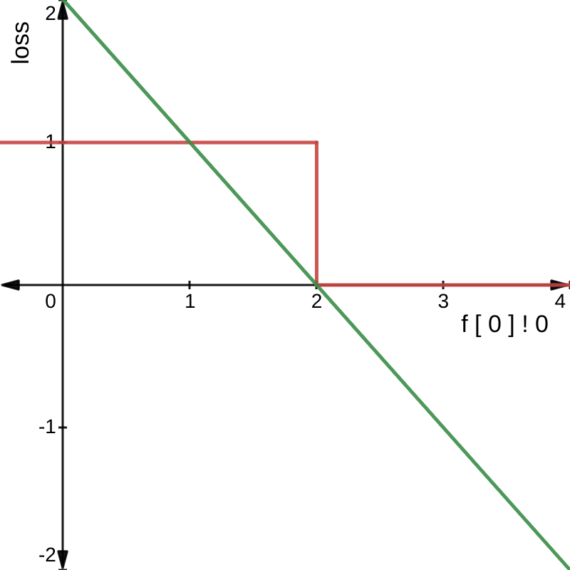

# Motivation

We finished the last chapter with a conjecture concerning
diminishing robustness verification success with increasing values of $\epsilon$.
Let us now see, using a concrete example, how soon the success rate declines.

The last exercise of the previous chapter gave us a property specification
for robustness of ``Fashion MNIST" models. We propose now to look into the statistics of verifying one of such models on 500 examples from the data set. To obtain quicker verification times, let us use a Fashion MNIST model with one input layer of $32$ neurons, and one output layer of $10$ neurons (the tutorial files contain the model if you wish to check it). Running Vehicle, we obtain the following success rates:

| $\epsilon = 0.01$ | $\epsilon = 0.05$ | $\epsilon = 0.1$ | $\epsilon = 0.5$ |
| :---------------: | :---------------: | :--------------: | :--------------- |
| 82.6 % (413/500)  | 29.8 % (149/500)  |  3.8 % (19/500)  | 0 % (0/500)      |

As we see in the table, verifiability of the property deteriorates quickly with growing
$\epsilon$. Yet, for majority of practical applications, it is desirable to have a larger $\epsilon$,
as this increases the chance that new yet unseen data points will fall within the verified
subspaces of the input vector space.

Can we re-train the neural network to be more robust within a desirable $\epsilon$?
The long tradition of robustifying neural networks in machine learning has a few methods
ready, for example, to re-train the networks with new data set that was augmented with images within the
desired $\epsilon$-balls, or to generate adversarial examples (sample images closest to the decision boundary) within the given $\epsilon$-balls during training.

Let us look closer into this.

# Robustness Training

## Data Augmentation

 Suppose we are given a data set $\mathcal{D} =  \{(\mathbf{x}_1, y_1), \ldots , (\mathbf{x}_n, y_n)\}$.
  Prior to training, we can generate new training data samples within $\epsilon$-balls of the existing data and label them with the same output as the original data. Then we can use our usual training methods with this new *augmented data set* [@SK19].

However, this method maybe problematic for verification purposes.
Let us have a look at its effect, pictorially. Suppose this is the manifold that corresponds to $\mathcal{D}$ (crosses are the original data points, and circles are the $\epsilon$-balls around them):



Remember that we sampled our new data from these $\epsilon$-balls.
But suppose your true decision boundary runs over the manifold like this:


We have a problem, because some of the data points we sampled from the  suddenly have wrong labels!

Actually, it maybe even worse. Depending how our data lies on the manifold, we may have even generated inconistent labelling. Here is the example when this happens:


It seems data augmentation is not general enough for Vehicle, and only works correctly if strong assumptions about the underlying manifold are taken.

## Adversarial Training

It would be nice to somehow reflect the fact of proximity to the decision boundary in our training! The closer the point is to the decision boundary, the less certain the neural network should be about its class:



However, using data labels as a method is unfit for the task. We cannot achieve the effect we are looking for with data augmentation.
We have to modify our training algorithm instead [@GoodfellowSS14].

## Loss Function

Given a data set $\mathcal{D}$ and a function ${f_{\theta}: \mathbb{R}^n \rightarrow \mathbb{R}^m}$ with optimisation parameters $\theta$, a *loss function*

$$
    \mathcal{L}: \mathbb{R}^n \times \mathbb{R}^m \rightarrow \mathbb{R}
$$

computes a penalty proportional to the difference between the output of $f_{\theta}$ on a training input $\hat{\mathbf{x}}$ and a desired output $\mathbf{y}$.

The reader will find an excellent exposition of adversarial training in the tutorial by @KM18.

## Example: Cross-Entropy Loss

Given a function  ${f_{\theta}: \mathbb{R}^n \rightarrow [0,1]^m}$, the cross-entropy loss is defined as

$$
    \mathcal{L}_{ce}(\hat{\mathbf{x}}, \mathbf{y})
    =
    - \Sigma_{i=1}^{m} \mathbf{y}_i \; log(f_{\theta}(\hat{\mathbf{x}})_i)
$$

where $\mathbf{y}_i$ is the true probability for class $i$ and $f_{\theta}(\hat{\mathbf{x}})_i$ is the probability for class $i$ as predicted by $f_{\theta}$ when applied to $\hat{\mathbf{x}}$.

## Adversarial Training for Robustness

*Gradient descent*  minimises loss $\mathcal{L}(\hat{\mathbf{x}}, \mathbf{y})$ between the predicted value $f_{\theta}(\hat{\mathbf{x}})$ and the true value $\mathbf{y}$, for each entry $(\hat{\mathbf{x}}, \mathbf{y})$ in $\mathcal{D}$. It thus solves the optimisation problem:

$$
    \min_{\theta} \mathcal{L}(\hat{\mathbf{x}}, \mathbf{y})
$$


For *adversarial training*, we instead minimise the loss with respect to the worst-case perturbation of each sample in $\mathcal{D}$.
We replace the standard training objective with:

$$
    \min_{\theta} [ \max_{\mathbf{x} : |\mathbf{x} - \hat{\mathbf{x}}| \leq \epsilon} \mathcal{L}(\mathbf{x}, \mathbf{y})]
$$

 The inner maximisation is done by *projected gradient descent* (PGD), that ``projects" the gradient of $\mathcal{L}$ on $\hat{\mathbf{x}}$ in order to perturb it and get the worst $\mathbf{x}$.

## Adversarial Training and Verification

Adversarial training is almost the right solution!
Its main limitation turns out to be the logical property it optimises for.
Recall that we may encode an arbitrary property in Vehicle. However, as we discovered in [@CasadioKDKKAR22], the projected gradient descent can only optimise for one concrete property.
Recall the property of $\epsilon$-ball robustness was defined as:
$\forall \mathbf{x} \in \mathbb{B}(\hat{\mathbf{x}}, \epsilon). robust(f(\mathbf{x}))$. It turns out that adversarial training determines the definition of *robust* to be
$|f(\mathbf{x}) - f(\hat{\mathbf{x}})| \leq \delta$.

# Logical Loss Functions

:::epigraph
> Is there any way to generate neural network optimisers for any given logical property?
:::

The main idea is that we would like to co-opt the same gradient-descent algorithm that is used to
train the network to fit the data to also train the network to obey the specification.

## Logical Loss Function: Simple Example

Consider the very simple example specification:

```vehicle
@network
f : Tensor Real [1] -> Tensor Real [1]

@property
greaterThan2 : Bool
greaterThan2 = f [ 0 ] ! 0 > 2
```

This statement is either true or false, as shown in the left graph below:



However, what if instead, we converted all `Bool` values to `Real`, where a value greater than
`0` indicated false and a value less than `0` indicated true?
We could then rewrite the specification as:

```vehicle
greaterThan2 : Real
greaterThan2 = f [ 0 ] ! 0 - 2
```

If we then replot the graph we get the following:



Now we have a useful gradient, as successfully minimising `f [ 0 ] ! 0 - 2` will result in the property `greaterThan2` becoming true.

This is the essence of logical loss functions: convert all booleans and operations over booleans
into equivalent numeric operations that are differentiable and whose gradient's point in the
right direction.

## Differentiable Logics
Traditionally, translations from a given logical syntax to a loss function are
known as “differentiable logics", or DLs.
One of the first attempts to translate propositional logic specifications to loss functions was given in [[@XuZFLB18]](http://proceedings.mlr.press/v80/xu18h.html) and was generalised to a fragment of first-order logic in [[@FischerBDGZV19]](http://proceedings.mlr.press/v97/fischer19a.html).
Later, this work was complemented by giving a fuzzy interpretation to DL by [[@KriekenAH22]](https://doi.org/10.1016/j.artint.2021.103602) and [[@SlusarzKDSS23]](https://arxiv.org/abs/2303.10650) proposed generalisation for the
syntax and semantics of DL, with a view of encoding all previously presented DLs in one formal
system, and comparing their theoretical properties.

Vehicle has several different differentiable logics from the literature available, but will not go into detail about
how they work here.

Instead, we explain the main idea by means of an example.
Let us define a very simple differentiable logic on a toy language

$$
    p := p\ |a\ \leq\ a|\ p \land p\ |\ p \Rightarrow p
$$

One possible DL (called *Product DL* in [@KriekenAH22]) for it can be defined as:

$$
    \mathcal{I}(a_1 \leq a_2) := 1-\max(\frac{a_1 -a_2}{a_1 + a_2}, 0)
$$

$$
    \mathcal{I}(p_1 \land p_2) := \mathcal{I}(p_1) * \mathcal{I}(p_2)
$$

$$
    \mathcal{I}(p_1 \Rightarrow p_2) := 1 - \mathcal{I}(p_1) + \mathcal{I}(p_1) * \mathcal{I}(p_2)
$$

An example of this translation is:

$$
    \mathcal{I} (| f(\mathbf{x}) - f(\hat{\mathbf{x}})| \leq \delta) =
    1 - \max (\dfrac{| f(\mathbf{x}) - f(\hat{\mathbf{x}})| - \delta}{| f(\mathbf{x}) - f(\hat{\mathbf{x}})| + \delta},0)
$$

# Logical Loss Functions in Vehicle

We now have all the necessary building blocks to define Vehicle approach to property-driven training. We use the formula:

$$
    \text{Vehicle Training} = \text{Differentiable Logics} + \text{Projected Gradient Descent}
$$

In Vehicle, given a property $\forall \mathbf{x}. \mathcal{P}(\mathbf{x}) \Rightarrow \mathcal{S}(\mathbf{x})$, we replace the usual PGD training objective with

$$
    \min_{\theta} [ \max_{\mathbf{x} \in \mathbb{H}_{\mathcal{P}(\mathbf{x})}} \mathcal{L}_{\mathcal{S}(\mathbf{x})}(\mathbf{x}, \mathbf{y})]
$$

where

*   $\mathbb{H}_{\mathcal{P}(\mathbf{x})}$ is a hyper-shape that corresponds to the pre-condition $\mathcal{P}(\mathbf{x})$ and
*   $\mathcal{L}_{\mathcal{S}(\mathbf{x})}$ is obtained by DL-translation of the post-condition $\mathcal{S}(\mathbf{x})$.

Let us see how this works for the following definition of robustness:

$$
    \forall \mathbf{x}. |\mathbf{x} - \hat{\mathbf{x}}| \leq \epsilon \Rightarrow |f(\mathbf{x}) - f(\hat{\mathbf{x}})| \leq \delta
$$

The definition of the optimisation problem above instantiates by taking:

*   $\mathbb{H}_{\mathcal{P}(\mathbf{x})}$ given by the $\epsilon$-cube around $\hat{\mathbf{x}}$ and
*   given any DL translation $\mathcal{I}$, the loss function
    $$
        \mathcal{L}_{\mathcal{S}(\mathbf{x})} = \mathcal{I} ( || f(\mathbf{x}) - f(\hat{\mathbf{x}})|| \leq \delta)
    $$

# Coding Example: generating a logical loss function in Python

The Python bindings ship backend-specific helpers in `vehicle_lang.loss.tensorflow`
and `vehicle_lang.loss.pytorch`. They both expose a single entry point
`load_specification(path, ...)` which compiles your `.vcl` file to a dictionary of
callable Python loss functions. The returned dictionary keys are the names of
`@property` declarations in your spec.

Below is a minimal PyTorch example that mirrors the tests in `vehicle-python/tests`:

```python
import torch
from vehicle_lang.typing import DifferentiableLogic
from vehicle_lang.loss.pytorch import load_specification

# Compile the Vehicle spec to PyTorch loss functions
spec = load_specification(
    "test_trainable.vcl",  # any Vehicle spec path
    logic=DifferentiableLogic.Vehicle,
)

constraint_loss = spec["output_bounded"]  # name of a @property in the spec

train_x = torch.tensor([0.0, 0.5, 1.0], dtype=torch.float32).unsqueeze(1)
train_y = torch.tensor([0.0, 1.0, 2.0], dtype=torch.float32)

model = torch.nn.Sequential(
    torch.nn.Linear(1, 8), torch.nn.ReLU(), torch.nn.Linear(8, 1)
)
optimizer = torch.optim.Adam(model.parameters(), lr=1e-2)

for step in range(50):
    optimizer.zero_grad()

    # Task loss (e.g., MSE to a target function)
    preds = model(train_x).squeeze(1)
    task_loss = torch.mean((preds - train_y) ** 2)

    # Constraint loss produced by Vehicle; signature matches the Vehicle property
    constraint_loss_value = constraint_loss(model)

    loss = 0.5 * task_loss + 0.5 * constraint_loss_value
    loss.backward()
    optimizer.step()
```

Switching to TensorFlow changes only the backend import and model definition; the
property call still follows the spec's argument list (typically a single
`network` callable for many specs):

```python
import tensorflow as tf
from vehicle_lang.typing import DifferentiableLogic
from vehicle_lang.loss.tensorflow import load_specification

spec = load_specification("test_trainable.vcl", logic=DifferentiableLogic.Vehicle)
constraint_loss = spec["output_bounded"]

train_x = tf.constant([[0.0], [0.5], [1.0]], dtype=tf.float32)
train_y = tf.constant([0.0, 1.0, 2.0], dtype=tf.float32)

model = tf.keras.Sequential([
    tf.keras.layers.Input(shape=(1,)),
    tf.keras.layers.Dense(8, activation="relu"),
    tf.keras.layers.Dense(1),
])

optimizer = tf.keras.optimizers.Adam(learning_rate=1e-2)

for step in range(50):
    with tf.GradientTape() as tape:
        preds = tf.squeeze(model(train_x), axis=1)
        task_loss = tf.reduce_mean(tf.square(preds - train_y))

        constraint_loss_value = constraint_loss(model)
        loss = 0.5 * task_loss + 0.5 * constraint_loss_value

    grads = tape.gradient(loss, model.trainable_variables)
    optimizer.apply_gradients(zip(grads, model.trainable_variables))
```

Optional parameters such as `logic`and `samplers` are
available on `load_specification`; see the [Python API docs](https://vehicle-lang.readthedocs.io/en/stable/training.html) for defaults and examples. To customise
how Vehicle searches adversarial points, you can supply your own sampler (cf. the default FGSM-based
samplers in the source tree) when you have domain-specific needs.
