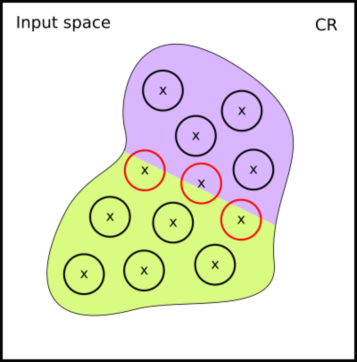
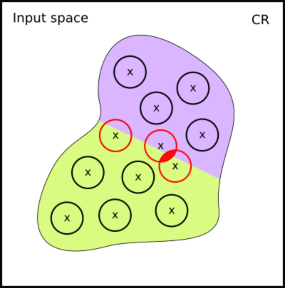

# Motivation
We will begin this chapter with a question: _how can we train a neural network to be more robust within a desirable $\epsilon$?_
The long tradition of robustifying neural networks in machine learning has a few methods
ready. For example, we can re-train the networks with new data that was augmented using images within the
desired $\epsilon$-balls, or generate adversarial examples (sample images closest to the boundary of the $\epsilon$-ball) during training. Let us briefly explore these approaches.

# Training with Loss Functions
Humans learn by making mistakes. The same is true of neural networks. Loss functions are a way of measuring the "magnitude" of a mistake made by a neural network. For a given training input, loss functions compute a penalty proportional to the difference between the output of the network and the _true_ output (i.e., the training label). Formally, this is written as follows:

$$\mathcal{L}: \mathbb{R}^n \times \mathbb{R}^m \rightarrow \mathbb{R}$$

The function $f_\theta: \mathbb{R}^n \rightarrow \mathbb{R}^m$ represents the network, whose optimisation parameters are $\theta$, and $n$ and $m$ represent the sizes of the input and output tensors respectively.

One of the simplest (yet usable) loss functions is called **mean squared error**, defined as:

$$\mathcal{L}_\text{MSE}(\hat x, y)=\frac{1}{k}\sum_{i=1}^k(y_i-f_\theta(\hat x_i))^2$$

where $k$ is the total number of data points, $y_i$ is the label for data point ${\hat x}_i$, and $f_\theta(\hat x_i)$ is the model's predicted value for $\hat x_i$. I.e., we find the difference between the prediction and the actual value, square it, and take the average across the training dataset.

The example later in this chapter classifies images rather than predicting a
number, and for that the usual choice is **cross-entropy loss**. In the same
notation:

$$\mathcal{L}_\text{CE}(\hat x, y)=-\frac{1}{k}\sum_{i=1}^k\sum_{c=1}^m y_{i,c}\log f_\theta(\hat x_i)_c$$

where $m$ is the number of classes, which is also the size of the output tensor,
$y_{i,c}$ is $1$ when data point $\hat x_i$ belongs to class $c$ and $0$
otherwise, and $f_\theta(\hat x_i)_c$ is the probability the network assigns to
class $c$. Since only one term of the inner sum is non-zero, this is just the
average of $-\log$ of the probability given to the *correct* class. The penalty
therefore grows without bound as that probability approaches zero, which is what
makes cross-entropy a better fit than mean squared error when the outputs are
class probabilities rather than magnitudes.

One practical note: the networks we build below end in a plain linear layer, so
they emit unnormalised scores rather than probabilities. Both PyTorch's
`CrossEntropyLoss` and TensorFlow's `SparseCategoricalCrossentropy` apply the
normalisation internally, which is why no softmax appears in the model
definitions.

Models learn by iteratively tweaking their optimisation parameters with the goal of minimising the output of the loss function. The most common way to do this is using **gradient descent**. Formally, we wish to find the set of parameters $\theta$ that yields the least loss:

$$\min_\theta\mathcal{L}(\hat x,y)$$

We are now ready to code all of this. 

## Getting Started with the Code

Let us start our first training pipeline.
Recall that Chapter 3 ended with failing to verify robustness. We used the model that was already pre-trained. Let us now try to train a similar model from scratch, in the plainest way possible, and see how robust it turns out to be.

Here, we use the Fashion MNIST dataset to train a neural network. All files used in this example can be found in the [chapter-4/chapter-code directory](https://github.com/vehicle-lang/tutorial/tree/exercises/chapter-4/chapter-code) of the tutorial repository.

First, we need some data to train on. Nothing here is specific to Vehicle, and the
same loader serves both the plain network we train in a moment and the
property-driven one later in the chapter.

<div class="tabs-container">
  <div class="tabs-header">
    <button class="tab-button active" data-index="0">PyTorch</button>
    <button class="tab-button" data-index="1">TensorFlow</button>
  </div>
  <div class="tabs-content">
<div>

```python
import torchvision
import torchvision.transforms as transforms
from torch.utils.data import DataLoader, Subset

MEAN, STD = 0.2860, 0.3530  # mean and standard deviation of Fashion MNIST
BATCH_SIZE = 64
SUBSET_SIZE = 1024  # ensure SUBSET_SIZE mod BATCH_SIZE == 0

transform = transforms.Compose([
    transforms.ToTensor(),
    transforms.Normalize((MEAN,), (STD,))
])

train_data = torchvision.datasets.FashionMNIST(
    root="./data", train=True, download=True, transform=transform
)
train_loader = DataLoader(
    Subset(train_data, range(SUBSET_SIZE)), batch_size=BATCH_SIZE, shuffle=True
)
```
</div>

<div>

```python
import tensorflow as tf

MEAN, STD = 0.2860, 0.3530  # mean and standard deviation of Fashion MNIST
BATCH_SIZE = 64
SUBSET_SIZE = 1024  # ensure SUBSET_SIZE mod BATCH_SIZE == 0

(train_images, train_labels), _ = tf.keras.datasets.fashion_mnist.load_data()

train_images = train_images[:SUBSET_SIZE].astype("float32") / 255.0
train_images = (train_images - MEAN) / STD
train_images = train_images[..., None]  # add channel dim -> (N, 28, 28, 1)
train_labels = train_labels[:SUBSET_SIZE].astype("int32")

train_loader = (
    tf.data.Dataset.from_tensor_slices((train_images, train_labels))
    .shuffle(SUBSET_SIZE)
    .batch(BATCH_SIZE)
)
```
</div>

</div>
</div>

Three of these choices are worth explaining.

`SUBSET_SIZE` restricts training to the first 1024 images. Plain training would happily
run over all 60,000, but evaluating a robustness property is far more expensive, so a
subset keeps the second half of this chapter runnable while still showing the effect.
Keep it an exact multiple of `BATCH_SIZE`; the reason becomes clear later, when we pass
`n=BATCH_SIZE` to the constraint loss.

`MEAN` and `STD` are the mean and standard deviation of Fashion MNIST, used to
normalise the pixel values. Note that this is normalisation for *training*, and is a
separate matter from the problem-space/input-space discussion of Chapter 2: it rescales
the data, not the specification.

Finally, note that the two frameworks store images differently: PyTorch's `ToTensor`
produces channel-first batches of shape `(N, 1, 28, 28)`, whereas here we append the
channel dimension last for TensorFlow, giving `(N, 28, 28, 1)`. It makes no difference
to the network we are about to train, whose first layer flattens its input either way,
but it will matter once we start handing images to a specification.

## Training the network the ordinary way

With the data in place, the rest is unremarkable supervised training. The architecture
is small — two hidden layers — which is deliberate: a simpler network has smoother
decision boundaries, and is therefore easier both to train and to verify.

```python
import torch
import torch.nn as nn

model = nn.Sequential(
    nn.Flatten(),
    nn.Linear(784, 64),
    nn.ReLU(),
    nn.Linear(64, 32),
    nn.ReLU(),
    nn.Linear(32, 10)
)

optimizer = torch.optim.Adam(model.parameters(), lr=1e-3)
cross_entropy = nn.CrossEntropyLoss()

for epoch in range(num_epochs):
    running_loss, correct, seen = 0.0, 0, 0

    for images, labels in train_loader:
        optimizer.zero_grad()
        logits = model(images)
        loss = cross_entropy(logits, labels)
        loss.backward()
        optimizer.step()

        running_loss += loss.item() * labels.numel()
        correct += (logits.argmax(1) == labels).sum().item()
        seen += labels.numel()

    print(f"Epoch: {epoch + 1}, mean loss: {running_loss / seen:.4f}, "
          f"train accuracy: {100 * correct / seen:.1f}%")
```

Nothing in that objective mentions robustness. The only thing being minimised is
cross-entropy, exactly as in any introductory classification example. This is the
complete script `vanilla_classifier.py` in the chapter code.

To verify the result we need it in ONNX form:

```python
model.eval()
torch.onnx.export(
    model,
    torch.randn(1, 1, 28, 28),
    "vanilla-experiment/onnx_models/vanilla_classifier.onnx",
    input_names=["input"],
    output_names=["output"],
    external_data=False,  # required for Marabou verification
)
```

## Asking Chapter 3's question of our own network

We now put this network to exactly the question Chapter 3 asked: the same
specification, the same $\epsilon$, the same fifty images.

```sh
vehicle verify \
  --specification fashionRobustness-solution.vcl \
  --network classifier:vanilla_classifier.onnx \
  --parameter epsilon:0.005 \
  --dataset trainingImages:0-49Images.idx \
  --dataset trainingLabels:0-49Labels.idx \
  --solver Marabou
```

On 1024 images this network reaches 98% training accuracy by about epoch 75, and 99.9%
by epoch 150. Training it well past the point where the task has essentially been
learned gives:

| epochs | mean loss | train accuracy | correctly classified | robust, $\epsilon = 0.005$ | robust, $\epsilon = 0.02$ |
| -----: | --------: | -------------: | -------------------: | ------------------------: | -----------------------: |
| 75 | 0.0785 | 98.1% | 38/50 | 37/50 | 25/50 |
| 100 | 0.0413 | 99.5% | 38/50 | 37/50 | _pending_ |
| 150 | 0.0103 | 99.9% | 37/50 | 36/50 | 21/50 |

The first three columns are measured during training, on the 1024 images the network
learns from. The last three are measured afterwards by Vehicle, on the fifty images of
Chapter 3's set --- which are *test* images, held out of training. So `correctly
classified` reports generalisation rather than memorisation, and it is a different
quantity from the training accuracy beside it.

Reading down the training columns, the mean loss almost halves between epochs 75 and 100
and falls by a factor of seven and a half by epoch 150. Reading down `correctly
classified` over the same span: 38, then 38, then 37. All that extra optimisation bought
no improvement in generalisation whatsoever.

The two robustness columns have to be read against `correctly classified`, not against
50. An image the network already gets wrong cannot be robust, because
`advises perturbedImage label` fails at zero perturbation; such an image is counted as a
failure for a reason that has nothing to do with robustness. So `correctly classified` is
a ceiling on how many images could possibly be proved robust.

At $\epsilon = 0.005$ the network sits exactly one image below that ceiling at every
checkpoint --- 37 of 38, 37 of 38, 36 of 37. The apparent dip at epoch 150 is the ceiling
moving rather than robustness changing: one image left the `correctly classified` column
and took its robustness result with it.

The $\epsilon = 0.02$ column tells a more interesting story. Here the checkpoints do not
agree. After 75 epochs the network proves 25 of the 38 images it classifies correctly;
after 150 epochs, only 21 of 37. Training for longer has made it *less* robust.

That is worth dwelling on, because it is what one would expect. Once the training data is
fitted, further optimisation of cross-entropy cannot change which side of the decision
boundary those points fall on --- so instead it draws the boundary closer to them, buying
ever greater confidence on examples that were already correct. The margin around each
point narrows. A small enough neighbourhood never notices this, which is why the
$\epsilon = 0.005$ column is flat; a larger one does, and points that sat comfortably
inside the correct region begin to straddle its edge. Robustness, on this evidence, is not
merely a quantity the task objective neglects. It is one the task objective quietly
erodes, and the erosion is invisible until the question is asked at a radius wide enough
to see it. Which is precisely why robustness has to be trained for, rather than hoped for
as a by-product of fitting the data well [@madry2017towards].

The $\epsilon = 0.005$ figures therefore say more about the question than about the
network. At that radius, classifying an image correctly almost guarantees classifying its
whole neighbourhood correctly, so the verification is measuring generalisation more than
robustness.

What survives regardless is the shape of the objective. Once cross-entropy is satisfied,
there is nothing left in it to push the network towards anything it does not measure ---
the loss falls sevenfold above while held-out accuracy does not improve at all.
Robustness is exactly such an unmeasured quantity. If we want it, it has to appear in the
objective itself.

**How much room is there to improve?** Before turning to methods, it is worth asking how
much of a robustness problem there is to solve, and that depends on $\epsilon$. The
figures above mix two effects together, because thirteen of the fifty images are
misclassified and so fail at zero perturbation. Setting those aside and keeping only the
37 images the epoch-150 network classifies correctly, the same specification at two radii
gives:

| $\epsilon$ | provably robust | not robust |
| ---------: | --------------: | ---------: |
| 0.005 | 36/37 | 1 |
| 0.02 | 21/37 | 16 |

Same network, same images; only the size of the neighbourhood differs. A four-fold
increase in the radius turns one failure into sixteen, so the near perfect robustness at
$\epsilon = 0.005$ was less a property of the network than of the question we asked it:
the neighbourhoods were small enough that almost nothing could go wrong inside them.

This sets the terms for the rest of the chapter. To ask whether adding robustness to the
training objective helps, we need a radius at which the network is genuinely vulnerable.
At $\epsilon = 0.005$ there is one image to win back; at $\epsilon = 0.02$ there are
sixteen.


# How to make our models verifiable?

## Current Approaches
**Data Augmentation** works by generating additional data within the $\epsilon$-balls of the original training data points, usually done using methods such as rotation, cropping, flipping, random sampling, etc. The augmented data points are assigned the same label as the original ones they were augmented from. We can then use our usual training methods with this augmented dataset with the hope that it will improve the network's average-case robustness [@SK19].

Unfortunately, this approach has its problems. Firstly, if our original sampled data point is already very close to the decision boundary, there is a chance that an augmented data point will actually lie on the wrong side, even though it is still within the $\epsilon$-ball. This means it will have been assigned the wrong label:



In the case where two data points' $\epsilon$-balls overlap, there is a chance we generate two new data points with the same position in the input space. Furthermore, if the two original data points lie both close to (and on opposite sides of) the decision boundary, the augmented data points may have _different labels_, despite occupying the same location in the input space:



These inconsistencies mean this approach is generally unviable for network robustification.

**Adversarial Training** [@madry2017towards] also involves generating new data to train the network, but unlike data augmentation where perturbations are sampled randomly, adversarial training aims to find the _worst-case_ perturbation within $\epsilon$-distance to a data point from the training dataset. Whilst data augmentation can be done using worst-case examples, it is still subtly different to adversarial training. Most notably, adversarial training is a process integrated into the network's training loop, so perturbations are regenerated at every iteration. This means the worst-case examples will _always_ be worst case, which is not true for data augmentation, as after a certain number of iterations the network will have learnt to account for these examples. The goal of adversarial training is to improve the network's worst-case robustness; it is a form of prophylaxis against adversarial attacks.

[the below paragraph was pasted from the previous version -- double check understanding and fix citation]: #

The main limitation of adversarial training turns out to be the logical property it optimises for.
Recall that we may encode an arbitrary property in Vehicle. However, as was discovered in [@CasadioKDKKAR22], projected gradient descent can only optimise for one concrete property.
Recall the property of $\epsilon$-ball robustness was defined as:
$\forall \mathbf{x} \in \mathbb{B}(\hat{\mathbf{x}}, \epsilon)\;.\;\text{robust}(f(\mathbf{x}))$. It turns out that adversarial training determines the definition of $\text{robust}$ to be
$|f(\mathbf{x}) - f(\hat{\mathbf{x}})| \leq \delta$.

## Adversarial training

Now we can explain further the mechanism that drives adversarial training. We can use a variant of gradient descent, called **projected gradient descent**, to _maximise_ loss in order to find worst-case perturbations. We ensure that the perturbation still lies within the $\epsilon$-ball of the original data point by _projecting_ those perturbations that escape the $\epsilon$-ball back inside. Our new training objective, due to Madry et al. [-@madry2017towards], becomes:

$$\min_\theta\bigg[\max_{x:|x-\hat x|\le\epsilon} \mathcal{L}(x, y) \bigg]$$

In other words, we want to find the perturbation $x$ that is within $\epsilon$-distance of the data point $\hat x$ that produces the _largest_ loss (the worst-case perturbation). Then, we aim to find the optimisation parameters $\theta$ which _minimises_ this loss value.

## Beyond $\epsilon$-Balls
In the previous chapter, we learnt how to prove properties of neural networks, with a specific focus on $\epsilon$-ball robustness. It is of course nice that we can prove this property is true for a given neural network, but as we have seen above, it is not novel to be able to train for it; this can be done with relative ease simply by using adversarial training.

However, something that adversarial training cannot do is teach a network to abide by _any arbitrary logical property_. This is where Vehicle comes in: we can define arbitrary properties in our specifications, and use Vehicle's built-in functionality to compile these into a loss function to train a neural network. We can escape the world of $\epsilon$-balls and train our networks to satisfy any property we may desire. Nonetheless, $\epsilon$-ball robustness is a useful and intuitive property to understand, and we will continue to use it for our running example throughout the rest of this section,  as well as in the exercises at the end.


# Logical Loss Functions
Traditional loss functions aim to minimise _task loss_. However, a neural network's performance on a given task is not necessarily correlated with the likelihood that it satisfies logical properties such as robustness. Let us recall our initial question: _how can we train a neural network to be more robust within a desirable $\epsilon$?_ Given what we now know about adversarial training and loss functions, we can reframe this question: _how can we train a network to abide by any arbitrary logical property?_

Gradient descent algorithms train networks to fit data. The big idea behind logical loss functions is to use that same algorithm to train the network to also obey the specification. Standard logic is insufficient for this task since we need a differentiable signal to find the gradient. Hence, we need a type of logic that we can differentiate.

# Differentiable Logics
Traditional logics are difficult to translate to loss functions for neural networks because they consist only of boolean values and operations, which are undifferentiable. If we want to use gradient-based techniques for logical properties, we need a logical calculus which uses connectives that are both mathematically rigorous in terms of semantics and differentiable.

Differentiable logics (DLs) convert booleans and operations over booleans into equivalent numerical operations that are differentiable. We have numerous DLs at our disposal (including DL2 [@FischerBDGZV19], DFLs [@KriekenAH22], and more), and Vehicle implements a variety of these. One such logic that has shown particular promise is quantitative linear logic (QLL), or Capucci Logic [@capucci2026]. QLL defines the logical connectives with the following real-valued functions:

**Negation:** $$\neg a:=-a$$

**Conjunction:** $$a\cap^pb:=\frac{1}{p}\log(e^{pa}+e^{pb})$$

**Disjunction:** $$a\cup^pb:=-\frac{1}{p}\log(e^{-pa}+e^{-pb})$$

**Implication:** $$a\implies b:=b-a$$

where $0<p<\infty$, representing the _hardness degree_. As $p\rightarrow\infty$, the QLL connectives converge on their traditional definitions. This is one approach that conserves logical semantics whilst allowing us to use gradient-based methods for property-driven training.

Note that in the Capucci logic the order is reversed: $-\infty$ is the top and $\infty$ is the
bottom. This is usual in the differentiable logic literature, DL2 [@FischerBDGZV19]
included, because the value measures how far a formula is from being satisfied — the
less error there is, the more true the formula is.

# Logical Loss Functions in Vehicle
Vehicle supports several different differentiable logics from the literature, though we will not explore them here. Instead, we will use a simple example to explain how logical loss functions can be generated using Vehicle with PyTorch. 

Next, we will load our Vehicle specification and define our constraint loss function:

<div class="tabs-container">
  <div class="tabs-header">
    <button class="tab-button active" data-index="0">PyTorch</button>
    <button class="tab-button" data-index="1">TensorFlow</button>
  </div>
  <div class="tabs-content">
<div>

```python
import vehicle_lang as vcl
from vehicle_lang.loss import pytorch as loss_pt

spec = loss_pt.load_specification(
    "fmnist-robustness.vcl",
    logic=vcl.VehicleDifferentiableLogic(),
)

constraint_loss_fn = spec["robust"]
```
</div>

<div>

```python
import vehicle_lang as vcl
from vehicle_lang.loss import tensorflow as loss_tf

spec = loss_tf.load_specification(
    "fmnist-robustness.vcl",
    logic=vcl.VehicleDifferentiableLogic(),
)

constraint_loss_fn = spec["robust"]
```
</div>

</div>
</div>

The first parameter to the `load_specification` function is the path to the Vehicle specification. The second parameter defines which logic to use -- this is optional, and defaults to DL2. We define which property from the specification to use as our constraint loss function by accessing it by name on the specification object.

Next, we will define a simple model and training procedure:

<div class="tabs-container">
  <div class="tabs-header">
    <button class="tab-button active" data-index="0">PyTorch</button>
    <button class="tab-button" data-index="1">TensorFlow</button>
  </div>
  <div class="tabs-content">
<div>

```python
import torch
import torch.nn as nn

model = nn.Sequential(
    nn.Flatten(),
    nn.Linear(784, 64),
    nn.ReLU(),
    nn.Linear(64, 32),
    nn.ReLU(),
    nn.Linear(32, 10)
)

def network(x: torch.Tensor) -> torch.Tensor:
    return model(x.reshape(1, 1, 28, 28)).reshape(10)

optimizer = torch.optim.Adam(model.parameters(), lr=1e-3)
cross_entropy = nn.CrossEntropyLoss()

num_epochs = 5
alpha = 0.5

for epoch in range(num_epochs):
    for step, (images, labels) in enumerate(train_loader):
        optimizer.zero_grad()
        logits = model(images)
        loss = cross_entropy(logits, labels)

        constraint_loss = constraint_loss_fn(
            n=BATCH_SIZE,
            classifier=network,
            epsilon=torch.tensor(0.005),
            trainingImages=images.squeeze(1),
            trainingLabels=labels
        )

        constraint_loss = torch.stack(constraint_loss).mean()
        total_loss = alpha * loss + (1 - alpha) * constraint_loss

        total_loss.backward()
        optimizer.step()
```
</div>

<div>

```python
from tensorflow.keras import layers, Sequential

model = Sequential([
    layers.InputLayer(shape=(1, 28, 28)),
    layers.Flatten(),
    layers.Dense(64, activation="relu"),
    layers.Dense(32, activation="relu"),
    layers.Dense(10)
])

def network(x: tf.Tensor) -> tf.Tensor:
    return tf.reshape(model(tf.reshape(x, (1, 1, 28, 28))), (10,))

optimizer = tf.keras.optimizers.Adam(learning_rate=1e-3)
cross_entropy = tf.keras.losses.SparseCategoricalCrossentropy(from_logits=True)

num_epochs = 5
alpha = 0.5

for epoch in range(num_epochs):
    for step, (images, labels) in enumerate(train_loader):
        with tf.GradientTape() as tape:
            logits = model(images)
            task_loss = cross_entropy(labels, logits)

            constraint_loss = constraint_loss_fn(
                n=BATCH_SIZE,
                classifier=network,
                epsilon=tf.constant(0.005),
                trainingImages=tf.squeeze(images, axis=-1),
                trainingLabels=labels
            )

            constraint_loss = tf.reduce_mean(tf.stack(constraint_loss))
            total_loss = alpha * task_loss + (1 - alpha) * constraint_loss

        grads = tape.gradient(total_loss, model.trainable_variables)
        optimizer.apply_gradients(zip(grads, model.trainable_variables))
```
</div>

</div>
</div>

Note that the `network` callable must match the type of the network declared in the Vehicle specification. The `alpha` parameter can be used to tweak the weighting of task loss vs. constraint loss, which are blended together in `total_loss`.

The `n=BATCH_SIZE` argument is the reason `SUBSET_SIZE` had to divide evenly by `BATCH_SIZE`. The specification declares its data set size as an inferred parameter, `n`, and here each batch plays the role of the data set, so `n` must be exactly the number of images in the batch. Were the last batch of an epoch short, the value of `n` would no longer describe the images being passed alongside it. We can now export this trained model to verify it using Vehicle, with the hope that it is more robust as a result of training with constraint loss. Model exportation can be done like so:

<div class="tabs-container">
  <div class="tabs-header">
    <button class="tab-button active" data-index="0">PyTorch</button>
    <button class="tab-button" data-index="1">TensorFlow</button>
  </div>
  <div class="tabs-content">
<div>

```python
import torch.onnx

model.eval()
input_tensor = torch.randn(1,1,28,28)

torch.onnx.export(
    model,
    input_tensor,
    "classifier.onnx", # file name
    external_data=False, # required for Marabou verification
)
```

Exporting an ONNX file in PyTorch works by tracing, which runs the model with an arbitrary input and records each operation. Hence, we provide the model with a randomly generated input tensor. At the time of writing, Marabou does not support external data locations, so we require that `external_data=False`. Recent versions of PyTorch route `torch.onnx.export` through a new exporter that additionally requires the `onnxscript` package, so install that alongside `torch` if the export reports it missing.
</div>

<div>

```python
model.export("classifier")
```

This saves the model at the specified directory. To convert this to ONNX format, we can run the following command (this will require installing tf2onnx):

```bash
python -m tf2onnx.convert \
    --saved-model classifier \
    --output classifier.onnx
```
The model is now saved in ONNX format under the name specified with the `--output` parameter.
</div>

</div>
</div>

# Exercises

We will use symbols (⭑), (⭑⭑) and (⭑⭑⭑) to rate exercise difficulty: *easy, moderate and hard*.

## Exercise #1 (⭑): Run the Chapter code
Download the required materials (or produce them yourself) and repeat the steps described in this chapter. All code used in this chapter is available from the [tutorial repository](https://github.com/vehicle-lang/tutorial/tree/exercises/chapter-4/chapter-code).

## Exercise #2 (⭑): Verifying and comparing networks
Use a Vehicle specification (either the one provided, or your own) to verify a property (e.g., robustness) of a network trained _with_ a logical loss function, and compare this to one trained _without_ a logical loss function. Which is more robust, which has the better task accuracy, and why?

## Exercise #3 (⭑⭑): Further experimentation
Try various combinations of task loss functions, constraint loss functions, and alpha values. How do these affect each other? Is there a combination that makes the network more robust? Is there a combination that makes the network more accurate? What happens when you use multiple constraint loss functions simultaneously?

## Exercise #4 (⭑⭑⭑): Training a model from scratch
Finally, try creating your own model from scratch and repeat the experiments and comparisons described above. Explore the relationship between how complex a model is and to what degree it can satisfy robustness, and the effect robustness training can have on this.

Hint: a simple model is worse at spotting the difference between two different images. Does this make it more or less likely to be robust?
