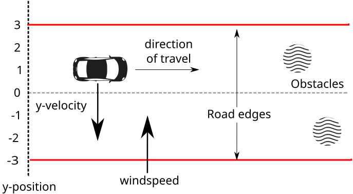

# Overview

Modern software systems increasingly combine neural network components with other software or mathematical models. This is particularly common in safety critical systems where systems can directly affect important decisions such as in cyber physical systems. Examples include autonomous vehicles, aircraft collision avoidance systems (such as the ACAS Xu example seen earlier), medical devices that control drug dosages, and robotics. Verifying that these systems satisfy their required safety and correctness properties is therefore essential. The work of formally proving system level properties is often carried out in interactive theorem provers (ITPs) such as Agda, Imandra, Rocq, or Isabelle (Isabelle/HOL).

 **Prerequisites**: This chapter assumes a general familiarity with interactive theorem provers. While deep expertise is not required, it is assumed that you are comfortable with core concepts and reading/constructing proofs in at least one ITP.

# Where does Vehicle fit?

The overall correctness of such systems depends on both the behaviour of the neural network and the surrounding software or mathematical model. Interactive theorem provers are well suited to reasoning about system level properties such as temporal properties and the interaction between software components and mathematical models. However, directly modelling and verifying trained neural networks inside an ITP can become difficult to scale and maintain as network sizes increase [@desmartin]. Previous work has observed that neural network verification involves a wide range of properties, many of which are better addressed using specialised verification techniques and solvers [@vehicle].

Specialised neural network verifiers such as Marabou have therefore been developed to verify these properties [@katzmarabou]. Marabou combines SMT solving with neural network specific techniques, including network level reasoning and symbolic bound tightening, to reduce the search space and improve the performance and scalability of neural network verification.

Vehicle fits into this workflow by acting as a bridge between these specialised verifiers and interactive theorem provers [@vehicle]. Rather than modelling the neural network directly inside the theorem prover, the desired neural network property is specified once in Vehicle and compiled to a specialised verifier such as Marabou. Once the property has been verified, it can then be exported into the target theorem prover, where it forms part of a larger system level proof [@vehicleCompVerification].

```text
Vehicle specification
        |
Neural network verifier
(e.g. Marabou)
        |
Verified neural network property
        |
Export to ITP
(Rocq / Agda / Isabelle / Imandra)
        |
Combine with system model
        |
System-level proof
```

Using Vehicle in this way has two main advantages:

*Specialised neural network verification*. Vehicle allows neural network properties to be verified using specialised neural network verifiers such as Marabou rather than requiring the complete neural network and verification procedure to be encoded directly inside the theorem prover. This allows the verification process to benefit from techniques designed specifically for neural network verification, while the resulting verified properties can still be incorporated into larger theorem proving developments.

*Reusable specifications*. Vehicle separates the specification of neural network properties from any particular theorem prover. The neural network is taken directly from its ONNX representation, which acts as the single canonical description of the model, while the specification is written once in Vehicle and compiled to both the neural network verifier and the target theorem prover. More generally, Vehicle is designed as an intermediate language that allows neural network specifications to be written once and compiled to machine learning frameworks, neural network verifiers, and interactive theorem provers. This avoids repeatedly reimplementing the neural network and its associated properties for each theorem prover, improving maintainability and reducing duplication.

# An Example: The Wind Controller

As a running example throughout this chapter, we will use the Wind Controller benchmark (located in the repository at `examples/windController`). This is a modified version of the vehicle verification problem originally presented by Boyer, Green, and Moore [@boyer1990use].
In this scenario an autonomous vehicle is travelling along a straight road of width 6 parallel to the x-axis, with a varying cross-wind that blows perpendicular to the x-axis.
The vehicle has an imperfect sensor that it can use to get a (possibly noisy) reading on its position on the y-axis, and can change its velocity on the y-axis in response.
The car's controller takes in both the current sensor reading and the previous sensor reading and its goal is to keep the car on the road.



Given this, the aim is to prove the following theorem:

*Theorem 1*: assuming that the wind-speed can shift by no more than 1 m/s and
that the sensor is never off by more than 0.25 m then the car will never leave the road.

This safety property is not just a property of the neural network, but is instead a temporal property about the model of the entire system, e.g. the car, the road, the physics of the system.

After analysing the system, it turns out that this theorem will be satisfied
if the car controller $f$ satisfies the property that if the absolute value of the
input sensor readings $x1$ and $x2$ are less than 3.25 then the absolute value of
$f [x1, x2] + 2 * x1 - x2$ should be less than 1.25.

We can encode this property in Vehicle as follows:

```vehicle
type InputVector = Tensor Real [2]

currentSensor  = 0
previousSensor = 1

type OutputVector = Tensor Real [1]

velocity = 0

@network
controller : InputVector -> OutputVector

-- Normalises the input values from the range [-4, 4] metres to the range [0, 1]
normalise : InputVector -> InputVector
normalise x = foreach i . (x ! i + 4.0) / 8.0

safeInput : InputVector -> Bool
safeInput x = forall i . -3.25 <= x ! i <= 3.25

safeOutput : InputVector -> Bool
safeOutput x = let y = controller (normalise x) ! velocity in
  -1.25 < y + 2 * (x ! currentSensor) - (x ! previousSensor) < 1.25

@property
safe : Bool
safe = forall x . safeInput x => safeOutput x
```

# Exporting to an ITP: The Command

To export a compiled Vehicle specification, use the `vehicle export` command. The key options are:

```bash
vehicle export \
  --target <ITP>          # One of: Agda, Rocq, Imandra, Isabelle/HOL
  --cache <path>          # Path to the verification cache (mutually exclusive with --specification)
  --specification <path>  # Path to the .vcl file (mutually exclusive with --cache)
  --network <name:file>   # Required when using --specification; maps a network name to its ONNX file
  --dataset <name:file>   # Required when using --specification; maps a dataset name to its data file
  --parameter <name:val>  # Required when using --specification; provides a concrete value for a parameter
  --output <file>         # Where to write the generated ITP file
  --module-name <name>    # Optional module name override for the generated file
```

 **Note**: `--cache` and `--specification` are mutually exclusive. Either point Vehicle to a previously generated verification cache (to export with verified lemmas) or directly to a `.vcl` specification file (to export as axioms/postulates). Passing both will result in a command-line error.

 **Note on concrete parameter values**: If your specification declares a parameter (e.g. `parameter p : Index 5`) and you originally verified and constructed a proof assuming `p` is universally quantified (i.e. `forall`), passing a concrete value via `--parameter p:3` at export time will cause the exported type to change. For example, in Rocq a `forall p, ...` lemma becomes a statement with a fixed `p = 3`. Any existing proof that relies on the `forall` quantifier structure will break and need to be updated accordingly.

A neural network controller `controller.onnx` can be verified against the specification by running:

```bash
vehicle verify \
  --specification windController.vcl \
  --network controller:controller.onnx \
  --verifier Marabou \
  --cache controller-result
```

The `--cache argument specifies where Vehicle writes the verification result. This cache records whether the property was successfully verified, alongside the hashes of the specification file and the neural network.

Assuming this property holds, we can export the specification from the cache to our ITP of choice:

```bash
vehicle export \
  --target <ITP_NAME> \
  --cache controller-result \
  --output WindControllerSpec.<ITP_EXTENSION>
```

If you want to export the specification directly **without a verification cache** (generating axioms or postulates instead of verified lemmas), you can pass the `.vcl` file and its resources directly without verifying:

```bash
vehicle export \
  --target <ITP_NAME> \
  --specification windController.vcl \
  --network controller:controller.onnx \
  --output WindControllerSpec.<ITP_EXTENSION>
```

*(Note: If your specification uses datasets or parameters, you must also pass them using `--dataset name:path` or `--parameter name:value` respectively).*

# What to Expect in the Generated Files

Regardless of which ITP you target, the generated file will generally contain the following:

- **Type definitions**: Vehicle types (e.g. `Tensor Real [2]`) are translated to their ITP equivalents.
- **Network declaration**: The neural network is represented as an opaque/abstract declaration (a `postulate` in Agda, a `Parameter` in Rocq). It is not given a concrete implementation inside the ITP; it is treated as a black-box function whose properties are given by the verified lemmas.
- **Helper definitions**: Any intermediate definitions from your specification (e.g. `safeInput`, `safeOutput`) appear as definitions or predicates.
- **Properties**: Each `@property` in the Vehicle specification is translated into a formal statement in the generated file. For example, the wind controller specification defines:
  ```vehicle
  @property
  safe : Bool
  safe = forall x . safeInput x => safeOutput x
  ```
  This compiles to:
  - `Lemma safe : forall x, safeInput x -> safeOutput x.` in Rocq,
  - `safe : ∀ x → SafeInput x → SafeOutput x` in Agda,
  - `axiom safe x = ((safe_input x) ==> (safe_output x))` in Imandra,
  - `assumes safe : "\<forall> x. safeInput controller x \<longrightarrow> safeOutput controller x"` in Isabelle.

  Depending on whether you export with a cache and if the backend supports it, the property is either a proved lemma or an unproven axiom/postulate.

 **Note (v0.26.1)**: At the time of writing, cache-backed validation, where the ITP actively checks the verification result, is only supported for **Agda** and **Rocq**. Imandra and Isabelle currently export all properties as axioms or locale assumptions regardless of whether `--cache` is supplied. See the [Vehicle exporting documentation](https://vehicle-lang.readthedocs.io/en/stable/exporting.html) for the latest list of supported backends.

 **Note on record types**: Some of the full proof files linked below may be written for a version of the specification that has been refactored to use records (as described in the earlier section on record types) rather than raw tensors. While this changes the syntax (e.g. accessing fields as `x.currentSensor` instead of `x ! currentSensor`), the overall verification logic and proof integration should remain very similar.

<div class="tabs-container">
  <div class="tabs-header">
    <button class="tab-button active" data-index="0">Agda</button>
    <button class="tab-button" data-index="1">Rocq</button>
    <button class="tab-button" data-index="2">Imandra</button>
    <button class="tab-button" data-index="3">Isabelle</button>
  </div>
  <div class="tabs-content">
<div>

**Companion Library**: To use the generated Agda file in your proof, you will need the [Vehicle Agda library](https://github.com/vehicle-lang/vehicle/tree/dev/vehicle-agda) installed. See the repository for installation instructions.

```bash
vehicle export \
  --target Agda \
  --cache controller-result \
  --output WindControllerSpec.agda
```

which will generate an Agda file:

```agda
open import Vehicle
open import Vehicle.Utils
open import Vehicle.Data.Tensor as 𝕋
open import Data.Product
open import Data.Integer as ℤ using (ℤ)
open import Data.Rational as ℚ using (ℚ)
open import Data.Fin as Fin using (Fin; #_)
open import Data.List.Base

module WindControllerSpec where

InputVector : Set
InputVector = Tensor ℚ (2 ∷ [])

currentSensor : Fin 2
currentSensor = # 0

previousSensor : Fin 2
previousSensor = # 1

OutputVector : Set
OutputVector = Tensor ℚ (1 ∷ [])

velocity : Fin 1
velocity = # 0

postulate controller : InputVector → OutputVector

normalise : InputVector → InputVector
normalise x = foreach (λ i → ((x ! i) 𝕋.+ (natScalar 4)) 𝕋.÷ (natScalar 8))

SafeInput : InputVector → Set
SafeInput x = ∀ i → 𝕋.- (scalar (ℤ.+ 13 ℚ./ 4)) ≤ (x ! i) × (x ! i) ≤ (scalar (ℤ.+ 13 ℚ./ 4))

SafeOutput : InputVector → Set
SafeOutput x = let y = controller (normalise x) ! velocity in 𝕋.- (scalar (ℤ.+ 5 ℚ./ 4)) < (y 𝕋.+ (natScalar 2) 𝕋.* (x ! currentSensor)) 𝕋.- (x ! previousSensor) × (y 𝕋.+ (natScalar 2) 𝕋.* (x ! currentSensor)) 𝕋.- (x ! previousSensor) < (scalar (ℤ.+ 5 ℚ./ 4))

abstract
  safe : ∀ x → SafeInput x → SafeOutput x
  safe = checkSpecification record
    { cache = "<absolute path to cache>"
    }
```

**Key components in the generated Agda file**:
- **`postulate controller`**: The neural network declared as an abstract postulate. No implementation is provided inside Agda; its properties come solely from the verified lemma.
- **`normalise`**: A helper preprocessing function generated from the specification.
- **`SafeInput` / `SafeOutput`**: Vehicle's property predicates translated to Agda types.
- **`safe`**: The `@property` from the specification. When a cache is provided, it is discharged using the `checkSpecification` macro with a `cache` field pointing to the verification result folder. This checks that the cache is present and hashes match, it does **not** re-run the verifier. If no cache is provided, this would instead be a `postulate`.

This Agda file can then be imported and used by the larger proof of correctness for the whole system.

Once exported, we can import this module and use the safety lemma to prove system-level properties in Agda:
```agda
import WindControllerSpec as Vehicle

(* Prove the controller lemma by applying the exported safe lemma *)
controller-lem : ∀ x y →
                 ∣ x ∣ ≤ roadWidth + maxSensorError →
                 ∣ y ∣ ≤ roadWidth + maxSensorError →
                 ∣ controller x y + 2ℚ * x - y ∣ < roadWidth - maxWindShift - 3ℚ * maxSensorError
controller-lem x y ∣x∣≤rw+εₘₐₓ ∣y∣≤rw+εₘₐₓ with ...
  | Vehicle.safe (record { currentSensor = scalar x ; previousSensor = scalar y }) Hsafe = ...

(* Establish system-level correctness using the lemma proven above *)
finalState-onRoad : ∀ xs → All ValidObservation xs → OnRoad (finalState xs)
finalState-onRoad []       []         = initialState-onRoad
finalState-onRoad (x ∷ xs) (px ∷ pxs) = ...
```

The full proof of correctness for the system can be found in [SafetyProof.agda](https://github.com/vehicle-lang/vehicle/blob/dev/examples/windController-newStyle/agdaProof/SafetyProof.agda).

</div>
<div>

**Companion Library**: To use the generated Rocq file in your proof, you will need the [Vehicle Rocq companion library](https://github.com/vehicle-lang/vehicle/tree/dev/vehicle-rocq) installed. See the repository for installation instructions.

 **Rocq option - constructive reals**: By default, Vehicle uses [MathComp](https://math-comp.github.io/) reals for the Rocq backend. If you want to use constructive reals instead, pass the `-r` / `--constructive-reals` flag. Example of use:
 ```bash
 vehicle export \
   --target Rocq \
   --constructive-reals \
   --cache controller-result \
   --output WindControllerSpec.v
 ```

 This changes the real number representation and the imports inside the generated specification file. For instance, the header will change to:
 ```coq
 From mathcomp Require Import all_boot.
 From mathcomp Require Import all_algebra.
 From mathcomp Require Import interval_inference.
 From mathcomp Require Import all_reals.
 From mathcomp Require Import Rstruct.
 From vehicle Require Import utils.
 Require Import Stdlib.Reals.Reals.
 Local Open Scope ring_scope.
 Local Open Scope order_scope.

 Notation R := Rdefinitions.R.
 ```

 Use this option if your existing proof development uses Coq's standard library constructive reals rather than MathComp reals.

 The rocq file generated below **omits** the `--constructive-reals` flag and uses the default MathComp reals.

```coq
From mathcomp Require Import all_boot.
From mathcomp Require Import all_algebra.
From mathcomp Require Import interval_inference.
From mathcomp Require Import all_reals.
From vehicle Require Import utils.
From vehicle Require Import validate.
Local Open Scope ring_scope.
Local Open Scope order_scope.

Parameter R : realType.

Definition InputVector : Type := 'nT[R]_[2].

Definition currentSensor : 'I_2%N := 0.

Definition previousSensor : 'I_2%N := 1.

Definition OutputVector : Type := 'nT[R]_[1].

Definition velocity : 'I_1%N := 0.

Parameter controller : InputVector -> OutputVector.

Definition normalise (x : InputVector) : InputVector := nstack (fun i => (x ^^ i + const_t (4 : R)) / const_t (8 : R)).

Definition safeInput (x : InputVector) : Prop := forallIndex (fun i => - const_t (13 / 4 : R) <= x ^^ i /\ x ^^ i <= const_t (13 / 4 : R)).

Definition safeOutput (x : InputVector) : Prop := let y := controller (normalise x) ^^ velocity in - const_t (5 / 4 : R) < y + const_t (2 : R) * x ^^ currentSensor - x ^^ previousSensor /\ y + const_t (2 : R) * x ^^ currentSensor - x ^^ previousSensor < const_t (5 / 4 : R).

Lemma safe : forall x, safeInput x -> safeOutput x.
Proof. vehicle_validate "<absolute path to cache>". Qed.
```

**Key components in the generated Rocq file**:
- **`Parameter R : realType`**: The real number type is parameterised, using MathComp's `realType`.
- **`Parameter controller`**: The neural network declared as an opaque parameter using MathComp tensor types (`'nT[R]_[2]`).
- **`normalise`**: A helper preprocessing function generated from the specification.
- **`safeInput` / `safeOutput`**: Vehicle's predicates translated to Rocq `Prop` definitions.
- **`Lemma safe`**: The `@property` from the specification. When a cache is provided, it is discharged using the `vehicle_validate` tactic. This tactic checks that the cache is present and the hashes match the source files and the neural network. It does **not** re-run the neural network verifier (e.g. Marabou). If no cache is provided, this would be an `Axiom` instead.

Once exported, we can import this module and use the safety lemma to prove the continuous safety of the system:

```coq
From windController Require Import WindControllerSpec.
Import WindControllerSpec.

(* Prove the controller lemma by applying the exported safe property *)
Lemma controller_lem : forall x y,
  `|x| <= roadWidth + maxSensorError ->
  `|y| <= roadWidth + maxSensorError ->
  `|controller x y + 2 * x - y| < roadWidth - maxWindShift - 3 * maxSensorError.
Proof.
  move=> x y Hx Hy.
  ...
  (* Apply the safe lemma from the generated WindControllerSpec module *)
  apply WindControllerSpec.safe.
  ...
Qed.

(* Prove system-level correctness using the controller lemma established above *)
Theorem finalState_onRoad :
  forall xs, (forall x, List.In x xs -> validObservation x) ->
  onRoad(finalState xs).
Proof.
  ...
Qed.
```

The full proof of correctness for the system can be found in [SafetyProof.v](https://github.com/vehicle-lang/vehicle/blob/dev/examples/windController/rocqProof/SafetyProof.v).

 **Note on MathComp updates**: The `SafetyProof.v` proof file in the repository may use older MathComp tensor syntax (e.g., the `^^=` operator and `tensor_nilN` lemma). In newer versions of the MathComp tensor library, these have been updated. If you encounter compilation errors when running the proof locally, you may need to adjust the projections to match your installed MathComp version.

</div>
<div>

**Companion Library**: See the [Vehicle repository](https://github.com/vehicle-lang/vehicle/tree/dev/vehicle-imandra) for any Imandra-specific setup required.

```bash
vehicle export \
  --target Imandra \
  --cache controller-result \
  --output WindControllerSpec.iml
```

which will generate an Imandra file:

```ocaml
[@@@import "tensor.iml"]
[@@@import "subtensor.iml"]
[@@@import "add.iml"]
[@@@import "scalar_mult.iml"]
[@@@import "vehicle.iml"]

open Vehicle

module WindControllerSpec = struct

  type flex_index = int

  type input_vector = real Tensor.tensor

  type output_vector = real Tensor.tensor

  let controller : input_vector -> output_vector = () [@@opaque]

  let current_sensor : int = 0

  let previous_sensor : int = 1

  let velocity : int = 0

  let normalise (x : input_vector) : input_vector =
    (foreach 2
      (fun (i : int) ->
        (pointwise_div_real
          (tensor_plus_real (flex_subtensor x i) (flextensor_from_vec [] [ (Real.(4.0)) ]))
          (flextensor_from_vec [] [ (Real.(8.0)) ]))))

  let safe_input (x : input_vector) : bool =
    (forall_index 2
      (fun (i : int) ->
        ((leq_tensor_reduced_real
            (tensor_cdot (-1.0) (flextensor_from_vec [] [ (Real.(13.0 /. 4.0)) ]))
            (flex_subtensor x i))
          && (leq_tensor_reduced_real (flex_subtensor x i) (flextensor_from_vec [] [ (Real.(13.0 /. 4.0)) ])))))

  let safe_output (x : input_vector) : bool =
    let y = (flex_subtensor (controller (normalise x)) velocity) in
    ((lt_tensor_reduced_real
        (tensor_cdot (-1.0) (flextensor_from_vec [] [ (Real.(5.0 /. 4.0)) ]))
        ((tensor_plus_real (tensor_plus_real
          y
          (hadamard_prod_real
            (flextensor_from_vec [] [ (Real.(2.0)) ])
            (flex_subtensor x current_sensor))) (tensor_cdot (-1.0) (flex_subtensor x previous_sensor)))))
      && (lt_tensor_reduced_real
        ((tensor_plus_real (tensor_plus_real
          y
          (hadamard_prod_real
            (flextensor_from_vec [] [ (Real.(2.0)) ])
            (flex_subtensor x current_sensor))) (tensor_cdot (-1.0) (flex_subtensor x previous_sensor))))
        (flextensor_from_vec [] [ (Real.(5.0 /. 4.0)) ])))

  axiom safe x =
    ((safe_input x) ==> (safe_output x))

end
```

**Key components in the generated Imandra file**:
- **`let controller = () [@@opaque]`**: The neural network declared as an opaque value. No implementation is given; Imandra treats it as an uninterpreted function.
- **`safe_input` / `safe_output`**: Vehicle's predicates compiled to boolean-valued Imandra functions.
- **`axiom safe`**: The `@property` is always exported as a bare `axiom` in Imandra. Cache-backed validation is not currently supported, so the property is assumed rather than proved.

This Imandra file can then be imported and used by the larger proof of correctness for the whole system.

Once exported, we can import this module and use the safety lemma to prove system-level properties in Imandra:

```ocaml
open WindControllerSpec

(* Prove the controller lemma by referencing the exported safe axiom *)
lemma controller_safety_scalar x y =
  safe_input x y ==> safe_output x y (controller_fun x y)
[@@by [%use Wind_controller_spec.safe (Tensor.tensor_from_vec [2] [x; y])]
   @> [%expand controller_fun x y] @> auto]

(* Establish system-level correctness using the lemma proven above *)
theorem final_state_on_road observations =
  all_valid_observations observations ==> on_road (final_state observations)
[@@by [%use final_state_safe_and_on_road observations] @> auto]
```

The full proof of correctness for the system can be found in [car_safety_auto.iml](https://github.com/imandra-ai/imandra-vehicle/blob/main/src/car_safety_auto.iml).
</div>
<div>

**Companion Library**: See the [Vehicle repository](https://github.com/vehicle-lang/vehicle/tree/dev/vehicle-isabelle) for any Isabelle-specific setup required.

```bash
vehicle export \
  --target Isabelle \
  --cache controller-result \
  --output WindControllerSpec.thy
```

which will generate an Isabelle theory file:

```isabelle
theory  WindControllerSpec

  imports

    "Complex_Main"

    "Deep_Learning.Tensor"
    "Deep_Learning.Tensor_Subtensor"
    "Deep_Learning.Tensor_Scalar_Mult"
    "Vehicle.Vehicle"

begin

  type_synonym R = "real"


  typedef InputVector  =  "{ a :: R tensor. (dims a) = ((2 :: nat) # []) }"
    using dims_tensor_from_lookup by blast

  (* Type Coercions *)
  declare [[coercion Rep_InputVector]]
  definition to_InputVector :: "R FlexTensor \<Rightarrow> InputVector"
    where[simp]: "to_InputVector a = (
      let t = Rep_FlexTensor a
      in (if dims t = ((2 :: nat) # []) then Abs_InputVector t else undefined))"
  declare [[coercion to_InputVector]]
  (* Type Rewrite Rules *)
  lemma InputVector_tensor_rewrite0[simp]:
    assumes "prod_list shape = length elems"
        and "shape = (2 :: nat) # []"
    shows "(Rep_tensor (Rep_InputVector (Abs_InputVector (Abs_tensor (shape,elems))))) =  (shape,elems)"
  proof -
    have "Rep_InputVector (Abs_InputVector (Abs_tensor (shape,elems)))
      = Abs_tensor (shape,elems)"
        using Abs_InputVector_inverse[of "Abs_tensor (shape,elems)"]
        using Abs_tensor_inverse[of "(shape, elems)"]
        unfolding dims_def
        using assms
        by (simp)
    moreover have "Rep_tensor (Abs_tensor (shape,elems)) = (shape,elems)"
        using assms
        by (simp add: Abs_tensor_inverse)
    ultimately show ?thesis by simp
  qed

  definition currentSensor  :: "  FlexIndex "
    where " currentSensor   = ( (Abs_FlexIndex 0) ) "

  definition previousSensor  :: "  FlexIndex "
    where " previousSensor   = ( (Abs_FlexIndex 1) ) "

  typedef OutputVector  =  "{ a :: R tensor. (dims a) = ((1 :: nat) # []) }"
    using dims_tensor_from_lookup by blast

  (* Type Coercions *)
  declare [[coercion Rep_OutputVector]]
  definition to_OutputVector :: "R FlexTensor \<Rightarrow> OutputVector"
    where[simp]: "to_OutputVector a = (
      let t = Rep_FlexTensor a
      in (if dims t = ((1 :: nat) # []) then Abs_OutputVector t else undefined))"
  declare [[coercion to_OutputVector]]
  (* Type Rewrite Rules *)
  lemma OutputVector_tensor_rewrite0[simp]:
    assumes "prod_list shape = length elems"
        and "shape = (1 :: nat) # []"
    shows "(Rep_tensor (Rep_OutputVector (Abs_OutputVector (Abs_tensor (shape,elems))))) =  (shape,elems)"
  proof -
    have "Rep_OutputVector (Abs_OutputVector (Abs_tensor (shape,elems)))
      = Abs_tensor (shape,elems)"
        using Abs_OutputVector_inverse[of "Abs_tensor (shape,elems)"]
        using Abs_tensor_inverse[of "(shape, elems)"]
        unfolding dims_def
        using assms
        by (simp)
    moreover have "Rep_tensor (Abs_tensor (shape,elems)) = (shape,elems)"
        using assms
        by (simp add: Abs_tensor_inverse)
    ultimately show ?thesis by simp
  qed

  definition velocity  :: "  FlexIndex "
    where " velocity   = ( (Abs_FlexIndex 0) ) "

  definition normalise  :: " (InputVector \<Rightarrow> OutputVector) \<Rightarrow> (InputVector) \<Rightarrow>  InputVector "
    where " normalise   controller x = ( (foreach (2 :: nat)  (\<lambda>  i . ((pointwise_div (tensor_plus (flex_subtensor x i) (flextensor_from_vec [] [ (((4 :: R) )) ])) (flextensor_from_vec [] [ (((8 :: R) )) ]))))) ) "

  definition safeInput  :: " (InputVector \<Rightarrow> OutputVector) \<Rightarrow> (InputVector) \<Rightarrow>  bool "
    where " safeInput   controller x = ( (forallIndex (2 :: nat)  (\<lambda>  i . (((leqTensorReduced (tensor_cdot (-1 :: R) (flextensor_from_vec [] [ (((13 :: R) / 4)) ])) (flex_subtensor x i))) \<and> ((leqTensorReduced (flex_subtensor x i) (flextensor_from_vec [] [ (((13 :: R) / 4)) ])))))) ) "

  definition safeOutput  :: " (InputVector \<Rightarrow> OutputVector) \<Rightarrow> (InputVector) \<Rightarrow>  bool "
    where " safeOutput   controller x = ( let y = (flex_subtensor ((controller ((normalise controller x)))) velocity) in ((ltTensorReduced (tensor_cdot (-1 :: R) (flextensor_from_vec [] [ (((5 :: R) / 4)) ])) ((tensor_plus ((tensor_plus y ((hadamard_prod (flextensor_from_vec [] [ (((2 :: R) )) ]) (flex_subtensor x currentSensor))))) (tensor_cdot (-1 :: R) (flex_subtensor x previousSensor)))))) \<and> ((ltTensorReduced ((tensor_plus ((tensor_plus y ((hadamard_prod (flextensor_from_vec [] [ (((2 :: R) )) ]) (flex_subtensor x currentSensor))))) (tensor_cdot (-1 :: R) (flex_subtensor x previousSensor)))) (flextensor_from_vec [] [ (((5 :: R) / 4)) ]))) ) "

  locale  WindControllerSpec  =

    fixes  controller  :: " InputVector \<Rightarrow> OutputVector "

    assumes  safe :  " (\<forall> x. (safeInput controller x) \<longrightarrow> (safeOutput controller x)) "

    begin

    end

end
```

**Key components in the generated Isabelle file**:
- **`typedef InputVector` / `typedef OutputVector`**: Vehicle tensor types are encoded as Isabelle `typedef`s, giving them proper type-level identities with associated coercions and rewrite lemmas.
- **`locale WindControllerSpec` with `fixes controller`**: The neural network is introduced as a fixed but uninterpreted function inside an Isabelle locale, rather than as a top-level definition.
- **`assumes safe`**: The `@property` is always exported as a locale assumption (`assumes`) in Isabelle. Cache-backed validation is not currently supported, so the property is assumed rather than proved.

Once exported, we can import this module and use the safety lemma to prove system-level properties in Isabelle:

```isabelle
context WindControllerSpec
begin

(* Prove the controller lemma by using the locale assumption 'safe' *)
lemma controller_lem:
  assumes "(abs x) \<le> roadWidth + maxSensorError"
      and "(abs y) \<le> roadWidth + maxSensorError"
    shows "(abs ((controllerFun x y) + 2*x - y)) <
              roadWidth - maxWindShift - 3*maxSensorError"
proof -
  ...
  (* Utilize the 'safe' locale assumption *)
  then have outputSafe: "safeOutput controller X"
    using safe
    unfolding safeInput_def
    apply (erule_tac x="X" in allE)
    by simp
  ...
end

(* Prove system-level correctness using the lemma established above *)
theorem finalState_onRoad:
  assumes "\<forall> x. List.member xs x \<longrightarrow> validObservation x"
  shows "onRoad (finalState xs)"
  ...
end
```

The full proof of correctness for the system can be found in [SafetyProof.thy](https://github.com/vehicle-lang/vehicle/blob/dev/examples/windController/isabelleProof/SafetyProof.thy).
</div>
  </div>
</div>

# The Role of the Verification Cache

When exporting specifications to an interactive theorem prover, you can choose whether or not to provide a verification cache using the `--cache` parameter.

# 1. Exporting WITH a Cache (`--cache`)
Providing the cache path points Vehicle to the hashes and verification results generated during the `vehicle verify` step.
*   **How it works (where supported)**: For Agda and Rocq, Vehicle translates `@property` declarations into formal proof structures (`Lemma` in Rocq, or macro calls in Agda). Note that Imandra and Isabelle do not currently support cache-backed validation.
*   **At check time**: When the theorem prover checks the generated file, it invokes a Vehicle validation step (`vehicle_validate` in Rocq or `checkSpecification` in Agda). This checks that the cache exists and that the stored hashes still match the current source files and network, it does **not** re-run the neural network verifier (e.g. Marabou). Verification was already done, the cache just records the result.
*   **Why use it**: A succesful verification is required for a cache to be created. Meaning an ITP proof using this cache can be used for actual verification. The cache also stores a hash of the network and specification, so if either is later modified, the hash check will fail, indicating that re-verification is needed before the proof is valid again.

# 2. Exporting WITHOUT a Cache (Postulates & Axioms)
If you omit the `--cache` parameter (or if your target backend does not support cache-backed validation, as is currently the case for Imandra and Isabelle), Vehicle cannot verify whether the property holds.
*   **How it works**: Vehicle compiles all `@property` declarations into **postulates** (Agda) or **axioms** (Rocq, Isabelle, Imandra).
*   **Why use it**:
    *   **Iterative development**: You want to check if your system-level proof is structurally correct under the assumption that the neural network satisfies its properties, before needing to run verification.

# Summary: The Vehicle to ITP Pipeline

The following diagram illustrates the complete process of using Vehicle to export a specification to an ITP:

```text
               Vehicle specification (.vcl)
                            │
                            ▼
        ┌───────────────────────────────────────┐
        │ Do you want to verify the network now?│
        └───────────┬───────────────┬───────────┘
                    │               │
                Yes │               │ No
       (Export WITH Cache)          │ (Export WITHOUT Cache)
                    │               │
                    ▼               │
         Neural network verifier    │
             (e.g. Marabou)         │
                    │               │
                    ▼               │
           Verification Cache       │
                    │               │
                    └───────┬───────┘
                            │
                            ▼
                      vehicle export
             (Agda / Rocq / Isabelle / Imandra)
                            │
                            ▼
                Generated ITP spec files
            (Lemmas/Proofs via cache or Postulates/Axioms)
                            │
                            ▼
                Combine with system model
                            │
                            ▼
                   System-level proof
```

# Exercises

 **Note**: While some of the instructions and examples in these exercises reference Rocq for consistency, you can complete them using your preferred ITP backend (Agda, Imandra, or Isabelle).

## Exercise 1 (*): Export the Wind Controller Specification

Navigate to the `examples/windController` directory in the repository. We will run a verification using the Marabou verifier to produce the verification cache, then export it:

1. Run the verification command to generate the cache:
   ```bash
   vehicle verify \
     --specification windController.vcl \
     --network controller:controller.onnx \
     --verifier Marabou \
     --cache controller-result
   ```
2. Export the verified specification to your ITP of choice (e.g. Rocq):
   ```bash
   vehicle export \
     --target Rocq \
     --cache controller-result \
     --output WindControllerSpec.v
   ```
3. Open `WindControllerSpec.v` and verify that the safety property `safe` appears as a `Lemma` discharged by the `vehicle_validate` tactic (Rocq).

## Exercise 2 (*): Exporting With vs. Without Cache

Let's compare the generated output files when exporting with and without a verification cache.

1. Export the specification again, but this time use `--specification` directly instead of `--cache`:
   ```bash
   vehicle export \
     --target Rocq \
     --specification windController.vcl \
     --network controller:controller.onnx \
     --output WindControllerSpecAxiom.v
   ```
2. Open both `WindControllerSpec.v` and `WindControllerSpecAxiom.v` side by side.
3. Note how the representation of the `safe` property changes. Confirm that it is exported as a `Lemma` (verified using the cache) in the former, but as an opaque `Axiom` or `Parameter` in the latter.

## Exercise 3 (*): Refactoring Specifications to Records

In previous chapters, we learned how to use user defined records to improve spec readability. Let's rewrite our specification to see how record types affect the exported ITP files.

1. Create a copy of `windController.vcl` and rewrite it. Refactor the network inputs and outputs to use records (using the `@tensor record` syntax) rather than raw tensors.
2. Update the network definition, `safeInput`, and `safeOutput` functions in your specification to project fields using record field names rather than tensor indexing operations.
3. Re-verify the updated specification and export it to Rocq.
4. Compare your .vcl file and generated export file. Notice how the difference in readability and structure between the two files and how it affects the generated code.

If you get stuck or want to compare your final specification with the completed versions:

*   Original tensor-based specification: [windController.vcl (tensor-based)](https://github.com/vehicle-lang/vehicle/blob/dev/examples/windController/windController.vcl)
*   Refactored record-based specification: [windController.vcl (record-based)](https://github.com/vehicle-lang/vehicle/blob/dev/examples/windController-newStyle/windController.vcl)
*   **Note**: The refactored record-based specification has normalisation built directly into the neural network itself, so it lacks the explicit `normalise` function found in the original tensor-based version. However, it is otherwise fundamentally the same.

## Exercise 4 (*): Verifying and Proving Centred Sensor Stability

Specify and verify a stability property: **Centred Sensor Stability**. This property asserts that when the sensor readings indicate the car is very close to the centre of the road (bounded within $[-0.5, 0.5]$ metres), the controller output adjustment must remain small (bounded within $[-0.5, 0.5]$ metres/second) to prevent sensor error from causing erratic overcorrections.

1. Open your copy of `windController.vcl`.
2. Define a new property `sensorNearCenter` that bounds the output velocity change when inputs are near the road centre (within $[-0.5, 0.5]$).
3. Run `vehicle verify` on the updated specification to generate a new verification cache.
4. Export the verified specification with the cache to Rocq.
5. In your `SafetyProof.v` file, write a new theorem `controllerCenterBound` and use the new exported `sensorNearCenter` lemma to prove a centred bound.

**Challenge (Parameterised Stability):**
Try creating a parameterised version of this property by declaring:
```vehicle
parameter maxDistance : Real
parameter maxSpeed : Real
```
You can save this parameterised version in a separate specification file (e.g., `windControllerParam.vcl`). This allows you to run verification with different distance and speed values (using the `--parameter` flag) to easily verify different safety bounds.

If you get stuck or want to compare your work:
*   [Completed Centred Stability Specification (windController.vcl)](https://github.com/vehicle-lang/vehicle/blob/dev/examples/windController/windController.vcl) <!-- Placeholder link -->
*   [Completed Safety Proof (SafetyProof.v)](https://github.com/vehicle-lang/vehicle/blob/dev/examples/windController/rocqProof/SafetyProof.v) <!-- Placeholder link -->
