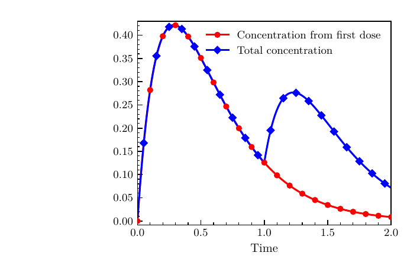

# Contents

| Part | What it covers |
| --- | --- |
| [Overview](#overview) | The dosing problem, safety goal, and how the different tools fit together. |
| [6.1 Vehicle Specification and Verification](#61-vehicle-specification-and-verification) | The network property, input bounds, Vehicle specification, verification, and Rocq export. |
| [6.2 Network Training](#62-network-training) | The data and settings used to train the controller, and how training relates to the property. |
| [6.3 Rocq System Proof](#63-rocq-system-proof) | The concentration model, repeated-dose proof, and connection to the exported network properties. |

# Overview

The previous chapters looked at the different parts of the Vehicle process separately. We saw how to write a Vehicle specification, verify a property of a neural network, train a network, and export properties to an interactive theorem prover. Sirman et al. bring these parts together in *Vancomycert*, a case study of a neural dosing controller connected to a Rocq safety proof [@vancomycert].

The case study considers repeated doses of vancomycin. A trained neural network acts as the controller and selects each new dose from the current patient information. The safety question is not only whether one network output is acceptable. It is whether the concentration produced by all the doses remains safe as time passes and more doses are added.

The neural network receives five values:

- the current drug concentration;
- body temperature;
- white blood cell count;
- age;
- weight.

It outputs a dose. The main result is that, under the assumptions used by the model and proof, the total concentration does not go above a safe boundary called $C_{\mathrm{safe}}$. This is proved for any number of doses, rather than only checking the next few doses.

The example contains a trained network, a Vehicle specification, neural network verification, a Rocq export, a mathematical concentration model, and a system-level proof. It therefore shows how the separate stages from the earlier chapters connect in a less trivial example.

The [runnable proof artefact](https://zenodo.org/records/20717396) contains the network, specification, verification setup, and Rocq proof used throughout Parts 6.1--6.3. It uses Vehicle 0.25.1.

## How the Argument Fits Together

The complete argument has two parts which are joined at the end. The first part is a general Rocq proof for an abstract dosing function:

```text
One-dose concentration model
        |
        v
Peak and non-increasing results
        |
        v
Abstract safe and non_neg assumptions
        |
        v
Repeated doses and induction
        |
        v
doses_safe
```

The second part connects the trained network to those abstract assumptions:

```text
Vehicle specification and trained network
        |
        v
safeFar, safeNear and nonNeg
        |
        v
Exported Spec.v properties
        |
        v
Rocq bridge to safe and non_neg
```

In the general Rocq proof, `safe` says that the concentration already present plus the peak contribution from the selected dose stays within $C_{\mathrm{safe}}$. The assumption `non_neg` says that the selected dose is not negative. For the trained network, `safeFar`, `safeNear`, and `nonNeg` are used to establish these two assumptions.

The final theorem, `pk_safe`, combines the network-specific properties with the general repeated-dose theorem, `doses_safe`.

| Part | What it contains in this example |
| --- | --- |
| Vehicle and Marabou | Network inputs and output, normalisation, patient input bounds, the pharmacokinetic parameters, and the properties `safeFar`, `safeNear`, and `nonNeg`. |
| Network training | The data, network structure, and training settings used to produce the controller. |
| Exported `Spec.v` | The generated tensor-valued parameters, normalisation definitions, and network properties that form the hand-off to Rocq. |
| Rocq | The concentration equations, the position of the peak, the sequence of doses, and the induction over the number of doses. |

Vehicle is used for properties that directly involve the inputs and output of the network. Rocq is used for the concentration equations, repeated doses, and the induction needed for the result over any number of doses.

Together, these parts show the main hand-off in the example: Vehicle does not prove the repeated-dose theorem, and Rocq does not analyse the layers of the neural network. Each tool handles the part of the problem that matches it, and the exported properties connect the two.

# 6.1 Vehicle Specification and Verification

## From the Safety Goal to a Network Property

The [overview](#overview) introduced the full safety goal: the total concentration should remain below $C_{\mathrm{safe}}$ for any number of doses. A neural network verifier does not carry out the induction over the complete dosing history. It instead checks the smaller input-output property needed by the Rocq proof.

[Part 6.3](#63-rocq-system-proof) defines the one-dose concentration function $C(D,t)$ and shows that it reaches its peak at $t_{\mathrm{peak}}$. If $c$ is the concentration already present when the controller is called and $f(c)$ is the selected dose, the required property is:

$$
0 \leq c \leq C_{\mathrm{safe}}
\quad\Longrightarrow\quad
c+C\left(f(c),t_{\mathrm{peak}}\right)
\leq C_{\mathrm{safe}}.
$$

This property is called $\psi$ in the case study and `safe` in the general Rocq proof. It says that the current concentration plus the largest contribution from the new dose must still be safe. The Rocq proof also has a `non_neg` assumption, which says that the selected dose is not negative.

The real network has five inputs, not one. The Vehicle properties quantify over every input vector inside the stated ranges. When the network is connected to the Rocq proof, concentration remains the input that changes between dosing steps. The other four patient values are supplied from the patient state. This gives the concentration-to-dose function required by the general proof.

## Vehicle Boundaries

The Vehicle properties use the following patient input ranges:

- concentration is between zero and `C_safe`;
- temperature is between 36.5 and 40;
- white blood cell count is between 7.5 and 20;
- age is between 18 and 89;
- weight is between 50 and 100.

Together, these ranges define the clinically viable input domain used in this example. Temperature, white blood cell count, age, and weight do not appear directly in the concentration equation, but they are inputs used by the network when it selects a dose.

The property sent to Marabou must be linear in the network inputs and output. The exponential and logarithm expressions from the concentration model are therefore not placed directly in the Vehicle property. Concrete upper and lower exponential approximations are passed as parameters instead, and their required bounds are checked in Rocq with the `interval` tactic.

The two exponential values at $t_{\mathrm{peak}}$ may be irrational and cannot be expressed or computed in this Vehicle specification. Vehicle instead receives upper and lower approximations as parameters and chooses which ones to use depending on whether `Ka < Ke`. Rocq then checks the concrete approximation bounds used in `Spec.v`.

## Inputs and Normalisation

`pk.vcl` starts by giving names to the five input positions. It also declares the mean and standard deviation data used to normalise the network inputs.

```vehicle
type UnnormalisedInputVector = Tensor Real [5]
type InputVector = Tensor Real [5]

conc = 0
temp = 1
wbc = 2
age = 3
weight = 4

type OutputVector= Tensor Real [1]

@dataset
meanScalingValues : UnnormalisedInputVector

@dataset
standardDeviationValues : UnnormalisedInputVector

normalise : UnnormalisedInputVector -> InputVector
normalise x = foreach i .
  (x ! i - meanScalingValues ! i) / (standardDeviationValues ! i)

@network
pk : InputVector -> OutputVector

normpk : UnnormalisedInputVector -> OutputVector
normpk x = pk (normalise x)
```

`pk` is the trained network and takes normalised inputs. As mentioned in the earlier chapters, it is preferable to include input normalisation in the neural network itself. In this case, the Vehicle function `normalise` converts the original input values into the form expected by `pk`. The function `normpk` applies `normalise` before calling `pk`, so the properties can use the original patient values.

The required network behaviour is divided into three Vehicle properties.

At the mathematical level, the proof needs the one `safe` property shown earlier. Vehicle checks a property by asking Marabou whether a counterexample exists, so the property is negated. A required `<=` bound would produce a strict `>` counterexample query, which this version cannot handle. As explained in Appendix B of the case study, `safeFar` uses `<` so that its counterexample query uses `>=`, while `safeNear` covers the area close to the boundary. Rocq then combines them to obtain the required non-strict `safe` result.

## `safeFar`

For `safeFar`, let the network dose and the selected exponential bound be:

$$
\begin{aligned}
D(x) &= [\operatorname{normpk}(x)]_0, \\
y(x) &= \frac{D(x)K_a}{V_d(K_a-K_e)}, \\
b &=
\begin{cases}
K_e^{\text{under}}-K_a^{\text{over}}, & \text{if }K_a<K_e, \\
K_e^{\text{over}}-K_a^{\text{under}}, & \text{otherwise}.
\end{cases}
\end{aligned}
$$

Here, $b$ is the selected approximation of
$e^{-K_e t_{\mathrm{peak}}}-e^{-K_a t_{\mathrm{peak}}}$.

The checked inequality is:

$$
0 \leq x_{\mathrm{conc}} \leq 0.99C_{\mathrm{safe}}
\quad\Longrightarrow\quad
x_{\mathrm{conc}}+y(x)b<C_{\mathrm{safe}}.
$$

The five bounds in `safeFarInput` describe the patient input domain. The concentration part is shown above, and the other four values must also stay inside their stated ranges. In `pk.vcl`, this is:

```vehicle
safeFarInput : InputVector -> Bool
safeFarInput x =
    0 <= x ! conc <= C_safe * 0.99 and
    36.5 <= x ! temp <= 40 and
    7.5 <= x ! wbc <= 20 and
    18 <= x ! age <= 89 and
    50 <= x ! weight <= 100

safeFarOutput : InputVector -> Bool
safeFarOutput x =
  let y = ((((normpk x) ! 0) * Ka) / (Vd * (Ka - Ke))) in
  if Ka < Ke
  then (x ! conc) + y * (Ke_under - Ka_over) < C_safe
  else (x ! conc) + y * (Ke_over - Ka_under) < C_safe

@property
safeFar : Bool
safeFar = forall x . safeFarInput x => safeFarOutput x
```

`safeFar` is the main check of the peak bound. For every input in `safeFarInput`, it takes the dose returned by `normpk` and substitutes it into an upper approximation of the peak-concentration expression. It then requires the current concentration plus that upper approximation to be below `C_safe`. This covers concentrations from zero to 99 percent of $C_{\mathrm{safe}}$; it does not try to prove anything about repeated doses.

The expression `y` contains the network dose and the factor with `Ka - Ke` in its denominator. The sign of this factor changes with the ordering of `Ka` and `Ke`, so the two branches select the matching upper and lower exponential approximations. The concrete approximation bounds used here are checked later in Rocq.

## `safeNear`

`safeNear` handles concentrations from 99 percent of $C_{\mathrm{safe}}$ up to $C_{\mathrm{safe}}$. Its mathematical condition is:

$$
0.99C_{\mathrm{safe}}
\leq x_{\mathrm{conc}}
\leq C_{\mathrm{safe}}
\quad\Longrightarrow\quad
[\operatorname{normpk}(x)]_0<\varepsilon.
$$

The corresponding Vehicle property is:

```vehicle
safeNearOutput : InputVector -> Bool
safeNearOutput x = ((normpk x) ! 0) < eps

@property
safeNear : Bool
safeNear = forall x . safeNearInput x => safeNearOutput x
```

Here, `safeNearInput` contains the same bounds for temperature, white blood cell count, age, and weight. Instead of checking the longer peak expression again, it requires the output to be smaller than `eps`. In the Rocq file, the function `error` treats an output below `eps` as zero. Therefore, `safeFar` handles the range below the top one percent and `safeNear` fills the remaining part up to $C_{\mathrm{safe}}$.

## `nonNeg`

The final network condition in the artefact is:

$$
0 < [\operatorname{normpk}(x)]_0
$$

for every input in `safeInput`. It is written as:

```vehicle
nonNegOutput : InputVector -> Bool
nonNegOutput x =  0 < (normpk x) ! 0

@property
nonNeg : Bool
nonNeg = forall x . safeInput x => nonNegOutput x
```

This strict property is the version checked in the artefact. It is enough for the concentration proof, which only needs the selected doses to be non-negative. The `error` function shown in Part 6.3 can also turn a small positive network output into zero.

## Verification and Export

The artefact first checks the specification against the trained network with Vehicle 0.25.1 and Marabou:

```text
vehicle verify \
  -v Marabou \                              # verifier
  -s pk.vcl \                               # specification
  -n pk:pk.onnx \                           # network
  -c cache \                                # verification cache
  -p Ka:4.5 \                               # absorption
  -p Ke:3.5 \                               # elimination
  -p Vd:10 \                                # distribution volume
  -p C_safe:30 \                            # concentration bound
  -p ttd:2 \                                # dose interval
  -p Ka_over:0.3228 \                       # Ka exponential upper
  -p Ka_under:0.3227 \                      # Ka exponential lower
  -p Ke_over:0.415 \                        # Ke exponential upper
  -p Ke_under:0.4149 \                      # Ke exponential lower
  -p eps:0.001 \                            # zero cutoff
  -d meanScalingValues:pk_mean.idx \        # input means
  -d standardDeviationValues:pk_mean.idx    # input deviations
```

Here, `-n` supplies the ONNX network, `-d` supplies the normalisation data, and `-c` names the verification cache. The parameters are the same values used later by the Rocq proof. In particular, this artefact verifies the properties with `C_safe` set to 30.

The next command exports the verified specification from the cache:

```bash
vehicle export -t Rocq -c cache -o Spec.v -r
```

This is the cache-backed Rocq export introduced in Chapter 5. Because the cache is supplied, the network properties are generated as lemmas rather than bare axioms. The machine-specific cache path is shortened below:

```coq
Lemma safeFar : forall x, safeFarInput x -> safeFarOutput x.
Proof. vehicle_validate ".../cache". Qed.

Lemma safeNear : forall x, safeNearInput x -> safeNearOutput x.
Proof. vehicle_validate ".../cache". Qed.

Lemma nonNeg : forall x, safeInput x -> nonNegOutput x.
Proof. vehicle_validate ".../cache". Qed.
```

When Rocq checks `Spec.v`, `vehicle_validate` checks that verification succeeded and that the specification, network, and datasets still match the files recorded in the cache. It uses the existing result rather than running Marabou again.

## Part 6.1 Summary

This part reduced the system safety goal to three properties of the trained network. `safeFar` checks the peak bound away from $C_{\mathrm{safe}}$, `safeNear` handles the remaining range using `eps`, and `nonNeg` checks that the selected dose is positive. The verified properties are then exported to `Spec.v` for use in [Part 6.3](#63-rocq-system-proof).

# 6.2 Network Training

## Training Setup

The controller is trained using supervised learning on synthetic patient state and dosing data generated by a rule-based feedback dosing controller. Data is generated for 50 patients over a 24-day simulation, with state-action pairs recorded every 12 hours.

The network has five inputs, hidden layers with 128 and 64 neurons using ReLU activations, and one output neuron which also uses ReLU. It is trained with Adam and mean squared error for 50 epochs, using a batch size of 32 and an 80/20 train-test split.

## Training and the Verified Property

Training the network does not by itself prove the property $\psi$ introduced in [Part 6.1](#61-vehicle-specification-and-verification). The methodology recommends developing the training data alongside the specification and including boundary examples, such as concentrations close to the maximum allowed value.

The ReLU output makes dose predictions non-negative, while a small positive offset added during model export gives the strict positivity required by `nonNeg`. Vehicle then checks `safeFar`, `safeNear`, and `nonNeg` against the trained network.

## Property-Driven Training

Property-driven training, introduced in Chapter 4, is another possible step. It adapts the loss function to include the specification, which can make the network better able to meet the constraints. This is suggested but not developed further in this case study, so no property-driven loss function or results are given here.

The next part uses the verified network properties in the [Rocq system proof](#63-rocq-system-proof).

# 6.3 Rocq System Proof

## The Dosing Model

The [overview](#overview) introduced the goal of keeping the total concentration below $C_{\mathrm{safe}}$ for any number of doses. This part shows how the concentration model and repeated-dose argument are written in Rocq, then connects that proof to the properties exported in Part 6.1.

Vancomycert uses a one-compartment pharmacokinetic model [@taleviBellera2021]. In this model, the body is treated as one volume and the concentration caused by one dose is:

$$
C(D,t) =
\frac{D \cdot k_a}{V_d \cdot (k_a-k_e)}
\left(e^{-k_e t}-e^{-k_a t}\right).
$$

Here, $D$ is the dose, $t$ is the time since it was given, $k_a$ is the absorption constant, $k_e$ is the elimination constant, and $V_d$ is the volume of distribution. The model requires $k_a \neq k_e$, because the equation divides by $k_a-k_e$.

For several doses, the contributions from the individual doses are added. In the Rocq development this is represented by:

$$
C_{\Sigma}(\bar D,t) =
\sum_{i=0}^{n-1}
\max\left(0,C(D_i,t-ttd\cdot i)\right),
$$

where $ttd$ is the time between two doses. The maximum with zero stops a dose from contributing before the time when it is given.

This is an over-approximation of the concentration in the body. It adds the separate concentration from each dose and does not include stronger elimination at a higher total concentration. This approximation belongs to the model itself. A second, simpler upper bound is used later inside the induction proof.

Figure 1 shows the difference between the two functions above. The red curve is the concentration contributed by the first dose, $C$. Near time 1, this contribution keeps falling while the blue total, $C_{\Sigma}$, rises because another dose has started to contribute. This is the behaviour represented by the sum in the total-concentration equation.

:::fullwidth

:::

## Proof Idea

It helps to see the complete proof idea before looking at how each part is written in Rocq. The concentration from one non-negative dose reaches its peak at:

$$
t_{\mathrm{peak}}=
\frac{\ln(k_a/k_e)}{k_a-k_e}.
$$

This value is called `dCdt_root` in `proof.v`. The proof assumes that the time between doses, $ttd$, is at least $t_{\mathrm{peak}}$.

Now suppose a new dose is given at time $t_n$. Let $C_{\mathrm{old}}(t)$ be the total contribution from all doses given before $t_n$, and let $c_n=C_{\mathrm{old}}(t_n)$. Every earlier dose has had at least $ttd$ time to take effect, so its concentration contribution has reached its peak. After the peak, its rate of change is non-positive. The total from the earlier doses is therefore non-increasing, so for every time $t\geq t_n$:

$$
C_{\mathrm{old}}(t)
\leq C_{\mathrm{old}}(t_n)
=c_n.
$$

Let $f:\mathbb{R}\rightarrow\mathbb{R}$ be an abstract function that chooses a dose from the current concentration. The contribution from the dose $f(c_n)$ is no larger than its peak:

$$
\max\left(0,C\left(f(c_n),t-t_n\right)\right)
\leq C\left(f(c_n),t_{\mathrm{peak}}\right).
$$

Putting the two bounds together gives:

$$
\begin{aligned}
C_{\mathrm{old}}(t)
&+\max\left(0,C\left(f(c_n),t-t_n\right)\right) \\
&\leq c_n+C\left(f(c_n),t_{\mathrm{peak}}\right) \\
&\leq C_{\mathrm{safe}}.
\end{aligned}
$$

Only the final comparison

$$
c_n+C\left(f(c_n),t_{\mathrm{peak}}\right)
\leq C_{\mathrm{safe}}
$$

is the smaller property required from the network. It is called $\psi$ in the Vancomycert description and `safe` in the general Rocq proof. [Part 6.1](#61-vehicle-specification-and-verification) shows how `safeFar` and `safeNear` establish this property for the trained network.

The first comparison comes from the concentration model. It keeps the **old concentration** at its value when the new dose was given, even though the old concentration is actually falling. It also replaces the new contribution by the largest concentration that the chosen dose can produce. These replacements make the right-hand side at least as large as the real total, so it can be used as an upper bound. The dose itself is not being held at a fixed value.

For the first dose, Rocq uses the same peak bound. For later doses, it repeats the argument by induction. The following sections show how this proof idea appears in the Rocq definitions and theorem statements.

## Proof Assumptions

The result is conditional on assumptions written in `pk.vcl` and `proof.v`. The main model and proof assumptions are:

- `Vd`, `Ka`, `Ke`, `ttd`, and `C_safe` are positive.
- `Ka != Ke`, so the concentration equation does not divide by zero.
- `dCdt_root <= ttd`, so every earlier concentration contribution has reached its peak before the next dose is given.
- The initial concentration is between zero and `C_safe`.
- The controller returns a non-negative dose and satisfies the peak-concentration property over the verified input domain.
- Temperature is between 36.5 and 40, white blood cell count is between 7.5 and 20, age is between 18 and 89, and weight is between 50 and 100.

Together, the patient ranges define the clinically viable input domain used in this example. Temperature, white blood cell count, age, and weight do not appear directly in the concentration equation, but they are inputs used by the network when it selects a dose.

## Proof Libraries

The proof file begins with the following imports:

```coq
From Stdlib Require Lra.
Tactic Notation "std_lra" := Lra.lra.
From Stdlib Require Import Reals.
From mathcomp Require Import
  all_boot all_order all_algebra all_reals
  Rstruct Rstruct_topology.
From mathcomp Require Import ring lra.
From mathcomp Require Import all_classical all_analysis.
From Interval Require Import Tactic.
From vehicle Require Import utils.
From HB Require Import structures.

Require Import Spec.
```

The main contribution of each part is summarised below. Not every imported definition is used directly in the snippets shown in this chapter.

| Part | Why it is needed here |
| --- | --- |
| Rocq | Defines the functions and theorem statements, checks the proof, and supports recursion and induction. |
| MathComp | Provides the tensor types and indexing used by the export, as well as ordered algebra, finite tuples, finite indices, and big sums. |
| MathComp Analysis | Provides the real-analysis results used for continuity, derivatives, `expR`, and `ln`. |
| Interval | The `interval` tactic checks concrete numerical bounds used when the exported parameters are connected to the general proof. |
| Vehicle utilities | Provide helper lemmas used to move between tensor ordering and ordinary real-number comparisons. |
| `Spec.v` | Provides the generated parameters, normalisation definitions, and cache-backed network properties. |

For example, `n.-tuple R` is a tuple of `n` real values and `\sum_(i < n)` is a sum over its finite indices. These are used to represent and add the previous doses.

## Concentration in Rocq

The first Rocq definitions correspond to the peak time and the concentration from one dose:

$$
\begin{aligned}
t_{\mathrm{peak}} &= \frac{\ln(K_a/K_e)}{K_a-K_e}, \\
C(D,t) &=
\frac{D K_a}{V_d(K_a-K_e)}
\left(e^{-K_e t}-e^{-K_a t}\right).
\end{aligned}
$$

They are written directly in Rocq as:

```coq
Definition dCdt_root : R :=
  (ln (Ka/Ke)) / (Ka - Ke).

Definition Concentration (D t : R) : R :=
  ((D * Ka) / (Vd * (Ka - Ke))) *
  (expR ((-Ke) * t) - expR ((-Ka) * t)).
```

`dCdt_root` is the peak time described earlier. `Concentration D t` is the concentration caused by dose `D` after time `t`.

For a tuple of `n` doses, the mathematical definition is:

$$
C_{\Sigma}(\bar D,t)=
\sum_{i=0}^{n-1}
\max\left(0,C(D_i,t-ttd\cdot i)\right).
$$

Writing the result type explicitly, the corresponding Rocq definition is:

```coq
Definition total_conc {n} (Ds : n.-tuple R) : R -> R :=
  \sum_(i < n)
       ((cst 0) \max (Concentration (tnth Ds i))
        \o (center (ttd * i%:R))).
```

The type `R -> R` is Rocq notation for a function from reals to reals. It means that `total_conc Ds` is a function which still takes a time. `tnth Ds i` selects dose `i`, `center (ttd * i%:R)` shifts the time to the point where that dose was given, and `\max` keeps its contribution at least zero.

The old-concentration and new-contribution bounds from the main proof idea are:

$$
t>t_{\mathrm{peak}}\Longrightarrow C'(D,t)\leq 0,
\qquad
C(D,t)\leq C(D,t_{\mathrm{peak}}).
$$

They are provided by these two Rocq lemmas:

```coq
Lemma deriv_is_non_pos (D t : R) (HD : 0 <= D)
  (Ht : t \in `]dCdt_root, +oo[%R) :
 ((Concentration D)^`() t <= 0).

Lemma root_is_max (D t : R) (HD : 0 <= D) :
  Concentration D t <= Concentration D dCdt_root.
```

`deriv_is_non_pos` says that, for a non-negative dose, the concentration has a non-positive derivative after `dCdt_root`. `root_is_max` says that the concentration at any time is no larger than its value at `dCdt_root`. These are the two facts used for the old and new parts of the upper bound shown earlier.

## Repeated Doses

The central part of the proof is written for an abstract function $f:\mathbb{R}\rightarrow\mathbb{R}$. It assumes:

$$
\begin{aligned}
0\leq c\leq C_{\mathrm{safe}}
&\Longrightarrow c+C(f(c),t_{\mathrm{peak}})\leq C_{\mathrm{safe}}, \\
0\leq c\leq C_{\mathrm{safe}}
&\Longrightarrow 0\leq f(c).
\end{aligned}
$$

In Rocq, $f$ is called `network` and the assumptions are called `safe` and `non_neg`:

```coq
Context {network : R -> R}.

Hypothesis safe : forall C : R, 0 <= C <= C_safe ->
  C + (Concentration (network C) dCdt_root) <= C_safe.

Hypothesis non_neg : forall C : R, 0 <= C <= C_safe ->
  0 <= network C.
```

`safe` is the peak-concentration property found earlier. `non_neg` says that the controller does not return a negative dose.

Let $D_n=\operatorname{doses}(c,n)$. The recursive definition is:

$$
\begin{aligned}
\operatorname{doses}(c,0) &= [f(c)], \\
\operatorname{doses}(c,n+1)
&=D_n\mathbin{+\!+}
\left[f\left(C_{\Sigma}(D_n,ttd\cdot(n+1))\right)\right].
\end{aligned}
$$

The Rocq version builds the same tuple:

```coq
Fixpoint n_doses (initial : R) (n : nat) : n.+1.-tuple R :=
  match n with
  | 0 => [:: network initial]
  | n'.+1 =>
      let Doses := n_doses initial n' in
      rcons Doses (network (total_conc Doses (ttd *+ (n'.+1))%R))
  end.
```

For `n = 0`, the tuple contains the first dose. For the next case, `rcons` adds a dose chosen from the concentration at the next dosing time.

The system result can now be written as:

$$
\forall n,c,t,\quad
0\leq c\leq C_{\mathrm{safe}}
\Longrightarrow
0\leq C_{\Sigma}(\operatorname{doses}(c,n),t)
\leq C_{\mathrm{safe}}.
$$

The corresponding Rocq theorem is:

```coq
Theorem doses_safe
  (n : nat) (initial t : R)
  (HC : 0 <= initial <= C_safe) :
  0 <= total_conc (n_doses initial n) t <= C_safe.
```

The proof can be read in four main steps:

1. Show that one dose has its maximum at `dCdt_root` and is non-increasing after that point.
2. Assume that the selected dose is non-negative and satisfies `safe`.
3. In the base case, bound the first dose by its peak and then use `safe` with the initial concentration.
4. In the inductive case, first handle the time before the new dose starts contributing. After it starts, bound the old concentration by its value at the dosing time and bound the new contribution by its peak. The assumption `dCdt_root <= ttd` makes the old-concentration bound possible.

The main comparisons in the inductive case are:

$$
\begin{aligned}
C(D_i,t-ttd\cdot i)
&\leq C(D_i,t_n-ttd\cdot i), \\
\max\left(0,C(D_{\mathrm{new}},t-t_n)\right)
&\leq C(D_{\mathrm{new}},t_{\mathrm{peak}}).
\end{aligned}
$$

The first comparison follows from the non-positive derivative after the peak. The second follows from `root_is_max`, with the zero side of the `max` handled separately. The `safe` hypothesis then bounds the old concentration at the dosing time plus the peak contribution of the new dose.

## Connecting the Network

The general theorem only needs a function from concentration to dose, while the actual network has five inputs. The application section connects these two forms.

For a network output $x$, the near-boundary wrapper is:

$$
\operatorname{error}(x)=
\begin{cases}
0, & x<\varepsilon, \\
x, & \text{otherwise}.
\end{cases}
$$

In `proof.v`, this is written as:

```coq
Definition error (x : R) :=
  if (x < eps.[::])%R then 0%R else x.
```

The local Rocq lemma called `safe` uses the exported properties in two cases. Below 99 percent of $C_{\mathrm{safe}}$, `safeFar` supplies the peak bound. In the remaining range, `safeNear` makes the output less than `eps`, so `error` turns it into zero. `nonNeg` supplies the other hypothesis required by `doses_safe`.

`pk_safe` is stated for any patient state $s$ inside the verified input domain. The Vehicle properties use `forall x`, so the temperature, white blood cell count, age, and weight ranges are all covered by the network check.

The handwritten Rocq helper is declared with the argument order `(temp wbc age weight C : R)`. Supplying the first four values from $s$ leaves concentration as the final argument, which produces the real-to-real function required by `doses_safe`. Inside the helper, `state_to_tuple` still gives the trained network its original input order: concentration, temperature, white blood cell count, age, and weight.

Let $N$ include the trained network and its normalisation. For each allowed state $s$, the resulting one-input dosing function is:

$$
f_s(c)=\operatorname{error}
\left(N(c,T_s,\mathrm{WBC}_s,\mathrm{age}_s,\mathrm{weight}_s)\right).
$$

This is the function written in Rocq as `error \o (network s.(T) s.(wbc) s.(age) s.(weight))`. Writing the tensor conversion in the input condition as $\operatorname{safeInput}(s)$, substituting $f_s$ into `doses_safe` gives:

$$
\operatorname{safeInput}(s)
\Longrightarrow
0\leq C_{\Sigma}
\left(\operatorname{doses}_{f_s}(C_s,n),t\right)
\leq C_{\mathrm{safe}}.
$$

The final Rocq theorem is:

```coq
Theorem pk_safe (n : nat) (t : R) (s : state) :
  safeInput (ntensor_of_tuple (x := 5%:posnat)%R (state_to_tuple s)) ->
  (0 <=
   total_conc Vd.[::] Ke.[::] Ka.[::] ttd.[::]
     (@n_doses R Vd.[::] Ke.[::] Ka.[::] ttd.[::]
       (error \o (network s.(T) s.(wbc) s.(age) s.(weight)))
       (C s) n)
     t
   <= C_safe.[::])%R.
```

The long type mainly comes from passing the exported constants and converting the patient state into the tensor representation. The conclusion is the same bound as `doses_safe`, now applied to the neural network and patient state.

## Parameter Experiment

The verification command in Part 6.1 passes the pharmacokinetic constants as parameters. Before changing them, try to predict which part of the proof depends on each value.

1. What happens if `Ka` is set equal to `Ke`?
2. What happens if `ttd` is made smaller than `dCdt_root`?
3. What happens if `C_safe` is lowered?

For the first change, the assumption `Ka != Ke` is no longer true and the concentration equation would divide by zero. For the second change, the proof no longer has its required assumption that a previous dose has reached its peak before the next dose is given. For the third change, the general shape of `doses_safe` stays the same, but the Vehicle input bounds and safety properties now contain the new value of `C_safe`. The relevant network properties therefore need to be verified again for that value.

When trying this experiment, rerun the verification and export rather than editing `Spec.v` by hand. Changing a relevant parameter changes the property being checked, so a new verification result is needed.

## Limitations

The training data is synthetic and the PK/PD model is simplified. The network was built to demonstrate the method, so its performance was not evaluated and it is not an optimal controller.

Vehicle 0.25.1 connects the cached verification result to the exported Rocq lemmas through `vehicle_validate`, rather than leaving the network properties as bare axioms. However, Rocq still trusts the result returned by Marabou because the artefact does not provide a Marabou proof certificate that Rocq can check.

## Summary

The Rocq proof models how concentrations from repeated doses change over time and proves the result by induction. The old concentration is bounded by its value when the next dose is given, and the new contribution is bounded by its peak.

The important connection is the peak-concentration property. [Part 6.1](#61-vehicle-specification-and-verification) verifies this property for the neural network, and Rocq uses it to prove that the total stays below $C_{\mathrm{safe}}$ for any number of doses.
